# PROFESSOR WORT & SPRAT — GAME TECHNICAL DESIGN DOCUMENT (TDD)

> Built on **TDD Standard 2.1.0** (`V57/docs/tdd/TDD_Template.md`). Systems, rules and contracts only — level layouts are level deliveries validated against §6 level rules (§0.0 rule 5, G-19). Narrative lives in the GDD (`narrativeRef:`).

## 0.0 · Fill-policy legend

| Marker | Meaning | Resolved by |
|---|---|---|
| `[REQUIRED]` | Must hold a concrete value for the gate to pass; blocker while placeholder | Document author / producer |
| `[RECOMMENDED]` | Strongly advised; the gate reports a warning, never a failure | Document author / producer |
| `[TO-FILL:eng]` | Late-bound engineering detail resolved during implementation; never on a `[REQUIRED]` field | Implementation team |
| `[PENDING owner=<who> resolve-by=<milestone>]` | Slot awaiting content; a final TDD has zero | The named owner |

**Rules.** (1) No `[REQUIRED]` field is a placeholder. (2) Conditional concerns carry explicit `N/A`. (3) Every pending marker has a §14.2 row — this document has none. (4) No legacy markers. (5) **Scope boundary:** no level content (coordinates, per-level placement counts, specific routes or measured gaps), no execution scope (slice flags, roadmap, staffing), no storefront data, no per-asset production detail. Level-dependent quantities are rules or bounds (§6).

## 0.1 · Document Control

| Field | Value |
|---|---|
| **Game title** | `Professor Wort & Sprat` |
| **Studio** | `V57 Studio` |
| **Document** | Game Technical Design Document (TDD) |
| **Template standard** | `TDD Standard 2.1.0` |
| **Document version** | `1.0.0` — versioning rules in §0.3 |
| **Date** | October 7, 2026 |
| **Phase reached** | `Production` |
| **Intended use** | Production source of truth (design + engineering) |
| **Owner** | `V57 Studio` |

### Changelog  `[REQUIRED]`

| Version | Date | Change summary | Sections touched | Author |
|---|---|---|---|---|
| `1.0.0` | 2026-10-07 | First gate-passing version, rebuilt on TDD Standard 2.1.0 from TDD `0.9.0 DRAFT` + Core Gameplay Spec `v0.2` + the delivered character rigs. Ids aligned with the art delivery (`Professor` = Professor Wort, `Shark` replaces the Whale, `Fly` = Neon Fly). Map-specific content removed (counts, routes, gaps → §6 level rules). Camera: authored Crash-Bandicoot-3-style follow camera (no Look). Sprat: Aku-Aku-style companion with no gameplay effect (new mechanic `SpratCompanion`). Audio: Unity built-in. Save: zone-completion checkpoints (mid-zone state is session-only). All support systems registered; event graph closed; all invariants PASS; zero pending. | all | V57 Studio |

## 0.2 · Completeness Gate  `[REQUIRED]`

The TDD carries no execution-scope metadata: it describes the complete game. What to implement first is the consuming tool's decision.

| # | Item | Check | Status |
|---|---|---|---|
| **G-01** | §A required fields | Every `[REQUIRED]` key concrete; `save_model` summary, `multiplayer_model: "N/A"` explicit | PASS |
| **G-02** | Engine pin | `Unity 6000.6.2f1` · `URP (Forward+)` · `3D` | PASS |
| **G-03** | Mechanic bar | 7 mechanics with quantified rules, io, dependencies, state machines | PASS |
| **G-04** | Acceptance criteria | AC-LOC, AC-JMP, AC-STP, AC-FLY, AC-KEY, AC-CRB, AC-SPR — all tagged | PASS |
| **G-05** | §C parity | 7 §B ↔ 7 §C, names 1:1 | PASS |
| **G-06** | No orphans | Every §D node and `dependencies[]` id is a §B mechanic or a §B-S entry (12 registered) | PASS |
| **G-07** | Zero pending | §14.2 empty; no markers | PASS |
| **G-08** | Consistency ledger | INV-01…INV-14 all PASS | PASS |
| **G-09** | Persistence coverage | Mechanics persist `none` (session state); `SaveService` / `ZoneFlow` rows in §11.4 match §A `save_model` | PASS |
| **G-10** | Input coverage | `Move`, `Jump`, `Stomp`, `Pause` + UI navigation in §11.3 with consumers | PASS |
| **G-11** | UI coverage | 5 screens in §9.1, each consumed | PASS |
| **G-12** | Scene coverage | 9 scenes; every PlayMode AC maps to a test scene | PASS |
| **G-13** | Performance budgets | `PC_Steam`, `Console_Ready` rows | PASS |
| **G-14** | Player agency & locomotion | `player-driven`; camera owner `CameraRig`, authored follow; `Look: none (authored camera)`; `Move` → `Locomotion` | PASS |
| **G-15** | Core loop traceability | §3 table | PASS |
| **G-16** | Play space & bootstrap | `ZoneFlow` owns every gameplay scene; entry bootstrap declared | PASS |
| **G-17** | Content inventory | §13.1 covers config assets, string table, GDD narrative data | PASS |
| **G-18** | Event graph closure | 20 events, each ≥ 1 consumer; every subscription has a publisher (§D) | PASS |
| **G-19** | Scope boundary | No coordinates, per-map counts, routes, slice flags, price matrices or per-asset briefs; level quantities are §6 rules/bounds | PASS |

**Verdict: 19 PASS · 0 FAIL · 0 WARN.**

## 0.3 · Living TDD — Change Management  `[REQUIRED]`

**Amendment workflow.** (1) Edit the §B block, its §C spec and §D edges (pending markers only while drafting). (2) Re-run the §0.2 gate on the whole document. (3) Sync downstream documents. (4) Regenerate only the affected specs. (5) Implement against the updated spec, tests included. (6) Monitor drift; divergence returns to step 1. **A new or redesigned level is not an amendment** — it is validated against §6; only a new rule or a changed bound amends the TDD.

| Change | Mechanic `version` | §C spec | Document version |
|---|---|---|---|
| New mechanic | starts `0.1.0` | new spec | minor |
| Rule / number change | patch or minor | update in place | patch or minor |
| Breaking behavior or API change | major | major | minor or major |
| Mechanic removal | `status: deprecated` first | keep until deleted | minor |

**Deprecation.** A deprecated block stays while any §D edge or `dependencies[]` entry references it (G-06); delete it and its §C spec only when unreferenced, with a changelog row.

---

# 1 · High Concept  `[REQUIRED]`

- **One-liner.** A dishevelled professor and his floating companion Sprat scramble through a flooded research station collecting glowing Neon Flies — and the Access Key that opens each zone does not exist until the last fly is caught.
- **Elevator pitch.** A 3D collect-a-thon platformer played like Crash Bandicoot 3: an authored camera follows Professor Wort through the station while Sprat floats at his shoulder. Every fly in a zone is load-bearing — collecting all of them materialises the key that opens the zone door. The full move-set (run, jump, stomp) is available from the first second.
- **Core fantasy.** *The key does not exist yet — the player builds it, fly by fly, and earns it into existence.*
- **Pillars.** (1) **Every Fly Is the Key** — no fly is decorative; the key cannot exist before the last one. (2) **One Action Clears Everything** — the stomp is the only offensive verb; one stomp defeats a crab. (3) **The World Speaks, Not the UI** — the fly arc is the map; the drop shadow is the depth reference; the counter is an integer `N / T`. (4) **Duo Readable** — every state readable by a child and an adult on a sofa. Anti-pillars: no loot (crabs drop nothing), no tooltips in the first 90 s, no power-ups.

---

# 2 · Game Overview  `[REQUIRED]`

| Attribute | Value |
|---|---|
| **Genre / sub-genre** | 3D Platformer / Collect-a-thon · Family Adventure |
| **Setting** | Flooded industrial research station (hydro labs, glass passages, scaffold research wings) |
| **Primary platform** | PC (Windows, Steam) — console-ready architecture |
| **Target audience** | Ages 7+; families; fans of Crash Bandicoot, Banjo-Kazooie, Astro Bot |
| **Price / model** | Premium, buy-to-play |

- **USP.** The Access Key has no world existence until the last fly of the zone is collected — every collectible is a structural gate, not filler.
- **Positioning.** For players who grew up on Crash and Banjo, *Professor Wort & Sprat* is a forward-scrolling 3D platformer where the collectible itself is the level gate — no health bar, no power-ups, no optional filler.

---

# 3 · Core Gameplay  `[REQUIRED]`  *(gate G-15)*

- **Core verbs.** `move · jump · stomp · collect · carry-key`
- **Core loop.** `READ → ACT → FEEDBACK → REWARD` — read the fly arc ahead of the camera → run, jump and stomp (flies pop on contact, crabs flatten under a stomp) → counter ticks, Sprat reacts, crab squashes → the last fly materialises the Access Key (`1.2 s` ceremony); carrying it to the zone door opens the way.
- **Win / lose conditions.** **Win (zone)** = all flies placed in the zone collected → key materialises → key collected → door unlocked → zone exit reached. **Win (level)** = the last zone of the level exited. **Lose** = none: crab body contact knocks the Professor back `2.5 m` in `0.5 s` with a `0.5 s` stun; falling respawns him at the last safe ground after a `0.5 s` fade. Collected flies are never lost (INV-05). Levers owned by `FlyCollection` (zone total = flies placed) and `CrabEncounter` (stun) / `RespawnService` (fade).

### Core-loop traceability (G-15)

| Loop step | §B mechanic | Trigger (§11.3 action / event) | Feedback channel (declared in the mechanic) |
|---|---|---|---|
| READ — follow the fly arc | `FlyCollection`, `Locomotion` | `Move` · `OnPlayerMoved` | World: fly emissive glow + halo, drop shadow |
| ACT — run, jump, stomp | `Locomotion`, `Jump`, `Stomp`, `CrabEncounter` | `Move`, `Jump`, `Stomp` | Animation: Run/Jump/Attack; camera: `4 px` land bump; world: splash |
| FEEDBACK — fly pops, crab squashes, Sprat reacts | `FlyCollection`, `CrabEncounter`, `SpratCompanion` | `OnFlyCollected`, `OnCrabDefeated`, `OnStunBegin` | `UI_HUDCounter` pop; Fly `PopOut`; Crab `Death`; Sprat `Excited` / `Freeze`; audio |
| REWARD — key materialises, door opens | `KeyMaterialisation` | `OnZoneComplete` → proximity `1.5 m` | Camera key shot; amber light `0→4.0`; Sprat `Spin`; `UI_HUDCounter` `KeyCarried`; door slide `0.8 s` |

---

# 4 · Mechanics & Systems (strategic summary)  `[REQUIRED]`

> Engineering-ready definitions in §B; specs in §C.

- **`Locomotion`** *(core)* — camera-relative run on wet steel: `5.5 m/s`, `18 / 22 m/s²` accel/decel, slopes `≤ 45°`; knockback + stun receiver.
- **`Jump`** *(core)* — single `2.2 m` jump, `0.12 s` coyote, `0.10 s` buffer, `1.8×` falling gravity, always-on drop shadow.
- **`Stomp`** *(core)* — air-only straight-down slam (`52.9 m/s²`), `1.0 m` impact radius, 1-hit crab defeat, `0.8 m` bounce off a defeated crab.
- **`FlyCollection`** *(core)* — `0.6 m` proximity collection; zone total = flies placed in the zone; `OnZoneComplete` is the sole key trigger; never decrements.
- **`KeyMaterialisation`** *(core)* — Access Key spawns only on `OnZoneComplete` (`1.2 s` ceremony + camera key shot), collected at `1.5 m`, unlocks the zone door (`0.8 s`).
- **`CrabEncounter`** *(core)* — Mechanical Crabs patrol a one-way range `≤ 4.0 m` at `1.2 m/s`; contact = knockback + stun; stomp = defeat; no drops.
- **`SpratCompanion`** *(feature)* — Aku-Aku-style floating companion at the Professor's shoulder; reacts with its delivered animations; **no gameplay effect**.

Support systems (§B-S): `EventBus`, `InputHandler`, `CameraRig`, `ZoneFlow`, `RespawnService`, `SaveService`, `HUDController`, `PauseController`, `AudioService`, `VFXService`, `CharacterAnimationDriver`, `AmbientCreatures`.

---

# 5 · Game Modes  `[RECOMMENDED]`

- **`MainRun`** — play the levels in order; each level is a sequence of key-gated zones (`SCN_HydroStation_Gameplay`).
- **`Boot`** — title, start / continue, quit (`SCN_MainMenu_Boot`).
- **`Pause`** — overlay on the active gameplay scene: resume, restart zone, quit to menu (`UI_PauseMenu`).

---

# 6 · World Structure & Level Rules  `[RECOMMENDED]`

- **Structure.** The world is a sequence of **levels**; each level is one gameplay scene holding an ordered sequence of **≥ 1 zones**. A zone is a closed gameplay unit: its flies, its crabs, one key anchor, one door and one zone exit. Zones of a level are traversed in order; the last zone's exit ends the level. The current level is **HydroStation** (Sector 7 Hydro Labs → Crystal Passage → Research Wing B-17 themes). Zone count, layout and placements are level content (delivered in `Docs/Design/LevelMaps/<LevelId>/`).
- **Camera direction.** Levels are authored as forward-scrolling paths (Crash Bandicoot 3): the camera looks along the level's forward axis; side or angled sections are camera zones (§11.5).
- **Set-piece types.** *Background creature transit* — the **Shark** (`PassiveTransit`) crosses behind glass, non-interactive; its `EyeRotation` plays once when the Professor is within `6.0 m` of the glass. *Ambient creatures* — **Jellyfish** (`PulseIdle`) and **Fish** (`HoverIdle`) in tanks or water, non-interactive. *Key eruption* — owned by `KeyMaterialisation`.
- **Progression.** Zone-gated: `OnZoneComplete` → key → door → zone exit → next zone / level end. No hub, no optional unlocks.

| Rule id | Rule (bound or derivation) | Derived from (§B id + value) | Checked by |
|---|---|---|---|
| `LR-01` | Fly centre-to-centre spacing ≥ `1.2 m` | `FlyCollection` triggerRadius `0.6 m × 2` | level validation at assembly |
| `LR-02` | Authored horizontal gap ≤ `3.2 m`; step-up height ≤ `2.0 m` | `Jump` max flat distance `6.4 m × 50 %`; peak `2.2 m − 0.2 m` margin | level validation |
| `LR-03` | Per zone: `1–30` flies, exactly `1` key anchor, `1` door, `1` zone exit behind the door; per level exactly `1` player spawn (first zone) | `FlyCollection`, `KeyMaterialisation`, `ZoneFlow` | level validation |
| `LR-04` | Per zone `0–4` crabs; crab-to-crab distance ≥ `2.0 m`; patrol range `0–4.0 m` one-way along the crab's local X on an unobstructed walkable surface | `Stomp` impactRadius `1.0 m × 2`; `CrabEncounter` range cap | level validation |
| `LR-05` | Every region the Professor can fall into has a kill volume beneath it | `RespawnService` | level validation |
| `LR-06` | Each level declares a default camera yaw (its forward axis); adjacent camera zones differ by ≤ `90°` | `CameraRig` | level validation |
| `LR-07` | Onboarding (first zone of the first level): ≥ `1` fly reachable without jumping, ≥ `1` that needs a jump, and the first crab static (range `0`) beneath a fly | Pillar 3 (no tooltips) | design review |
| `LR-08` | Set-piece and ambient creatures have no collider and sit outside walkable space | `AmbientCreatures` | level validation |

- **Level contract.** What a level delivery places so the systems can bind it (types and names only; positions and counts are the delivery's):

| Element | Delivered as | Bound by (§B / §B-S id) |
|---|---|---|
| Player spawn | `Marker_Spawn_Player` — point, exactly 1 per level | `ZoneFlow` |
| Zone | `Marker_Zone_<ZoneId>` — box; zones run in natural order of `ZoneId`; actors inside a zone box belong to that zone | `ZoneFlow` |
| Zone exit | `Marker_Exit_<ZoneId>` — box, behind the zone's door | `ZoneFlow` |
| Fall region | `Marker_Kill_<NN>` — box | `RespawnService` |
| Camera direction | `Marker_CameraZone_<Id>` — box, yaw = marker Y rotation; `Marker_CameraZone_Default` (optional) sets the level default yaw, else world +Z | `CameraRig` |
| Crab patrol end | `Marker_Patrol_<CrabInstanceName>` — point; range = distance from the crab along its local X (≤ 4.0 m); absent = static crab | `CrabEncounter` |
| Flies | instances of `Fly` | `FlyCollection` |
| Crabs | instances of `MechanicalCrab` | `CrabEncounter` |
| Key anchor | instance of `AccessKey` (hidden until spawn) | `KeyMaterialisation` |
| Door | instance of `ZoneDoor` | `KeyMaterialisation` |
| Background / ambient creatures | instances of `Shark`, `Jellyfish`, `Fish` | `AmbientCreatures` |

---

# 7 · Narrative & Characters  `[RECOMMENDED]`

- **Tone.** Playful controlled disaster — a cheerful wet machine room with an ocean listening at the walls. No peril, no death.
- **Protagonist.** **Professor Wort** (asset `Professor`) — stocky amphibian scientist; full move-set from the first frame.
- **Key archetypes.** **Sprat** — the anxious-then-delighted floating companion (tonal, non-verbal, Aku-Aku role without its powers); **Mechanical Crab** — station machinery that walks; **Shark** — the scale event behind the glass; **Neon Fly** (asset `Fly`) — the collectible that builds the key.

> Dialogue, lore and intro/outro beats live in the GDD (`narrativeRef: gdd.md#§5`); the TDD consumes them only as string-table keys (§13.1).

---

# 8 · Art Direction & Visual Style  `[REQUIRED]`

- **Style.** Hand-painted stylized 3D on a closed palette (`#FF8C00` Station Amber, `#0A1F3C` Deep Ocean Blue, `#4A3728` Rust Brown, `#00E5FF` Accent Cyan, `#FFD600` Caution Yellow, `#FFFFFF` Lab White). Near-zero specular; flat planar water; panoramic sky.
- **Readability.** Characters read over a `30 %` desaturated background; cyan reserved for flies and Sprat; amber reserved for the key and door; landing surfaces lighter on top with hazard-striped leading edges; the drop shadow is always visible under the Professor.
- **Scope coherence.** Locked palette, kit-based environments, a white-listed post stack (neutral tonemapping, colour grading only — no bloom, DOF, motion blur, SSR, volumetrics, upscalers) and in-place character clips keep art cost bounded.

> Per-asset briefs, texture sizes and file lists belong to the ADD / art delivery.

---

# 9 · UI / UX  `[REQUIRED]`

- **Principle.** The world speaks: the only gameplay HUD is the fly counter `N / T` (plus the key glyph while carried). No arrows, minimap or quest list; nothing appears during the first `90 s` beyond the counter.
- **Accessibility.** `[RECOMMENDED]` Keyboard + gamepad with focus states and remapping through Input System action maps; colour never carries meaning alone (shape + sound + animation on every signal); counter legible at `16 px` @1080p; subtitles `N/A` (non-verbal VO).

## 9.1 Screen registry  *(gate G-11)*

| Screen id | Purpose | Key states | Consumed by (§B / §B-S ids) |
|---|---|---|---|
| `UI_HUDCounter` | Fly counter `N / T` (from `FlyCollection` events); key glyph while the key is carried (from `KeyMaterialisation`) | `Default` · `Pop` · `KeyCarried` · `Hidden` | `HUDController` |
| `UI_MainMenu` | Title: Start / Continue (if a save exists) / Quit | `Default` · `Active` · `Hidden` | `standalone` |
| `UI_PauseMenu` | Resume / Restart zone / Quit to menu | `Default` · `Active` · `Hidden` | `PauseController` |
| `UI_Loading` | Cover during scene loads and the respawn fade | `Hidden` · `FadeOut` · `FadeIn` | `ZoneFlow`, `RespawnService` |
| `UI_LevelEnd` | Level results: flies per zone `N / T`, time; Continue | `Hidden` · `Active` | `ZoneFlow` |

---

# 10 · Audio Direction  `[RECOMMENDED]`

- **Music.** One cue per level with two synchronised layers (base + intensity) started with `AudioSource.PlayScheduled`; the intensity layer fades in (`0.5 s`) while a crab is near (`OnCrabProximity`) or one fly remains, and out otherwise. Menu cue, level-end sting, key motif (`1.2 s`) and door-unlock cadence.
- **SFX / ambience.** Footsteps on wet steel, jump/land splashes, stomp impact, crab patter/contact/defeat, fly pop, key ceremony, door; one ambience bed per zone theme. **VO is non-verbal**: Professor efforts and Sprat tonals only.
- **Middleware.** **Unity built-in** (`AudioSource` + `AudioMixer`). Justification: the required features — two-layer music, ducking and pause filtering — are covered by mixer **snapshots** (`Gameplay`, `KeyCeremony` = music `−12 dB`, `Paused` = low-pass `800 Hz` + `−6 dB`) and scheduled playback. FMOD would add licence administration (free only below its revenue threshold), a second authoring tool, build integration and platform plug-ins with no feature this game needs; it is **not** adopted. Revisit only if the design adds parameter-driven music with ≥ 4 layers or large randomised variation banks (a new rule → amendment).

---

# 11 · Technical Design  `[REQUIRED]`

## 11.1 Engine & rendering

| Area | Decision |
|---|---|
| **Engine** | `Unity 6000.6.2f1` (exact pin) |
| **Render pipeline** | `URP` (Universal Render Pipeline, Unity 6 bundled), **Forward+ on every tier** — ≤ `6` real-time lights per view need no deferred path |
| **Dimension** | `3D` |
| **Architecture** | Component-based. ScriptableObject configs (read-only); runtime state in plain C# models owned by one component each; typed synchronous `EventBus` for all cross-mechanic messages; one gameplay scene per level whose saved content is the level (no runtime level generation). Packages: Input System, Cinemachine 3.1, UI Toolkit |
| **AI** | Deterministic patrol only (move between two points along the crab's local X); no NavMesh, no pathfinding, no aggro |

> **Coherence rule:** post stack white-listed (§8). Bloom, DOF, motion blur, SSR, volumetrics, film grain and temporal upscalers are style violations.

## 11.2 Data ownership (engine guardrails)

| Data class | Container | Runtime mutability | Persisted? |
|---|---|---|---|
| Design config | ScriptableObjects: `LocomotionConfig`, `JumpConfig`, `StompConfig`, `FlyConfig`, `AccessKeyConfig`, `CrabConfig`, `SpratConfig`, `CameraConfig`, `RespawnConfig` | Read-only at runtime | No |
| Runtime state | `LocomotionModel` (Locomotion), `JumpModel` (Jump), `StompModel` (Stomp), `ZoneFlyModel` (FlyCollection), `AccessKeyModel` (KeyMaterialisation), `CrabPatrolModel` (CrabEncounter, one per crab), `SessionModel` (ZoneFlow) | Only through the owning component | Session only, except the `SessionModel` subset saved by `SaveService` (§11.4) |
| Save data | JSON snapshot of `SessionModel.completedZones` | Written only by `SaveService` | Yes |

> Exactly one owner per datum (the component named above). Level-placed values (a crab's patrol range, a fly's idle variant) are serialized on the placed instance and validated against §6 bounds.

## 11.3 Input map  *(gates G-10, G-14)*

- **Input system.** `new` (Input System); legacy input disabled.

| Action map | Action | Suggested binding | Consumed by (§B / §B-S id) |
|---|---|---|---|
| `Gameplay` | `Move` | `<Gamepad>/leftStick` · `<Keyboard>/WASD` · `<Keyboard>/arrows` | `Locomotion`, `InputHandler` |
| `Gameplay` | `Jump` | `<Gamepad>/buttonSouth` · `<Keyboard>/space` | `Jump`, `InputHandler` |
| `Gameplay` | `Stomp` | `<Gamepad>/buttonSouth` · `<Gamepad>/buttonEast` · `<Keyboard>/space` · `<Keyboard>/leftCtrl` | `Stomp`, `InputHandler` |
| `Gameplay` | `Pause` | `<Gamepad>/start` · `<Keyboard>/escape` | `PauseController` |
| `UI` | `Navigate` · `Submit` · `Cancel` | `<Gamepad>/dpad`/`leftStick` · `buttonSouth` · `buttonEast`; `<Keyboard>/arrows` · `enter` · `escape` | `PauseController`, `ZoneFlow` |

`Move` is converted to world space by `InputHandler` (camera-relative). `Stomp` shares the jump button on purpose: `Jump` ignores airborne presses and `Stomp` ignores grounded presses, so one button plays the whole game; `buttonEast` / `leftCtrl` are dedicated stomp keys. `UI` navigation also drives `UI_MainMenu` (standalone). `Look`: **none (authored camera)** — the player never rotates the camera (§11.5).

## 11.4 Persistence spec  *(gate G-09)*

- **Save model.** **Zone-completion checkpoints.** Progress inside a zone (flies, key, defeated crabs) is session state; reloading or *Restart zone* replays the zone from its start (Crash-style). When a zone exit is reached, `SaveService` writes `Application.persistentDataPath/save.json`; it also writes on application quit (completed zones only). Loaded once at session bootstrap. `save_schema_version = 1`; `Migrate(fromVersion)` runs before inflation. No cloud sync.

| System / mechanic | What persists | Format | Save trigger | Versioning / migration |
|---|---|---|---|---|
| `ZoneFlow` (`SessionModel`) | `completedZones[]: { levelId, zoneId, fliesCollected, fliesTotal, bestTimeSeconds }`, `lastLevelId` | JSON | `OnZoneCleared` · application quit | v1; lists keyed by ids — no zone or level count is pinned, so new levels never bump the schema |
| `SaveService` | file envelope `{ save_schema_version, data }` | JSON | — | `Migrate()` shim on version increment |
| `Locomotion` · `Jump` · `Stomp` · `FlyCollection` · `KeyMaterialisation` · `CrabEncounter` · `SpratCompanion` | `none` — session state, reset when the zone restarts | — | — | — |

## 11.5 Movement & spatial model  *(gate G-14)*

| Topic | Decision |
|---|---|
| **Space** | 3D physics: `CharacterController` capsule (radius `0.35 m`, height `1.0 m`) with manual per-state gravity in `FixedUpdate` (rising `9.81`, falling `17.66`, stomping `52.97 m/s²`); triggers and overlap checks for collectibles/crabs |
| **Pathfinding** | `none` |
| **Control mode** | `[REQUIRED]` `player-driven` — `Move` is converted to world XZ relative to the **active camera-zone yaw** (not the camera transform), so directions stay stable during camera blends |
| **In-play camera** | `[REQUIRED]` Owner **`CameraRig`**. Crash Bandicoot 3 style authored follow: Cinemachine 3 camera following the Professor with a world-space offset `(0, 3.2, −6.5) m` rotated by the camera-zone yaw, look target `+1.0 m` above the Professor, damping `0.3 s`, look-ahead `0.25 s`, FOV `50°`. Camera zones (trigger volumes, level content) change yaw/offset with a `0.8 s` ease-in-out blend; the new input basis applies when the stick drops below `0.2` or the blend ends. Key shot on `OnKeySpawned` (§B KeyMaterialisation). Cut (no blend) on `OnPlayerRespawned`. **Look: none (authored).** |
| **Depth / sorting** | z-buffer; drop shadow is a URP decal projector |

## 11.6 Performance budgets  *(gate G-13)*

| Platform | Resolution | FPS target | Frame budget (ms) | Memory ceiling | Notes |
|---|---|---|---|---|---|
| `PC_Steam` — reference (GTX 1060 6 GB / RX 580 8 GB, i5-8400) | 1920×1080 | 60 | 16.6 | 8 GB RAM · 3 GB VRAM | Forward+, shadow distance `40 m`, 2 cascades, SSAO off (baked AO); resolution scale `75 %` allowed, never a banned pass |
| `PC_Steam` — Steam Deck | 1280×800 | 60 | 16.6 | 16 GB shared (game ≤ 4 GB) | Same settings, shadow distance `25 m` |
| `Console_Ready` (PS5 / Xbox Series proxy) | 1920×1080 | 60 | 16.6 | 4 GB game budget | Architecture target only; validated through the PC reference profile |

**Frame buckets (reference, peak frame).** GPU ≤ `13.0 ms` · CPU main ≤ `10.0 ms` · draw calls ≤ `800` · visible tris ≤ `750 k` · real-time lights ≤ `6` visible (≤ `2` shadow-casting) · feedback particles ≤ `60` active (priority cull) · ambient particles ≤ `300`.

## 11.7 Multiplayer

- **Model.** `N/A` — single-player, offline. `networking_tier: null`, `max_players: null`, `session_visibility: null`. No `NetworkSession`.

---

# 12 · Business Model  `[RECOMMENDED]`

- Premium buy-to-play (target band `$19.99–$29.99`). Optional one-time DLC is cosmetic or content only. **No purchase affects any §B value**; no currency, consumables, ads, timers or revives. Regional pricing and storefront data live outside the TDD.

---

# 13 · Content Scope & Scene Manifest  `[REQUIRED]`

## 13.1 Content scope & inventory (quantified)  *(gate G-17)*

| Category | First-pass count | Owner | Notes |
|---|---|---|---|
| Levels | `1` (`HydroStation`) — zones per level are level content (§6) | Level design | Layout delivered in `Docs/Design/LevelMaps/<LevelId>/` |
| Characters (rigged) | `7`: `Professor`, `Sprat`, `MechanicalCrab`, `Fly`, `Shark`, `Jellyfish`, `Fish` | Art | Ids = art delivery ids; clips per §B-S `CharacterAnimationDriver` / `AmbientCreatures` |
| Gameplay props | `2`: `AccessKey`, `ZoneDoor` | Art | Static meshes; door opens by transform tween |
| Environment kits / dressing | per art delivery | Art | Visual only unless a §B mechanic needs a collider |
| VFX | `9` effects: land splash, footstep splash, stomp impact, crab defeat sparks, fly pop, zone complete ring, key materialise, door unlock, respawn fade | Art / VFX | Pooled by `VFXService` |
| UI screens | `5` — equals §9.1 | UX | UI Toolkit |
| UI icons / fonts | `2` icons (`ICO_Fly`, `ICO_AccessKey`) · `1` typeface (rounded sans, tabular numerals) | Art | |
| Audio — music | `4` cues (menu, level two-layer cue, key motif, level-end sting) | Audio | Unity built-in |
| Audio — SFX | `≈ 30` | Audio | |
| Audio — ambience | `3` beds (one per zone theme) | Audio | |
| VO | `≈ 22` non-verbal events (Professor efforts, Sprat tonals) | Audio | No subtitles needed |
| Config assets (ScriptableObject) | `9`: `LocomotionConfig`, `JumpConfig`, `StompConfig`, `FlyConfig`, `AccessKeyConfig`, `CrabConfig`, `SpratConfig`, `CameraConfig`, `RespawnConfig` | Engineering | Read-only at runtime |
| Narrative data (`narrativeRef` targets) | `1` GDD section (`gdd.md#§5`) | Narrative | Consumed only as string keys |
| Localized strings | `1` string table, EN (`hud_*`, `menu_*`, `pause_*`, `levelend_*`, `loading_*`) | UX | Externalized from day one |
| Scenes | `9` (1 menu, 1 gameplay, 7 test) | Engineering | §13.2 |

## 13.2 Scene manifest  *(gates G-12, G-16)*

| Scene id | Purpose | World owner (§B / §B-S id) | Systems present (§B / §B-S ids) | PlayMode ACs covered |
|---|---|---|---|---|
| `SCN_MainMenu_Boot` | menu — build entry scene; loads the last level or the first one | `N/A` (menu) | `SaveService`, `AudioService`, `InputHandler` | — |
| `SCN_HydroStation_Gameplay` | gameplay — level `HydroStation`; **session bootstrap** (`ZoneFlow` creates the session when entered directly, spawns the Professor at the level's player spawn and starts zone 1) | `ZoneFlow` | Locomotion, Jump, Stomp, FlyCollection, KeyMaterialisation, CrabEncounter, SpratCompanion, EventBus, InputHandler, CameraRig, RespawnService, SaveService, HUDController, PauseController, AudioService, VFXService, CharacterAnimationDriver, AmbientCreatures | — |
| `SCN_Locomotion_Test` | test | `Locomotion` | Locomotion, InputHandler, CameraRig, EventBus | AC-LOC-02, AC-LOC-03, AC-LOC-04, AC-LOC-05 |
| `SCN_Jump_Test` | test | `Jump` | Jump, Locomotion, EventBus | AC-JMP-03, AC-JMP-04, AC-JMP-05 |
| `SCN_Stomp_Test` | test | `Stomp` | Stomp, Jump, Locomotion, CrabEncounter, EventBus | AC-STP-03, AC-STP-04, AC-STP-05, AC-STP-06, AC-STP-07 |
| `SCN_FlyCollection_Test` | test | `FlyCollection` | FlyCollection, Locomotion, CrabEncounter, RespawnService, EventBus | AC-FLY-03, AC-FLY-04, AC-FLY-05, AC-FLY-06 |
| `SCN_KeyMaterialisation_Test` | test | `KeyMaterialisation` | KeyMaterialisation, FlyCollection, Locomotion, CameraRig, EventBus | AC-KEY-02, AC-KEY-03, AC-KEY-04, AC-KEY-05 |
| `SCN_CrabEncounter_Test` | test | `CrabEncounter` | CrabEncounter, Stomp, Jump, Locomotion, FlyCollection, EventBus | AC-CRB-02, AC-CRB-03, AC-CRB-04, AC-CRB-05, AC-CRB-06 |
| `SCN_SpratCompanion_Test` | test | `SpratCompanion` | SpratCompanion, Locomotion, KeyMaterialisation, EventBus | AC-SPR-02, AC-SPR-03, AC-SPR-04 |

> The gameplay scene's layout comes from the level delivery for `HydroStation`; `ZoneFlow` binds what the §6 level contract places (spawn, zones, flies, crabs, key anchors, doors, exits, camera zones, kill volumes) — it never generates level geometry. Test scenes use synthetic geometry, so a new map cannot break an acceptance criterion.

---

# 14 · Risks, Open Items & Consistency  `[REQUIRED]`

## 14.1 Risks

| Risk | Severity | Mitigation / guard |
|---|---|---|
| Players miss the fly arc as navigation without UI help | 🔴 | Authored camera keeps the next flies in frame; LR-01/LR-07; fly glow is emissive + halo (readable without lights) |
| Camera-relative input flips direction when a camera zone changes yaw | 🟠 | Basis switch deferred until stick < `0.2` or blend end (§11.5); LR-06 caps yaw change at `90°`; AC-LOC-05 |
| Sprat occludes the Professor or the next fly | 🟡 | Shoulder offset on the camera-facing side, no collider, alpha fade `50 %` when within `0.4 m` of the camera ray to the Professor (AC-SPR-04) |
| Peak frame (stomp defeat + zone complete + key light) exceeds the particle/light caps | 🟠 | `VFXService` priority cull; flies emit no real-time light (INV-11) |
| A delivered map violates level rules (gap, spacing, crab separation) | 🟠 | §6 rules checked at assembly; violations go back to level design, never into gameplay code |

## 14.2 Pending registry  *(gate G-07)*

| Location (section) | What is pending | Owner | Resolve-by | Status |
|---|---|---|---|---|
| — | — | — | — | empty |

## 14.3 Consistency ledger  *(gate G-08)*

| Id | Invariant (statement with concrete numbers) | Systems involved | Status | Owner |
|---|---|---|---|---|
| INV-01 | `FlyCollection.triggerRadius 0.6 m × 2 = 1.2 m` = LR-01 minimum spacing → two trigger spheres never overlap | FlyCollection | PASS | Engineering |
| INV-02 | `Stomp.impactRadius 1.0 m × 2 = 2.0 m` = LR-04 crab separation → one stomp defeats at most one crab | Stomp, CrabEncounter | PASS | Engineering |
| INV-03 | `OnDoorUnlocked` fires only after `OnKeyCollected`, which only follows `OnKeySpawned`, which only follows `OnZoneComplete` for the same `zoneId` | FlyCollection, KeyMaterialisation | PASS | Engineering |
| INV-04 | A grounded `Stomp` press and an airborne `Jump` press change no state in any mechanic | Jump, Stomp | PASS | Engineering |
| INV-05 | `ZoneFlyModel.collectedCount` never decrements within a zone run (crab contact, fall, stun, pause: `0` flies lost) | FlyCollection, CrabEncounter, RespawnService | PASS | Engineering |
| INV-06 | `acceleration 18 m/s²` reaches `runSpeed 5.5 m/s` at `0.31 s ≤ 0.35 s` (AC-LOC-02 window) | Locomotion | PASS | Engineering |
| INV-07 | `jumpImpulse 6.6 m/s` → peak `6.6² / (2 × 9.81) = 2.22 m` ∈ `[2.17, 2.27]`; airtime `0.67 + 0.50 = 1.17 s`; max flat distance `5.5 × 1.17 = 6.4 m`; LR-02 gap bound `3.2 m = 50 %` of it | Jump, Locomotion | PASS | Engineering |
| INV-08 | Stomp descent from `1.5 m` at `3.0 × 17.66 = 52.97 m/s²` from rest = `0.238 s` ∈ AC-STP-02 window `[0.20, 0.28] s`; bounce `0.8 m` → `√(2 × 9.81 × 0.8) = 3.96 m/s` | Stomp | PASS | Engineering |
| INV-09 | Knockback `2.5 m / 0.5 s = 5.0 m/s ≤ runSpeed 5.5 m/s`; `stunDuration 0.5 s = knockbackDuration 0.5 s` (input resumes when displacement ends) | CrabEncounter, Locomotion | PASS | Engineering |
| INV-10 | Patrol: `range` is **one-way**; round trip = `2 × range / 1.2 m/s + 2 × 0.4 s` pause → `4.0 m` cap = `7.47 s`; `patrolSpeed 1.2 m/s < runSpeed 5.5 m/s` (`4.6×`) so a crab is always avoidable | CrabEncounter, Locomotion | PASS | Engineering |
| INV-11 | Real-time lights ≤ `6`: level lighting ≤ `3` + key amber `1` + door light `1` + stomp-defeat flash `1`; flies and Sprat use emissive only (`0` lights) | KeyMaterialisation, Stomp, FlyCollection, VFXService | PASS | Engineering |
| INV-12 | Peak feedback particles: crab defeat `24` + zone complete `32` = `56 ≤ 60` cap; key materialise (`28`) never overlaps zone complete because it starts after the `0.6 s` ring | VFXService, CrabEncounter, FlyCollection, KeyMaterialisation | PASS | Engineering |
| INV-13 | Key ceremony `1.2 s` = camera key-shot hold `1.2 s`; pickup is deferred until the ceremony ends | KeyMaterialisation, CameraRig | PASS | Engineering |
| INV-14 | Save schema holds lists keyed by `levelId`/`zoneId` — no count pinned — so adding zones or levels never changes `save_schema_version` | SaveService, ZoneFlow | PASS | Engineering |

---

---

# §A · Project Identity  `[REQUIRED]`

```yaml
project_name: "Professor Wort & Sprat"
document_version: "1.0.0"
studio: "V57 Studio"
owner: "V57 Studio"
repo_kind: unity_game
engine: "Unity 6000.6.2f1"
render_pipeline: "URP (Universal Render Pipeline, Forward+)"
dimension: "3D"
language: "C# (Unity 6 scripting runtime)"
pattern: >
  Component-based. ScriptableObject configs read-only at runtime; runtime state in
  plain C# models with one owning component each; typed synchronous EventBus for
  cross-mechanic messages; one gameplay scene per level whose saved content is the
  level; ZoneFlow binds placed content and initializes systems in order.
  Animator state driven by CharacterAnimationDriver from mechanic state, never by
  gameplay code calling Animator.Play.
target_platform: ["PC_Steam", "Console_Ready"]
input_system: "new"
test_assembly_prefix: "ProfessorSprat"
genre: "3D Platformer / Collect-a-thon"
save_model: >
  Zone-completion checkpoints. SaveService writes JSON to
  Application.persistentDataPath/save.json on OnZoneCleared and on quit:
  completedZones[] {levelId, zoneId, fliesCollected, fliesTotal, bestTimeSeconds},
  lastLevelId. Mid-zone progress is session-only (zone restarts on reload).
  save_schema_version = 1 with Migrate() before inflation.
multiplayer_model: "N/A"
networking_tier: null
max_players: null
session_visibility: null
performance_targets:
  - platform: "PC_Steam"
    resolution: "1920x1080"
    fps_target: 60
  - platform: "PC_Steam (Steam Deck)"
    resolution: "1280x800"
    fps_target: 60
  - platform: "Console_Ready"
    resolution: "1920x1080"
    fps_target: 60
```

---

# §B · Production Mechanics  `[REQUIRED]`

> Seven mechanics, same production bar. Script paths are relative to the project's script root (`Scripts/`), config assets to the data root (`Data/`); consumers remap them to their layout.

## Mechanic: Locomotion

### Spec metadata
- **name (PascalCase):** `Locomotion`
- **type:** `mechanic`
- **status:** `active`
- **version:** `1.0.0`
- **One-line description:** Camera-relative ground movement of the Professor — run, accelerate, decelerate, turn, slopes — and the receiver of crab knockback and stun.
- **narrativeRef:** —

### Player-facing behavior  `[REQUIRED]`
- **Goal / fantasy:** Weighty but responsive: plant a foot and go, arrive under a fly without overshooting the edge.
- **Loop:** `Move` → accelerate to `5.5 m/s` → reach the fly or edge → release → stop within `0.69 m`.
- **Feedback by outcome:** moving → animation `Idle`/`Walk`/`Run` by speed + footstep splash VFX + footstep SFX; stunned → animation `HitReaction`, `8 px` camera shake `0.3 s`, contact SFX; slope slide → `Idle` pose sliding, scrape SFX. No speed readout (Pillar 3).
- **Progression / tuning levers:** `runSpeed [5.5]`, `acceleration [18]`, `deceleration [22]`, `turnRate [720]`, `airControl [0.4]`, `slopeLimit [45]`, `slideSpeed [2.0]`.

### Rules and constraints  `[REQUIRED]` (quantified)
1. Top speed on flat ground `5.5 m/s`; stick magnitude scales target speed linearly (deadzone `0.05`).
2. Acceleration `18 m/s²`; deceleration with no input `22 m/s²` (stop from top speed in `0.25 s` within `0.69 m`).
3. Facing rotates toward the movement direction at `720 °/s`.
4. Air control `7.2 m/s²` (`40 %` of ground acceleration); top horizontal air speed `5.5 m/s`.
5. Slope limit `45°`; steeper surfaces slide the Professor down at `2.0 m/s` and suppress uphill input; step height `0.25 m`.
6. `Move` is interpreted in the basis of the active camera-zone yaw supplied by `InputHandler` (§11.5).
7. Knockback: horizontal displacement `2.5 m` over `0.5 s` (constant `5.0 m/s`) away from the crab; vertical velocity untouched (also when airborne).
8. Stun: `0.5 s`; `Move` is ignored while stunned; the stick value at stun end applies immediately. A new stun cannot start while stunned.
- **Limits:** one stun at a time; speed never exceeds `5.5 m/s` horizontally except during knockback (`5.0 m/s`).
- **Authority:** `client` · **Multiplayer / determinism:** `N/A` — deterministic `FixedUpdate`.

### Inputs and outputs  `[REQUIRED]`
- **Player inputs:** `Move` (§11.3) through `InputHandler.MoveWorld`.
- **System inputs:** `OnCrabContactPlayer {crabId, knockbackVector}` from `CrabEncounter`; `Teleport()` from `RespawnService`; `SetMoveBasis()` from `InputHandler`.
- **Outputs:**
  - `OnPlayerMoved {Vector3 position, Vector3 velocity}` (every `FixedUpdate`) — consumed by: `FlyCollection`, `KeyMaterialisation`, `CrabEncounter`, `AmbientCreatures`
  - `OnGroundedChanged {bool isGrounded, Vector3 position}` — consumed by: `Jump`, `RespawnService`, `CharacterAnimationDriver`
  - `OnStunBegin {float duration}` — consumed by: `SpratCompanion`, `AudioService`, `VFXService`, `CharacterAnimationDriver`
  - `OnStunEnd {}` — consumed by: `SpratCompanion`, `CharacterAnimationDriver`

### Persistence  `[REQUIRED]`
- `none` — session state (§11.4).

### Dependencies and integration  `[REQUIRED]`
| kind | id | minVersion | Why needed |
|---|---|---|---|
| system | `EventBus` | `1.0.0` | Publishes movement/stun events; receives contact |
| system | `InputHandler` | `1.0.0` | Camera-relative `Move` |
| mechanic | `CrabEncounter` | `1.0.0` | Source of `OnCrabContactPlayer` |

- **Messaging:** publishes `OnPlayerMoved`, `OnGroundedChanged`, `OnStunBegin`, `OnStunEnd`; subscribes `OnCrabContactPlayer`.

### Preconditions
- `CharacterController` on the Professor gameplay prefab; `ZoneFlow` has initialized the zone.

### State machine  `[REQUIRED]`
- **States:** `Grounded-Idle | Grounded-Run | Airborne | Sliding | Stunned`
- **Initial:** `Grounded-Idle`
- **Transitions:** `Grounded-Idle → Grounded-Run` (move magnitude > `0.05`) · `Grounded-Run → Grounded-Idle` (speed < `0.1 m/s` and no input) · `Grounded-* → Airborne` (not grounded for > `0` frames; Jump takes over vertical) · `Airborne → Grounded-Idle/Run` (ground contact) · `Grounded-* → Sliding` (surface angle > `45°`) · `Sliding → Grounded-Idle` (angle ≤ `45°`) · `any → Stunned` (`OnCrabContactPlayer`, not already stunned) · `Stunned → previous ground/air state` (timer `0.5 s`).

### Components (sketch)
1. **`ProfessorLocomotion`** (`MonoBehaviour`) — `Scripts/Gameplay/Locomotion/ProfessorLocomotion.cs`. Events: `OnPlayerMoved`, `OnGroundedChanged`, `OnStunBegin`, `OnStunEnd`.
2. **`LocomotionConfig`** (`ScriptableObject`) — `runSpeed 5.5`, `acceleration 18`, `deceleration 22`, `turnRate 720`, `airControl 0.4`, `slopeLimit 45`, `slideSpeed 2.0`, `stepHeight 0.25`, `knockbackDuration 0.5`, `stunDuration 0.5` — `Data/Config/LocomotionConfig.asset`.
3. **`LocomotionModel`** (plain C#) — `Scripts/Gameplay/Locomotion/LocomotionModel.cs`.

### Public API contract  `[TO-FILL:eng]`
- **Methods:** `void SetMoveInput(Vector3 worldDirection)` · `void ApplyKnockback(Vector3 direction, float distance, float duration)` · `void Stun(float duration)` · `void Teleport(Vector3 position, Quaternion rotation)` · `Vector3 Velocity { get; }` · `bool IsGrounded { get; }` · `LocomotionState State { get; }`.
- **Events:** `OnPlayerMoved`, `OnGroundedChanged`, `OnStunBegin`, `OnStunEnd`.

### Edge cases and fail states
- Stomp landing and crab contact on the same `FixedUpdate` → stomp resolves first (`CrabEncounter` priority); no contact event.
- Contact while stunned → ignored (no stacking).
- `Teleport` clears velocity, stun and slide; publishes `OnGroundedChanged` from the new position.
- Scene unload → unsubscribes all handlers.

### Implementation notes
- **Performance:** no allocation per frame; ground check from `CharacterController.isGrounded` + one sphere cast for slope angle.
- **Suggested tests:** EditMode `LocomotionConfigTests`; PlayMode `LocomotionPlayTests`.

### Acceptance criteria (testable)  `[REQUIRED]`
- [ ] **AC-LOC-01 (EditMode):** `LocomotionConfig` holds `runSpeed 5.5`, `acceleration 18`, `deceleration 22`, `stunDuration 0.5`.
- [ ] **AC-LOC-02 (PlayMode):** from rest, full `Move` for `0.35 s` → horizontal speed ∈ `[5.4, 5.6] m/s`. Scene: `SCN_Locomotion_Test`.
- [ ] **AC-LOC-03 (PlayMode):** knockback from a contact → displacement `2.5 m ± 0.1 m` within `0.5 s`, vertical velocity unchanged, `Move` ignored until `0.5 s`, speed > `0.1 m/s` within `1` frame after. Scene: `SCN_Locomotion_Test`.
- [ ] **AC-LOC-04 (PlayMode):** on a `46°` slope with full uphill input → uphill speed ≤ `0`; downhill slide ≥ `1.9 m/s` within `0.5 s`. Scene: `SCN_Locomotion_Test`.
- [ ] **AC-LOC-05 (PlayMode):** camera-zone yaw `90°`, stick up → movement along world `+X`; yaw changes while the stick is held → direction unchanged until stick < `0.2`. Scene: `SCN_Locomotion_Test`.

### Open questions / assumptions
- None.

---

## Mechanic: Jump

### Spec metadata
- **name (PascalCase):** `Jump`
- **type:** `mechanic`
- **status:** `active`
- **version:** `1.0.0`
- **One-line description:** Single jump with coyote time, jump buffer, falling-gravity scale and an always-on drop shadow. No double jump.
- **narrativeRef:** —

### Player-facing behavior  `[REQUIRED]`
- **Goal / fantasy:** One button, one readable arc — clear the gap, reach the next fly tier, set up the stomp.
- **Loop:** `Jump` → rise to `2.2 m` → apex → fall at `1.8×` → land.
- **Feedback by outcome:** take-off → animation `Jump`, splash VFX, jump SFX; landing → splash VFX, land SFX, `4 px` camera bump (fall > `1.0 m`); depth → drop shadow always under the Professor.
- **Progression / tuning levers:** `jumpImpulse [6.6]`, `fallingGravityScale [1.8]`, `coyoteTime [0.12]`, `jumpBuffer [0.10]`, `dropShadowRadius [0.35]`.

### Rules and constraints  `[REQUIRED]` (quantified)
1. Jump impulse `6.6 m/s` (peak `2.22 m`).
2. Gravity rising `9.81 m/s²`; falling (`verticalVelocity ≤ 0`) `17.66 m/s²` (`1.8×`).
3. Airtime on flat ground `1.17 s`; max flat horizontal distance `6.4 m`.
4. Coyote time `0.12 s` after leaving ground without jumping; it closes on jump press.
5. Jump buffer `0.10 s`: a press up to `0.10 s` before landing (or before stun end) fires on landing (or on stun end).
6. Drop shadow: decal of radius `0.35 m` projected straight down, max distance `20 m`.
- **Limits:** no double jump; no variable height (press only).
- **Authority:** `client` · **Multiplayer / determinism:** `N/A`.

### Inputs and outputs  `[REQUIRED]`
- **Player inputs:** `Jump` (press) — §11.3.
- **System inputs:** `OnGroundedChanged` from `Locomotion`; stun state from `Locomotion.State`.
- **Outputs:**
  - `OnJumpStarted {Vector3 position}` — consumed by: `Stomp`, `AudioService`, `VFXService`, `CharacterAnimationDriver`
  - `OnLanded {Vector3 position, float fallDistance}` — consumed by: `Stomp`, `AudioService`, `VFXService`, `CharacterAnimationDriver`

### Persistence  `[REQUIRED]`
- `none`.

### Dependencies and integration  `[REQUIRED]`
| kind | id | minVersion | Why needed |
|---|---|---|---|
| mechanic | `Locomotion` | `1.0.0` | Shared body, grounded state |
| system | `EventBus` | `1.0.0` | Events |
| system | `InputHandler` | `1.0.0` | `Jump` press |

- **Messaging:** publishes `OnJumpStarted`, `OnLanded`; subscribes `OnGroundedChanged`.

### Preconditions
- `Locomotion` active on the same body.

### State machine  `[REQUIRED]`
- **States:** `Grounded | Coyote | Rising | Falling`
- **Initial:** `Grounded`
- **Transitions:** `Grounded → Rising` (press, not stunned) · `Grounded → Coyote` (left ground without jumping) · `Coyote → Rising` (press within `0.12 s`) · `Coyote → Falling` (`0.12 s` elapsed) · `Rising → Falling` (`verticalVelocity ≤ 0`) · `Rising/Falling → Grounded` (ground contact; `OnLanded`; buffered press → `Rising` in the same frame) · `Rising/Falling` + press → ignored (stored as buffer).

### Components (sketch)
1. **`ProfessorJump`** (`MonoBehaviour`) — `Scripts/Gameplay/Jump/ProfessorJump.cs`.
2. **`JumpConfig`** (`ScriptableObject`) — `jumpImpulse 6.6`, `fallingGravityScale 1.8`, `coyoteTime 0.12`, `jumpBuffer 0.10`, `dropShadowRadius 0.35` — `Data/Config/JumpConfig.asset`.
3. **`JumpModel`** (plain C#) — `Scripts/Gameplay/Jump/JumpModel.cs`.
4. **`DropShadow`** (`MonoBehaviour`, URP decal) — `Scripts/Gameplay/Jump/DropShadow.cs`.

### Public API contract  `[TO-FILL:eng]`
- **Methods:** `void PressJump()` · `bool IsAirborne { get; }` · `float VerticalVelocity { get; }` · `float TimeSinceJumpStart { get; }`.
- **Events:** `OnJumpStarted`, `OnLanded`.

### Edge cases and fail states
- Press during stun → buffered; fires at stun end if within `0.10 s`.
- Press `0.05 s` after leaving an edge → coyote jump.
- `Teleport` (respawn) → state `Grounded`, buffer cleared.

### Implementation notes
- **Performance:** one gravity constant × state multiplier; one decal projector.
- **Suggested tests:** EditMode `JumpConfigTests`; PlayMode `JumpPlayTests`.

### Acceptance criteria (testable)  `[REQUIRED]`
- [ ] **AC-JMP-01 (EditMode):** `JumpConfig.jumpImpulse == 6.6`, `fallingGravityScale == 1.8`.
- [ ] **AC-JMP-02 (EditMode):** peak `h = v² / (2g)` from config ∈ `[2.17, 2.27] m`.
- [ ] **AC-JMP-03 (PlayMode):** walk off a ledge, press at `0.10 s` → jump executes, peak gain ≥ `1.8 m`. Scene: `SCN_Jump_Test`.
- [ ] **AC-JMP-04 (PlayMode):** press `0.08 s` before landing → `OnJumpStarted` within `1` frame of `OnLanded`. Scene: `SCN_Jump_Test`.
- [ ] **AC-JMP-05 (PlayMode):** press while airborne → no second `OnJumpStarted`; peak ≤ `2.3 m`. Scene: `SCN_Jump_Test`.

### Open questions / assumptions
- None.

---

## Mechanic: Stomp

### Spec metadata
- **name (PascalCase):** `Stomp`
- **type:** `mechanic`
- **status:** `active`
- **version:** `1.0.0`
- **One-line description:** The only offensive action — an air-only straight-down slam that defeats a crab within `1.0 m` of the landing point and bounces the Professor `0.8 m` off it.
- **narrativeRef:** —

### Player-facing behavior  `[REQUIRED]`
- **Goal / fantasy:** A rubber stamp — jump over the crab, press, land on it, pop back up.
- **Loop:** airborne → `Stomp` → straight drop → land → crab flattened + bounce, or plain landing.
- **Feedback by outcome:** slam start → animation `Attack`, whoosh SFX; landing → impact VFX (`18` particles), `6 px` bump, impact SFX; crab defeated → bounce, sparks + amber flash (`120 ms`), hitstop `0.05×` for `30 ms`, defeat SFX; grounded press → nothing.
- **Progression / tuning levers:** `stompGravityMultiplier [3.0]`, `impactRadius [1.0]`, `bounceHeight [0.8]`, `landRecovery [0.25]`, `minTimeAfterJump [0.15]`.

### Rules and constraints  `[REQUIRED]` (quantified)
1. Eligible while airborne, not stunned, and either `≥ 0.15 s` after `OnJumpStarted` or airborne without a jump (fell off a ledge).
2. On stomp: vertical velocity set to `0`, horizontal velocity set to `0` and air control disabled (straight down); gravity `3.0 ×` the falling gravity = `52.97 m/s²`.
3. Landing publishes `OnStompLanded` with impact radius `1.0 m` (horizontal distance from the landing point).
4. If a crab was defeated by that landing: bounce `0.8 m` (`3.96 m/s`) and the Professor is airborne again (stomp eligible again after `0.15 s`).
5. Otherwise: landing recovery `0.25 s` (move input ignored), then `Grounded-Idle`.
- **Limits:** `1` stomp per airborne window unless a bounce occurred; ignored when grounded.
- **Authority:** `client` · **Multiplayer / determinism:** `N/A`.

### Inputs and outputs  `[REQUIRED]`
- **Player inputs:** `Stomp` (press) — §11.3.
- **System inputs:** `Jump.IsAirborne`, `OnJumpStarted`, `OnLanded` from `Jump`; `OnCrabDefeated` from `CrabEncounter` (bounce decision, same frame).
- **Outputs:**
  - `OnStompStarted {Vector3 position}` — consumed by: `AudioService`, `CharacterAnimationDriver`
  - `OnStompLanded {Vector3 position, float impactRadius}` — consumed by: `CrabEncounter`, `AudioService`, `VFXService`, `CharacterAnimationDriver`

### Persistence  `[REQUIRED]`
- `none`.

### Dependencies and integration  `[REQUIRED]`
| kind | id | minVersion | Why needed |
|---|---|---|---|
| mechanic | `Jump` | `1.0.0` | Airborne state and events |
| mechanic | `Locomotion` | `1.0.0` | Shared body velocity |
| system | `EventBus` | `1.0.0` | Events |
| system | `InputHandler` | `1.0.0` | `Stomp` press |

- **Messaging:** publishes `OnStompStarted`, `OnStompLanded`; subscribes `OnJumpStarted`, `OnLanded`, `OnCrabDefeated`.

### Preconditions
- Professor airborne and not stunned.

### State machine  `[REQUIRED]`
- **States:** `Idle | Stomping | Bounce | LandRecovery`
- **Initial:** `Idle`
- **Transitions:** `Idle → Stomping` (press, eligible) · `Stomping → Bounce` (landing + `OnCrabDefeated` in the same frame) · `Stomping → LandRecovery` (landing, no defeat; `0.25 s`) · `Bounce → Idle` (bounce applied) · `LandRecovery → Idle` (timer).

### Components (sketch)
1. **`ProfessorStomp`** (`MonoBehaviour`) — `Scripts/Gameplay/Stomp/ProfessorStomp.cs`.
2. **`StompConfig`** (`ScriptableObject`) — `stompGravityMultiplier 3.0`, `impactRadius 1.0`, `bounceHeight 0.8`, `landRecovery 0.25`, `minTimeAfterJump 0.15` — `Data/Config/StompConfig.asset`.
3. **`StompModel`** (plain C#) — `Scripts/Gameplay/Stomp/StompModel.cs`.

### Public API contract  `[TO-FILL:eng]`
- **Methods:** `void PressStomp()` · `bool IsStomping { get; }` · `float ImpactRadius { get; }`.
- **Events:** `OnStompStarted`, `OnStompLanded`.

### Edge cases and fail states
- Grounded press → ignored, no event.
- Press `0.10 s` after a jump → ignored (not yet eligible).
- Two crabs within `1.0 m` cannot happen (LR-04 / INV-02).
- Landing on a fly trigger → fly collected normally.

### Implementation notes
- **Performance:** hitstop restores `timeScale` frame-exactly; one defeat flash light pooled.
- **Suggested tests:** EditMode `StompConfigTests`; PlayMode `StompPlayTests`.

### Acceptance criteria (testable)  `[REQUIRED]`
- [ ] **AC-STP-01 (EditMode):** `impactRadius == 1.0`, `stompGravityMultiplier == 3.0`, `bounceHeight == 0.8`.
- [ ] **AC-STP-02 (EditMode):** descent from `1.5 m` at rest under stomp gravity `√(2 × 1.5 / 52.97)` ∈ `[0.20, 0.28] s`.
- [ ] **AC-STP-03 (PlayMode):** grounded press → `IsStomping` false, no `OnStompLanded`, velocity unchanged. Scene: `SCN_Stomp_Test`.
- [ ] **AC-STP-04 (PlayMode):** crab at `0.9 m` from the landing point → `OnCrabDefeated` within `1` frame of `OnStompLanded`; bounce peak gain ∈ `[0.7, 0.9] m`. Scene: `SCN_Stomp_Test`.
- [ ] **AC-STP-05 (PlayMode):** crab at `1.05 m` → no `OnCrabDefeated`; `0.25 s` recovery. Scene: `SCN_Stomp_Test`.
- [ ] **AC-STP-06 (PlayMode):** horizontal speed `0` from stomp start to landing. Scene: `SCN_Stomp_Test`.
- [ ] **AC-STP-07 (PlayMode):** press `0.10 s` after `OnJumpStarted` → no stomp; press at `0.20 s` → stomp. Scene: `SCN_Stomp_Test`.

### Open questions / assumptions
- None.

---

## Mechanic: FlyCollection

### Spec metadata
- **name (PascalCase):** `FlyCollection`
- **type:** `mechanic`
- **status:** `active`
- **version:** `1.0.0`
- **One-line description:** Proximity collection of Neon Flies; the zone total is the number of flies placed in the zone; the last fly fires `OnZoneComplete`, the only key trigger.
- **narrativeRef:** —

### Player-facing behavior  `[REQUIRED]`
- **Goal / fantasy:** Every cyan glow is a step; the arc is the map; together they build the key.
- **Loop:** follow the arc → touch a fly → it pops → counter ticks → the next one glows ahead.
- **Feedback by outcome:** collect → Fly `PopOut` (`0.25 s`), pop VFX (`16` particles), pop SFX, `UI_HUDCounter` pop (`1.0 → 1.35 → 1.0`, `200 ms`), Sprat `Excited`; one fly left → counter bold + higher-pitched pop; zone complete → ring VFX (`32` particles, `0.6 s`), sting SFX; crab hit or fall → no fly feedback (count unchanged).
- **Progression / tuning levers:** `triggerRadius [0.6]`, `popDuration [0.25]`, `glowIntensity [2.5]` (glow is emissive).

### Rules and constraints  `[REQUIRED]` (quantified)
1. A fly is collected when the Professor's capsule centre is within `0.6 m` of the fly centre (distance check on `OnPlayerMoved`, no physics collider).
2. Zone total = number of `FlyController` instances registered in the zone when `ZoneFlow` starts it (bounds `1–30`, LR-03). Registration closes at zone start.
3. Collected count never decreases within a zone run; flies never respawn within the run.
4. `OnZoneComplete` fires exactly once per zone run, when collected = total.
5. Each fly loops one delivered in-place idle (`HoverIdle` default; `HangIdle`, `LazyCircleDriftInPlace`, `OrbitLoopInPlace`, `FixedGazeHover` selectable per instance); collect plays `PopOut` (`0.25 s`) then deactivates; the last fly of a zone plays `AscentBurstInPlace` instead.
6. Fly glow is emissive material + halo sprite — no real-time light (INV-11).
- **Limits:** one `OnZoneComplete` per zone run.
- **Authority:** `client` · **Multiplayer / determinism:** `N/A`.

### Inputs and outputs  `[REQUIRED]`
- **Player inputs:** none — proximity.
- **System inputs:** `OnPlayerMoved` from `Locomotion`; `BeginZone(zoneId)` from `ZoneFlow`.
- **Outputs:**
  - `OnFlyCollected {string flyId, string zoneId, int newCount, int zoneTotal}` — consumed by: `HUDController`, `SpratCompanion`, `AudioService`, `VFXService`
  - `OnZoneComplete {string zoneId}` — consumed by: `KeyMaterialisation`, `SpratCompanion`, `AudioService`, `VFXService`

### Persistence  `[REQUIRED]`
- `none` — session state; the zone result is persisted by `ZoneFlow`/`SaveService` (§11.4).

### Dependencies and integration  `[REQUIRED]`
| kind | id | minVersion | Why needed |
|---|---|---|---|
| mechanic | `Locomotion` | `1.0.0` | Player position |
| system | `EventBus` | `1.0.0` | Events |
| system | `ZoneFlow` | `1.0.0` | Zone start and fly registration |

- **Messaging:** publishes `OnFlyCollected`, `OnZoneComplete`; subscribes `OnPlayerMoved`.

### Preconditions
- `ZoneFlow` has started the zone with ≥ `1` registered fly.

### State machine  `[REQUIRED]`
- **Per fly:** `Idle → Collecting` (within `0.6 m`; `0.25 s`) → `Collected` (deactivated).
- **Per zone (`ZoneFlyModel`):** `Registering → Tracking` (zone start) · `Tracking → Complete` (count = total; fires `OnZoneComplete`) · `Complete` + further collects → impossible (no flies left).
- **Initial:** `Registering`.

### Components (sketch)
1. **`FlyController`** (`MonoBehaviour`, one per fly) — `Scripts/Gameplay/Flies/FlyController.cs`.
2. **`ZoneFlyTracker`** (`MonoBehaviour`, one per zone) — `Scripts/Gameplay/Flies/ZoneFlyTracker.cs`.
3. **`FlyConfig`** (`ScriptableObject`) — `triggerRadius 0.6`, `popDuration 0.25`, `glowIntensity 2.5` — `Data/Config/FlyConfig.asset`.
4. **`ZoneFlyModel`** (plain C#) — `Scripts/Gameplay/Flies/ZoneFlyModel.cs`.

### Public API contract  `[TO-FILL:eng]`
- **Methods:** `void Register(FlyController fly)` · `void BeginZone(string zoneId)` · `int CollectedCount { get; }` · `int ZoneTotal { get; }` · `bool IsComplete { get; }`.
- **Events:** `OnFlyCollected`, `OnZoneComplete`.

### Edge cases and fail states
- Two flies reached in the same `FixedUpdate` → two `OnFlyCollected` (count `+2`), one `OnZoneComplete`.
- Registration after zone start → rejected with `LogError` (level setup error), total unchanged.
- Fall respawn or crab contact → count unchanged.
- *Restart zone* → scene reload; zone run restarts at `0`.

### Implementation notes
- **Performance:** checks are O(uncollected flies in the active zone), no allocation.
- **Suggested tests:** EditMode `ZoneFlyModelTests`; PlayMode `FlyCollectionPlayTests`.

### Acceptance criteria (testable)  `[REQUIRED]`
- [ ] **AC-FLY-01 (EditMode):** a model with `6` registered flies → total `6`, count `0` before collection.
- [ ] **AC-FLY-02 (EditMode):** `FlyConfig.triggerRadius == 0.6`.
- [ ] **AC-FLY-03 (PlayMode):** Professor at `0.55 m` → `OnFlyCollected` within `1` frame, count `+1`. Scene: `SCN_FlyCollection_Test`.
- [ ] **AC-FLY-04 (PlayMode):** all flies of a `6`-fly test zone collected → `OnZoneComplete` exactly once with that `zoneId`. Scene: `SCN_FlyCollection_Test`.
- [ ] **AC-FLY-05 (PlayMode):** `3` collected, then crab contact and a fall respawn → count stays `3`. Scene: `SCN_FlyCollection_Test`.
- [ ] **AC-FLY-06 (PlayMode):** a fly registered after zone start → total unchanged and an error logged. Scene: `SCN_FlyCollection_Test`.

### Open questions / assumptions
- None.

---

## Mechanic: KeyMaterialisation

### Spec metadata
- **name (PascalCase):** `KeyMaterialisation`
- **type:** `mechanic`
- **status:** `active`
- **version:** `1.0.0`
- **One-line description:** The Access Key appears at the zone's key anchor only on `OnZoneComplete` (`1.2 s` ceremony with a camera key shot), is collected at `1.5 m`, and unlocks the zone door when the Professor carries it within `1.5 m` of the door.
- **narrativeRef:** —

### Player-facing behavior  `[REQUIRED]`
- **Goal / fantasy:** The payoff earned into existence — it erupts where the player can see it and opens the way.
- **Loop:** last fly → camera frames Professor + key anchor → amber burst → key idles → walk into it → carry to the door → door slides open → walk through the zone exit.
- **Feedback by outcome:** spawn → camera key shot, dissolve-in `0.4 s`, amber light `0 → 4.0` (range `6.0 m`), key motif, mixer snapshot `KeyCeremony`, Sprat `Spin`; collect → collect VFX (`12`), SFX, `UI_HUDCounter` `KeyCarried`; unlock → door light `0 → 5.0 → 2.0`, unlock VFX (`20`), door slides up `0.8 s`, cadence SFX; door without key → `4 px` shake + locked clunk.
- **Progression / tuning levers:** `ceremonyDuration [1.2]`, `amberIntensity [4.0]`, `amberRange [6.0]`, `pickupRadius [1.5]`, `doorUnlockRadius [1.5]`, `doorOpenDuration [0.8]`.

### Rules and constraints  `[REQUIRED]` (quantified)
1. Only `OnZoneComplete` for the zone spawns the key (INV-03); spawn is idempotent.
2. Ceremony `1.2 s`; the key cannot be collected before it ends (pickup re-checked on the first frame after).
3. Pickup radius `1.5 m`; one key per zone; one door per zone (LR-03).
4. Door unlock when the key is carried and the Professor is within `1.5 m` of the door; the door leaf moves along its local `+Y` by its own height in `0.8 s`, its collider moving with it.
5. Amber light peak `4.0`, range `6.0 m`; the key hovers with a `0.5 s` bob of `±0.1 m` and a `90 °/s` spin (transform only).
- **Limits:** one spawn per zone run; one carried key at a time.
- **Authority:** `client` · **Multiplayer / determinism:** `N/A`.

### Inputs and outputs  `[REQUIRED]`
- **Player inputs:** none — proximity (movement via `Move`).
- **System inputs:** `OnZoneComplete` from `FlyCollection`; Professor position via `OnPlayerMoved` (read through `Locomotion`); `Arm(zoneId)` from `ZoneFlow`.
- **Outputs:**
  - `OnKeySpawned {string zoneId, Vector3 keyPosition}` — consumed by: `CameraRig`, `SpratCompanion`, `AudioService`, `VFXService`
  - `OnKeyCollected {string zoneId}` — consumed by: `HUDController`, `AudioService`, `VFXService`
  - `OnDoorUnlocked {string zoneId, string doorId}` — consumed by: `ZoneFlow`, `AudioService`, `VFXService`

### Persistence  `[REQUIRED]`
- `none` — session state.

### Dependencies and integration  `[REQUIRED]`
| kind | id | minVersion | Why needed |
|---|---|---|---|
| mechanic | `FlyCollection` | `1.0.0` | Sole trigger |
| mechanic | `Locomotion` | `1.0.0` | Professor position |
| system | `EventBus` | `1.0.0` | Events |
| system | `ZoneFlow` | `1.0.0` | Arms the zone's anchor and door |

- **Messaging:** publishes `OnKeySpawned`, `OnKeyCollected`, `OnDoorUnlocked`; subscribes `OnZoneComplete`, `OnPlayerMoved`.

### Preconditions
- The zone has one key anchor (placed `AccessKey` instance, hidden until spawn) and one `ZoneDoor`.

### State machine  `[REQUIRED]`
- **States:** `Dormant | Spawning | Waiting | Carried | DoorOpening | Open`
- **Initial:** `Dormant`
- **Transitions:** `Dormant → Spawning` (`OnZoneComplete`; `1.2 s`) · `Spawning → Waiting` (ceremony end) · `Waiting → Carried` (Professor within `1.5 m`; `OnKeyCollected`) · `Carried → DoorOpening` (within `1.5 m` of the door; `0.8 s`) · `DoorOpening → Open` (`OnDoorUnlocked`) · `Dormant/…` + extra `OnZoneComplete` → ignored.

### Components (sketch)
1. **`AccessKeyController`** (`MonoBehaviour`) — `Scripts/Gameplay/AccessKey/AccessKeyController.cs`.
2. **`ZoneDoorController`** (`MonoBehaviour`) — `Scripts/Gameplay/AccessKey/ZoneDoorController.cs`.
3. **`AccessKeyConfig`** (`ScriptableObject`) — `ceremonyDuration 1.2`, `amberIntensity 4.0`, `amberRange 6.0`, `pickupRadius 1.5`, `doorUnlockRadius 1.5`, `doorOpenDuration 0.8` — `Data/Config/AccessKeyConfig.asset`.
4. **`AccessKeyModel`** (plain C#) — `Scripts/Gameplay/AccessKey/AccessKeyModel.cs`.

### Public API contract  `[TO-FILL:eng]`
- **Methods:** `void Arm(string zoneId)` · `bool IsKeyCarried { get; }` · `KeyState State { get; }`.
- **Events:** `OnKeySpawned`, `OnKeyCollected`, `OnDoorUnlocked`.

### Edge cases and fail states
- Professor already inside `1.5 m` when the ceremony ends → collected on that frame.
- Fall respawn while carrying → key stays carried.
- Door reached without key → locked feedback, no state change.

### Implementation notes
- **Performance:** one pooled amber light and one door light (INV-11).
- **Suggested tests:** EditMode `AccessKeyConfigTests`; PlayMode `KeyMaterialisationPlayTests`.

### Acceptance criteria (testable)  `[REQUIRED]`
- [ ] **AC-KEY-01 (EditMode):** `ceremonyDuration == 1.2`, `pickupRadius == 1.5`, `doorOpenDuration == 0.8`.
- [ ] **AC-KEY-02 (PlayMode):** `OnZoneComplete` → `OnKeySpawned` within `1` frame; amber light reaches `4.0` at `1.2 s ± 0.05 s`. Scene: `SCN_KeyMaterialisation_Test`.
- [ ] **AC-KEY-03 (PlayMode):** `OnZoneComplete` twice → `OnKeySpawned` once. Scene: `SCN_KeyMaterialisation_Test`.
- [ ] **AC-KEY-04 (PlayMode):** Professor at `1.0 m` during the ceremony → no pickup until `1.2 s`, then `OnKeyCollected`; at `1.4 m` from the door → `OnDoorUnlocked` after `0.8 s ± 0.05 s`. Scene: `SCN_KeyMaterialisation_Test`.
- [ ] **AC-KEY-05 (PlayMode):** door approached without the key → no `OnDoorUnlocked`. Scene: `SCN_KeyMaterialisation_Test`.

### Open questions / assumptions
- None.

---

## Mechanic: CrabEncounter

### Spec metadata
- **name (PascalCase):** `CrabEncounter`
- **type:** `mechanic`
- **status:** `active`
- **version:** `1.0.0`
- **One-line description:** Mechanical Crabs patrol a one-way range along their local X; body contact knocks the Professor back and stuns him; a stomp within `1.0 m` defeats the crab; crabs drop nothing.
- **narrativeRef:** —

### Player-facing behavior  `[REQUIRED]`
- **Goal / fantasy:** Station furniture that walks — read the scuttle, stomp it, move on. It delays; it never kills.
- **Loop:** see the crab → time the patrol → jump + stomp → crab collapses → path open.
- **Feedback by outcome:** patrol → `ScuttleL`/`ScuttleR` by direction, `Idle` at endpoints and for static crabs, patter SFX (3D); near (`3.0 m`) → Sprat `Hazard`, music intensity layer; contact → crab `Charge` (`0.5 s`), Professor knockback + `HitReaction`, splash VFX (`12`), contact SFX; defeat → `Death` (`0.4 s`), sparks (`10`), eye light off, defeat SFX.
- **Progression / tuning levers:** `patrolSpeed [1.2]`, `endpointPause [0.4]`, `bodyRadius [0.5]`, `knockbackDistance [2.5]`, `stunDuration [0.5]`, `warnRadius [3.0]`, `defeatDuration [0.4]`.

### Rules and constraints  `[REQUIRED]` (quantified)
1. Patrol between origin A and B = A + local X × `range`; `range` is one-way, per placed instance, bound `0–4.0 m` (LR-04); `range 0` = static crab.
2. Speed `1.2 m/s`; pause `0.4 s` at each endpoint.
3. Body contact: crab body sphere radius `0.5 m` overlaps the Professor capsule while he is not stomping → `OnCrabContactPlayer` with knockback direction = horizontal crab→Professor.
4. Contact cooldown: no new contact from any crab while the Professor is stunned; the same crab needs the Professor to leave its `0.5 m` sphere first.
5. Defeat: `OnStompLanded` within `1.0 m` (horizontal) → collider disabled immediately, `Death` scaled to `0.4 s`, then deactivated.
6. Proximity: Professor within `3.0 m` → `OnCrabProximity(near=true)`; beyond `3.5 m` → `near=false` (hysteresis).
7. Drops `0` items.
- **Limits:** no projectile or chase; patrol never leaves its segment.
- **Authority:** `client` · **Multiplayer / determinism:** `N/A`.

### Inputs and outputs  `[REQUIRED]`
- **Player inputs:** none.
- **System inputs:** `OnPlayerMoved` from `Locomotion`; `OnStompLanded` from `Stomp`.
- **Outputs:**
  - `OnCrabContactPlayer {string crabId, Vector3 knockbackVector}` — consumed by: `Locomotion`, `AudioService`, `VFXService`
  - `OnCrabDefeated {string crabId, Vector3 position}` — consumed by: `Stomp`, `AudioService`, `VFXService`
  - `OnCrabProximity {string crabId, bool near}` — consumed by: `SpratCompanion`, `AudioService`

### Persistence  `[REQUIRED]`
- `none` — session state; crabs return when the zone restarts.

### Dependencies and integration  `[REQUIRED]`
| kind | id | minVersion | Why needed |
|---|---|---|---|
| mechanic | `Locomotion` | `1.0.0` | Professor position, stun state |
| mechanic | `Stomp` | `1.0.0` | Defeat source |
| system | `EventBus` | `1.0.0` | Events |

- **Messaging:** publishes `OnCrabContactPlayer`, `OnCrabDefeated`, `OnCrabProximity`; subscribes `OnPlayerMoved`, `OnStompLanded`.

### Preconditions
- Placed crab with its `range` inside the LR-04 bound.

### State machine  `[REQUIRED]`
- **States:** `Patrolling | EndpointPause | ContactReaction | Defeated`
- **Initial:** `Patrolling` (`EndpointPause` loop when `range 0`)
- **Transitions:** `Patrolling → EndpointPause` (endpoint reached; `0.4 s`) · `EndpointPause → Patrolling` (timer; direction reversed) · `Patrolling/EndpointPause → ContactReaction` (contact rule 3/4; `0.5 s`, crab holds position) · `ContactReaction → Patrolling` (timer) · `any → Defeated` (`OnStompLanded` within `1.0 m`; same-frame priority over contact).

### Components (sketch)
1. **`CrabController`** (`MonoBehaviour`) — `Scripts/Gameplay/Crab/CrabController.cs`.
2. **`CrabConfig`** (`ScriptableObject`) — `patrolSpeed 1.2`, `endpointPause 0.4`, `maxRange 4.0`, `bodyRadius 0.5`, `knockbackDistance 2.5`, `knockbackDuration 0.5`, `stunDuration 0.5`, `warnRadius 3.0`, `defeatDuration 0.4` — `Data/Config/CrabConfig.asset`.
3. **`CrabPatrolModel`** (plain C#) — `Scripts/Gameplay/Crab/CrabPatrolModel.cs`.

### Public API contract  `[TO-FILL:eng]`
- **Methods:** `void Init(Vector3 origin, Vector3 axis, float range)` · `bool IsDefeated { get; }`.
- **Events:** `OnCrabContactPlayer`, `OnCrabDefeated`, `OnCrabProximity`.

### Edge cases and fail states
- Stomp landing and contact in the same `FixedUpdate` → defeat wins; no contact event.
- `range` above `4.0 m` on an instance → clamped to `4.0` with `LogWarning` (level validation should have caught it).
- Defeated crab → no further events.

### Implementation notes
- **Performance:** patrol via `MoveTowards`, overlap by squared distance; ≤ `4` crabs per zone.
- **Suggested tests:** EditMode `CrabConfigTests`; PlayMode `CrabEncounterPlayTests`.

### Acceptance criteria (testable)  `[REQUIRED]`
- [ ] **AC-CRB-01 (EditMode):** `patrolSpeed 1.2`, `bodyRadius 0.5`, `knockbackDistance 2.5`, `maxRange 4.0`.
- [ ] **AC-CRB-02 (PlayMode):** contact → `OnCrabContactPlayer`; Professor displaced `2.5 m ± 0.1 m` in `0.5 s`; fly count unchanged. Scene: `SCN_CrabEncounter_Test`.
- [ ] **AC-CRB-03 (PlayMode):** stomp from `0.8 m` above → `OnCrabDefeated` within `1` frame, collider disabled, no `OnCrabContactPlayer`. Scene: `SCN_CrabEncounter_Test`.
- [ ] **AC-CRB-04 (PlayMode):** staying inside the sphere after a contact → no second contact until the Professor leaves and re-enters after the stun. Scene: `SCN_CrabEncounter_Test`.
- [ ] **AC-CRB-05 (PlayMode):** `range 4.0` → full round trip `7.47 s ± 0.1 s`. Scene: `SCN_CrabEncounter_Test`.
- [ ] **AC-CRB-06 (PlayMode):** approach to `2.9 m` → `OnCrabProximity(near=true)` once; retreat to `3.6 m` → `near=false`. Scene: `SCN_CrabEncounter_Test`.

### Open questions / assumptions
- None.

---

## Mechanic: SpratCompanion

### Spec metadata
- **name (PascalCase):** `SpratCompanion`
- **type:** `feature`
- **status:** `active`
- **version:** `1.0.0`
- **One-line description:** Sprat floats at the Professor's shoulder like Aku Aku in Crash Bandicoot 3 — following, reacting and celebrating — with **no** gameplay effect (no shield, no extra hit, no collider).
- **narrativeRef:** `gdd.md#§5` (Sprat personality)

### Player-facing behavior  `[REQUIRED]`
- **Goal / fantasy:** A companion that reads the moment with the player: excited at flies, nervous near crabs, frozen on a hit, spinning at the key.
- **Loop:** follows the Professor → event → reaction clip → back to idle follow.
- **Feedback by outcome:** idle follow → `Idle`; fly collected / one left → `Excited`; crab within `3.0 m` → `Hazard` (faces the crab); Professor stunned → `Freeze`; key spawned → `Spin`; tonal SFX on each reaction.
- **Progression / tuning levers:** `followSmoothTime [0.18]`, `maxLag [1.5]`, `snapDistance [4.0]`, `excitedDuration [1.0]`, `yawRate [360]`; shoulder offset `(0.55, 1.35, −0.25) m`.

### Rules and constraints  `[REQUIRED]` (quantified)
1. Target = Professor position + offset `(0.55, 1.35, −0.25) m` in the Professor's facing frame, mirrored to the camera-facing shoulder.
2. Follow with `SmoothDamp` (`0.18 s`); lag capped at `1.5 m`; beyond `4.0 m` (respawn, teleport) Sprat snaps to the target.
3. Yaw follows the Professor's facing at `360 °/s`; in `Hazard` it faces the nearest near crab.
4. Reaction priority: `Spin` (clip length, on `OnKeySpawned`) > `Freeze` (while stunned) > `Hazard` (while any crab is near) > `Excited` (`1.0 s` after `OnFlyCollected`) > `Idle`.
5. No collider, no trigger, no influence on any §B value (Pillar: companion only).
6. If Sprat is within `0.4 m` of the camera→Professor ray, its materials fade to `50 %` alpha.
- **Limits:** one reaction at a time per priority rule.
- **Authority:** `client` · **Multiplayer / determinism:** `N/A`.

### Inputs and outputs  `[REQUIRED]`
- **Player inputs:** none.
- **System inputs:** `OnFlyCollected`, `OnZoneComplete` (`FlyCollection`); `OnKeySpawned` (`KeyMaterialisation`); `OnCrabProximity` (`CrabEncounter`); `OnStunBegin`, `OnStunEnd` (`Locomotion`); `OnPlayerRespawned` (`RespawnService`).
- **Outputs:** Sprat transform + Animator state only — `none (reason: presentation-only feature, no events published)`.

### Persistence  `[REQUIRED]`
- `none`.

### Dependencies and integration  `[REQUIRED]`
| kind | id | minVersion | Why needed |
|---|---|---|---|
| mechanic | `Locomotion` | `1.0.0` | Follow target, stun events |
| mechanic | `FlyCollection` | `1.0.0` | Excited reactions |
| mechanic | `KeyMaterialisation` | `1.0.0` | Spin |
| mechanic | `CrabEncounter` | `1.0.0` | Hazard |
| system | `RespawnService` | `1.0.0` | Snap on respawn |
| system | `EventBus` | `1.0.0` | Subscriptions |

- **Messaging:** subscribes `OnFlyCollected`, `OnZoneComplete`, `OnKeySpawned`, `OnCrabProximity`, `OnStunBegin`, `OnStunEnd`, `OnPlayerRespawned`; publishes nothing.

### Preconditions
- Professor present; Sprat prefab bound by `ZoneFlow`.

### State machine  `[REQUIRED]`
- **States:** `Idle | Excited | Hazard | Freeze | Spin`
- **Initial:** `Idle`
- **Transitions:** resolved each frame by the priority in rule 4; `Spin` and `Excited` end on their timers; `Freeze` ends on `OnStunEnd`; `Hazard` ends when no crab is near.

### Components (sketch)
1. **`SpratCompanion`** (`MonoBehaviour`) — `Scripts/Gameplay/Sprat/SpratCompanion.cs`.
2. **`SpratConfig`** (`ScriptableObject`) — `shoulderOffset (0.55, 1.35, -0.25)`, `followSmoothTime 0.18`, `maxLag 1.5`, `snapDistance 4.0`, `excitedDuration 1.0`, `yawRate 360` — `Data/Config/SpratConfig.asset`.

### Public API contract  `[TO-FILL:eng]`
- **Methods:** `void Bind(Transform professor)` · `SpratState State { get; }`.
- **Events:** none.

### Edge cases and fail states
- Several crabs near → faces the nearest.
- `OnKeySpawned` during `Freeze` → `Spin` (higher priority).
- Respawn → snap, state `Idle`.

### Implementation notes
- **Performance:** one transform update + Animator; no physics.
- **Suggested tests:** EditMode `SpratConfigTests`; PlayMode `SpratCompanionPlayTests`.

### Acceptance criteria (testable)  `[REQUIRED]`
- [ ] **AC-SPR-01 (EditMode):** `followSmoothTime 0.18`, `maxLag 1.5`, `snapDistance 4.0`.
- [ ] **AC-SPR-02 (PlayMode):** Professor runs `1 s` at `5.5 m/s` → Sprat–target distance ≤ `1.5 m`; `0.5 s` after stopping ≤ `0.3 m`. Scene: `SCN_SpratCompanion_Test`.
- [ ] **AC-SPR-03 (PlayMode):** `OnKeySpawned` → state `Spin` within `1` frame; `OnStunBegin` → `Freeze`; `OnStunEnd` → `Idle`. Scene: `SCN_SpratCompanion_Test`.
- [ ] **AC-SPR-04 (PlayMode):** same input recorded with and without Sprat → identical Professor positions (± `0.001 m`) after `3 s`; Sprat has no collider. Scene: `SCN_SpratCompanion_Test`.

### Open questions / assumptions
- None.

---

# §B-S · Support Systems Registry  `[REQUIRED]`

| Id (PascalCase) | Purpose | Public surface (summary) | Spec |
|---|---|---|---|
| `EventBus` | Typed synchronous publish/subscribe for every `On*` event; handlers run in subscription order within the publishing frame | `Publish<T>(T)` · `Subscribe<T>(Action<T>)` · `Unsubscribe<T>(Action<T>)` · `Clear()` | `table-only` |
| `InputHandler` | Reads the Input System actions; converts `Move` to world XZ in the active camera-zone basis; dispatches `Jump`/`Stomp` presses; switches maps on pause | `Vector3 MoveWorld` · `SetMoveBasis(float yaw)` · `SetGameplayEnabled(bool)` | rules below |
| `CameraRig` | Owns the in-play camera (§11.5): follow camera, camera zones, key shot, respawn cut | `Bind(Transform)` · `float ActiveYaw` · `PlayKeyShot(Vector3, float)` | rules below |
| `ZoneFlow` | **World owner** of every gameplay scene: session bootstrap, init order, zone sequence, zone exits, level end, restart | `Init()` · `RestartZone()` · `string ActiveZoneId` | rules below |
| `RespawnService` | Tracks last safe ground; handles kill volumes; fade + teleport | `TriggerRespawn()` · `Vector3 SafePoint` | rules below |
| `SaveService` | JSON persistence per §11.4 | `Load()` · `Save(SessionModel)` · `bool HasSave` | rules below |
| `HUDController` | Drives `UI_HUDCounter` from events | `Show(bool)` | `table-only` |
| `PauseController` | `Pause` action → `timeScale 0`, `UI_PauseMenu`, mixer snapshot | `bool IsPaused` | `table-only` |
| `AudioService` | One-shots, loops, two-layer music, mixer snapshots (§10) | `PlayOneShot(id, pos)` · `SetMusicIntensity(float)` · `SetSnapshot(id, fade)` | `table-only` |
| `VFXService` | Pooled effects and pooled event lights with caps and priority cull (§11.6) | `Spawn(id, pos, rot)` · `Stop(id)` | `table-only` |
| `CharacterAnimationDriver` | Drives the Professor's Animator from mechanic state (engine `Animator` is consumed only through it) | parameters below | `table-only` |
| `AmbientCreatures` | Non-interactive set-piece and ambient creatures (§6): Shark transit, Jellyfish, Fish | `none` (self-contained) | `table-only` |

**`CharacterAnimationDriver` — Professor clip map (delivered `ANIM_Professor_*`).** Parameters `Speed` (float), `Grounded` (bool), `VerticalSpeed` (float), `Stomp` (trigger), `Hit` (trigger). `Idle` (speed < `0.1`) · `Walk` (`0.1–3.0 m/s`, 1D blend) · `Run` (`> 3.0 m/s`) · `Jump` (airborne, rising and falling) · `Attack` (`OnStompStarted` → until `OnStompLanded` + `0.25 s`) · `HitReaction` (`OnStunBegin` → `OnStunEnd`). `Death` is not used (no death in this game). Root motion off. Sprat, Crab and Fly clips are driven by their own mechanics; Shark/Jellyfish/Fish by `AmbientCreatures`.

**`InputHandler` rules.** Move basis = `CameraRig.ActiveYaw`; a basis change applies when `|Move| < 0.2` or after `0.8 s`. Jump and Stomp presses are both forwarded on a shared button; each mechanic applies its own gate. Gameplay map disabled while paused, during the level-end screen and during loading; `UI` map enabled then.

**`CameraRig` rules.** Follow per §11.5. Camera zones are trigger volumes placed in the level (yaw, optional offset); entering one blends `0.8 s` ease-in-out; leaving returns to the level default yaw. On `OnKeySpawned`: frame the Professor and the key anchor (target group, equal weights) for `1.2 s`, blend `0.5 s` in and out; gameplay basis unchanged. On `OnPlayerRespawned`: cut.

**`ZoneFlow` rules.** Init order on scene start: `EventBus.Clear` → `SaveService.Load` (creates the session if none: **session bootstrap**) → bind the Professor to the level's player spawn → `CameraRig.Bind` → `SpratCompanion.Bind` → register zones in order → `FlyCollection.BeginZone` / `KeyMaterialisation.Arm` / crabs `Init` for zone 1 → `InputHandler.SetGameplayEnabled(true)` → publish `OnZoneStarted {zoneId, zoneTotal}`. On `OnDoorUnlocked` it waits for the zone exit trigger; then publishes `OnZoneCleared {levelId, zoneId, fliesCollected, fliesTotal, elapsedSeconds, isLastZone}` and starts the next zone or shows `UI_LevelEnd` (Continue → next level or `SCN_MainMenu_Boot`, through `UI_Loading`). `RestartZone()` reloads the scene. Consumes `OnDoorUnlocked`; publishes `OnZoneStarted` (consumers `HUDController`, `AudioService`) and `OnZoneCleared` (consumers `SaveService`, `AudioService`).

**`RespawnService` rules.** Safe point = Professor position after `0.5 s` continuously grounded on a surface not tagged hazard/moving, refreshed every `0.5 s` while grounded. Respawn when entering a kill volume (level content, LR-05) or below `y = −50 m`: `UI_Loading` fade out `0.25 s` → `Locomotion.Teleport(safePoint)` → fade in `0.25 s` → publish `OnPlayerRespawned {position}` (consumers `CameraRig`, `SpratCompanion`, `VFXService`). Flies, key and crabs keep their state. Consumes `OnGroundedChanged`.

**`SaveService` rules.** §11.4. Consumes `OnZoneCleared`; writes atomically (temp file + replace); a corrupt file is renamed `save.bad.json` and the session starts empty.

---

# §C · Companion Specs (YAML)  `[REQUIRED]`

```yaml
# specs/features/locomotion.yaml
specVersion: "1.1"
name: Locomotion
type: mechanic
description: Camera-relative ground movement of the Professor; knockback and stun receiver.
version: 1.0.0
dependencies:
  - { kind: system, id: EventBus }
  - { kind: system, id: InputHandler }
  - { kind: mechanic, id: CrabEncounter }
preconditions:
  - "CharacterController on the Professor gameplay prefab"
  - "ZoneFlow initialized the zone"
components:
  - { name: ProfessorLocomotion, type: MonoBehaviour, files: [{ path: Scripts/Gameplay/Locomotion/ProfessorLocomotion.cs }] }
  - { name: LocomotionConfig, type: ScriptableObject, files: [{ path: Scripts/Gameplay/Locomotion/LocomotionConfig.cs }] }
  - { name: LocomotionModel, type: plain-C#, files: [{ path: Scripts/Gameplay/Locomotion/LocomotionModel.cs }] }
publicAPI:
  methods:
    - "void SetMoveInput(Vector3 worldDirection)"
    - "void ApplyKnockback(Vector3 direction, float distance, float duration)"
    - "void Stun(float duration)"
    - "void Teleport(Vector3 position, Quaternion rotation)"
  properties: ["Vector3 Velocity", "bool IsGrounded", "LocomotionState State"]
  events:
    - "OnPlayerMoved {Vector3 position, Vector3 velocity}"
    - "OnGroundedChanged {bool isGrounded, Vector3 position}"
    - "OnStunBegin {float duration}"
    - "OnStunEnd {}"
acceptanceCriteria:
  - { id: AC-LOC-01, description: "Config runSpeed 5.5, acceleration 18, deceleration 22, stunDuration 0.5", verification: EditMode }
  - { id: AC-LOC-02, description: "Speed 5.4-5.6 m/s after 0.35 s full input", verification: PlayMode }
  - { id: AC-LOC-03, description: "Knockback 2.5 m in 0.5 s, vertical unchanged, input ignored during stun", verification: PlayMode }
  - { id: AC-LOC-04, description: "Slope > 45 deg blocks uphill; slide >= 1.9 m/s", verification: PlayMode }
  - { id: AC-LOC-05, description: "Camera-relative move; basis change deferred while stick held", verification: PlayMode }
validationGates: { specStructural: required, compileUnity: required, standardsValidation: required, codeReviewer: required, acceptanceCriteria: all_must_pass }
specId: locomotion
touches:
  scripts: [Scripts/Gameplay/Locomotion/ProfessorLocomotion.cs, Scripts/Gameplay/Locomotion/LocomotionConfig.cs, Scripts/Gameplay/Locomotion/LocomotionModel.cs]
  prefabs: [Prefabs/Gameplay/PRF_Professor.prefab]
  scriptable_objects: [Data/Config/LocomotionConfig.asset]
  scenes: [Scenes/Tests/SCN_Locomotion_Test.unity]
  tests: [Tests/EditMode/Locomotion/LocomotionConfigTests.cs, Tests/PlayMode/Locomotion/LocomotionPlayTests.cs]
```

```yaml
# specs/features/jump.yaml
specVersion: "1.1"
name: Jump
type: mechanic
description: Single jump with coyote time, jump buffer, falling gravity and drop shadow.
version: 1.0.0
dependencies:
  - { kind: mechanic, id: Locomotion }
  - { kind: system, id: EventBus }
  - { kind: system, id: InputHandler }
preconditions: ["Locomotion active on the same body"]
components:
  - { name: ProfessorJump, type: MonoBehaviour, files: [{ path: Scripts/Gameplay/Jump/ProfessorJump.cs }] }
  - { name: JumpConfig, type: ScriptableObject, files: [{ path: Scripts/Gameplay/Jump/JumpConfig.cs }] }
  - { name: JumpModel, type: plain-C#, files: [{ path: Scripts/Gameplay/Jump/JumpModel.cs }] }
  - { name: DropShadow, type: MonoBehaviour, files: [{ path: Scripts/Gameplay/Jump/DropShadow.cs }] }
publicAPI:
  methods: ["void PressJump()"]
  properties: ["bool IsAirborne", "float VerticalVelocity", "float TimeSinceJumpStart"]
  events: ["OnJumpStarted {Vector3 position}", "OnLanded {Vector3 position, float fallDistance}"]
acceptanceCriteria:
  - { id: AC-JMP-01, description: "jumpImpulse 6.6, fallingGravityScale 1.8", verification: EditMode }
  - { id: AC-JMP-02, description: "Peak 2.17-2.27 m from config", verification: EditMode }
  - { id: AC-JMP-03, description: "Coyote jump at 0.10 s, gain >= 1.8 m", verification: PlayMode }
  - { id: AC-JMP-04, description: "Buffered press fires within 1 frame of landing", verification: PlayMode }
  - { id: AC-JMP-05, description: "No double jump; peak <= 2.3 m", verification: PlayMode }
validationGates: { specStructural: required, compileUnity: required, standardsValidation: required, codeReviewer: required, acceptanceCriteria: all_must_pass }
specId: jump
touches:
  scripts: [Scripts/Gameplay/Jump/ProfessorJump.cs, Scripts/Gameplay/Jump/JumpConfig.cs, Scripts/Gameplay/Jump/JumpModel.cs, Scripts/Gameplay/Jump/DropShadow.cs]
  prefabs: [Prefabs/Gameplay/PRF_Professor.prefab]
  scriptable_objects: [Data/Config/JumpConfig.asset]
  scenes: [Scenes/Tests/SCN_Jump_Test.unity]
  tests: [Tests/EditMode/Jump/JumpConfigTests.cs, Tests/PlayMode/Jump/JumpPlayTests.cs]
```

```yaml
# specs/features/stomp.yaml
specVersion: "1.1"
name: Stomp
type: mechanic
description: Air-only straight-down slam; defeats a crab within 1.0 m and bounces off it.
version: 1.0.0
dependencies:
  - { kind: mechanic, id: Jump }
  - { kind: mechanic, id: Locomotion }
  - { kind: system, id: EventBus }
  - { kind: system, id: InputHandler }
preconditions: ["Professor airborne and not stunned"]
components:
  - { name: ProfessorStomp, type: MonoBehaviour, files: [{ path: Scripts/Gameplay/Stomp/ProfessorStomp.cs }] }
  - { name: StompConfig, type: ScriptableObject, files: [{ path: Scripts/Gameplay/Stomp/StompConfig.cs }] }
  - { name: StompModel, type: plain-C#, files: [{ path: Scripts/Gameplay/Stomp/StompModel.cs }] }
publicAPI:
  methods: ["void PressStomp()"]
  properties: ["bool IsStomping", "float ImpactRadius"]
  events: ["OnStompStarted {Vector3 position}", "OnStompLanded {Vector3 position, float impactRadius}"]
acceptanceCriteria:
  - { id: AC-STP-01, description: "impactRadius 1.0, stompGravityMultiplier 3.0, bounceHeight 0.8", verification: EditMode }
  - { id: AC-STP-02, description: "Descent from 1.5 m in 0.20-0.28 s", verification: EditMode }
  - { id: AC-STP-03, description: "Grounded press ignored", verification: PlayMode }
  - { id: AC-STP-04, description: "Crab at 0.9 m defeated; bounce 0.7-0.9 m", verification: PlayMode }
  - { id: AC-STP-05, description: "Crab at 1.05 m not defeated; 0.25 s recovery", verification: PlayMode }
  - { id: AC-STP-06, description: "Horizontal speed 0 while stomping", verification: PlayMode }
  - { id: AC-STP-07, description: "Not eligible before 0.15 s after jump start", verification: PlayMode }
validationGates: { specStructural: required, compileUnity: required, standardsValidation: required, codeReviewer: required, acceptanceCriteria: all_must_pass }
specId: stomp
touches:
  scripts: [Scripts/Gameplay/Stomp/ProfessorStomp.cs, Scripts/Gameplay/Stomp/StompConfig.cs, Scripts/Gameplay/Stomp/StompModel.cs]
  prefabs: [Prefabs/Gameplay/PRF_Professor.prefab]
  scriptable_objects: [Data/Config/StompConfig.asset]
  scenes: [Scenes/Tests/SCN_Stomp_Test.unity]
  tests: [Tests/EditMode/Stomp/StompConfigTests.cs, Tests/PlayMode/Stomp/StompPlayTests.cs]
```

```yaml
# specs/features/fly_collection.yaml
specVersion: "1.1"
name: FlyCollection
type: mechanic
description: Proximity collection of flies; zone total = flies placed; last fly fires OnZoneComplete.
version: 1.0.0
dependencies:
  - { kind: mechanic, id: Locomotion }
  - { kind: system, id: EventBus }
  - { kind: system, id: ZoneFlow }
preconditions: ["Zone started with >= 1 registered fly"]
components:
  - { name: FlyController, type: MonoBehaviour, files: [{ path: Scripts/Gameplay/Flies/FlyController.cs }] }
  - { name: ZoneFlyTracker, type: MonoBehaviour, files: [{ path: Scripts/Gameplay/Flies/ZoneFlyTracker.cs }] }
  - { name: FlyConfig, type: ScriptableObject, files: [{ path: Scripts/Gameplay/Flies/FlyConfig.cs }] }
  - { name: ZoneFlyModel, type: plain-C#, files: [{ path: Scripts/Gameplay/Flies/ZoneFlyModel.cs }] }
publicAPI:
  methods: ["void Register(FlyController fly)", "void BeginZone(string zoneId)"]
  properties: ["int CollectedCount", "int ZoneTotal", "bool IsComplete"]
  events: ["OnFlyCollected {string flyId, string zoneId, int newCount, int zoneTotal}", "OnZoneComplete {string zoneId}"]
acceptanceCriteria:
  - { id: AC-FLY-01, description: "6 registered flies -> total 6, count 0", verification: EditMode }
  - { id: AC-FLY-02, description: "triggerRadius 0.6", verification: EditMode }
  - { id: AC-FLY-03, description: "Collect at 0.55 m within 1 frame", verification: PlayMode }
  - { id: AC-FLY-04, description: "OnZoneComplete exactly once", verification: PlayMode }
  - { id: AC-FLY-05, description: "Count unchanged after crab contact and respawn", verification: PlayMode }
  - { id: AC-FLY-06, description: "Late registration rejected", verification: PlayMode }
validationGates: { specStructural: required, compileUnity: required, standardsValidation: required, codeReviewer: required, acceptanceCriteria: all_must_pass }
specId: fly_collection
touches:
  scripts: [Scripts/Gameplay/Flies/FlyController.cs, Scripts/Gameplay/Flies/ZoneFlyTracker.cs, Scripts/Gameplay/Flies/FlyConfig.cs, Scripts/Gameplay/Flies/ZoneFlyModel.cs]
  prefabs: [Prefabs/Gameplay/PRF_Fly.prefab]
  scriptable_objects: [Data/Config/FlyConfig.asset]
  scenes: [Scenes/Tests/SCN_FlyCollection_Test.unity]
  tests: [Tests/EditMode/Flies/ZoneFlyModelTests.cs, Tests/PlayMode/Flies/FlyCollectionPlayTests.cs]
```

```yaml
# specs/features/key_materialisation.yaml
specVersion: "1.1"
name: KeyMaterialisation
type: mechanic
description: Access Key spawns only on OnZoneComplete (1.2 s ceremony), collected at 1.5 m, unlocks the zone door.
version: 1.0.0
dependencies:
  - { kind: mechanic, id: FlyCollection }
  - { kind: mechanic, id: Locomotion }
  - { kind: system, id: EventBus }
  - { kind: system, id: ZoneFlow }
preconditions: ["Zone has one key anchor and one ZoneDoor"]
components:
  - { name: AccessKeyController, type: MonoBehaviour, files: [{ path: Scripts/Gameplay/AccessKey/AccessKeyController.cs }] }
  - { name: ZoneDoorController, type: MonoBehaviour, files: [{ path: Scripts/Gameplay/AccessKey/ZoneDoorController.cs }] }
  - { name: AccessKeyConfig, type: ScriptableObject, files: [{ path: Scripts/Gameplay/AccessKey/AccessKeyConfig.cs }] }
  - { name: AccessKeyModel, type: plain-C#, files: [{ path: Scripts/Gameplay/AccessKey/AccessKeyModel.cs }] }
publicAPI:
  methods: ["void Arm(string zoneId)"]
  properties: ["bool IsKeyCarried", "KeyState State"]
  events: ["OnKeySpawned {string zoneId, Vector3 keyPosition}", "OnKeyCollected {string zoneId}", "OnDoorUnlocked {string zoneId, string doorId}"]
acceptanceCriteria:
  - { id: AC-KEY-01, description: "ceremonyDuration 1.2, pickupRadius 1.5, doorOpenDuration 0.8", verification: EditMode }
  - { id: AC-KEY-02, description: "Spawn within 1 frame; amber 4.0 at 1.2 s", verification: PlayMode }
  - { id: AC-KEY-03, description: "Double OnZoneComplete spawns once", verification: PlayMode }
  - { id: AC-KEY-04, description: "Pickup deferred to ceremony end; door unlock in 0.8 s", verification: PlayMode }
  - { id: AC-KEY-05, description: "Door stays locked without key", verification: PlayMode }
validationGates: { specStructural: required, compileUnity: required, standardsValidation: required, codeReviewer: required, acceptanceCriteria: all_must_pass }
specId: key_materialisation
touches:
  scripts: [Scripts/Gameplay/AccessKey/AccessKeyController.cs, Scripts/Gameplay/AccessKey/ZoneDoorController.cs, Scripts/Gameplay/AccessKey/AccessKeyConfig.cs, Scripts/Gameplay/AccessKey/AccessKeyModel.cs]
  prefabs: [Prefabs/Gameplay/PRF_AccessKey.prefab, Prefabs/Gameplay/PRF_ZoneDoor.prefab]
  scriptable_objects: [Data/Config/AccessKeyConfig.asset]
  scenes: [Scenes/Tests/SCN_KeyMaterialisation_Test.unity]
  tests: [Tests/EditMode/AccessKey/AccessKeyConfigTests.cs, Tests/PlayMode/AccessKey/KeyMaterialisationPlayTests.cs]
```

```yaml
# specs/features/crab_encounter.yaml
specVersion: "1.1"
name: CrabEncounter
type: mechanic
description: Mechanical Crabs patrol a one-way range; contact knocks back and stuns; stomp defeats; no drops.
version: 1.0.0
dependencies:
  - { kind: mechanic, id: Locomotion }
  - { kind: mechanic, id: Stomp }
  - { kind: system, id: EventBus }
preconditions: ["Placed crab range within 0-4.0 m"]
components:
  - { name: CrabController, type: MonoBehaviour, files: [{ path: Scripts/Gameplay/Crab/CrabController.cs }] }
  - { name: CrabConfig, type: ScriptableObject, files: [{ path: Scripts/Gameplay/Crab/CrabConfig.cs }] }
  - { name: CrabPatrolModel, type: plain-C#, files: [{ path: Scripts/Gameplay/Crab/CrabPatrolModel.cs }] }
publicAPI:
  methods: ["void Init(Vector3 origin, Vector3 axis, float range)"]
  properties: ["bool IsDefeated"]
  events: ["OnCrabContactPlayer {string crabId, Vector3 knockbackVector}", "OnCrabDefeated {string crabId, Vector3 position}", "OnCrabProximity {string crabId, bool near}"]
acceptanceCriteria:
  - { id: AC-CRB-01, description: "patrolSpeed 1.2, bodyRadius 0.5, knockbackDistance 2.5, maxRange 4.0", verification: EditMode }
  - { id: AC-CRB-02, description: "Contact displaces 2.5 m in 0.5 s; fly count unchanged", verification: PlayMode }
  - { id: AC-CRB-03, description: "Stomp defeats; collider off; no contact event", verification: PlayMode }
  - { id: AC-CRB-04, description: "No repeated contact without leaving the sphere after stun", verification: PlayMode }
  - { id: AC-CRB-05, description: "Round trip for range 4.0 = 7.47 s +/- 0.1 s", verification: PlayMode }
  - { id: AC-CRB-06, description: "Proximity near at 3.0 m, far at 3.5 m", verification: PlayMode }
validationGates: { specStructural: required, compileUnity: required, standardsValidation: required, codeReviewer: required, acceptanceCriteria: all_must_pass }
specId: crab_encounter
touches:
  scripts: [Scripts/Gameplay/Crab/CrabController.cs, Scripts/Gameplay/Crab/CrabConfig.cs, Scripts/Gameplay/Crab/CrabPatrolModel.cs]
  prefabs: [Prefabs/Gameplay/PRF_MechanicalCrab.prefab]
  scriptable_objects: [Data/Config/CrabConfig.asset]
  scenes: [Scenes/Tests/SCN_CrabEncounter_Test.unity]
  tests: [Tests/EditMode/Crab/CrabConfigTests.cs, Tests/PlayMode/Crab/CrabEncounterPlayTests.cs]
```

```yaml
# specs/features/sprat_companion.yaml
specVersion: "1.1"
name: SpratCompanion
type: feature
description: Aku-Aku-style floating companion that follows and reacts; no gameplay effect.
version: 1.0.0
dependencies:
  - { kind: mechanic, id: Locomotion }
  - { kind: mechanic, id: FlyCollection }
  - { kind: mechanic, id: KeyMaterialisation }
  - { kind: mechanic, id: CrabEncounter }
  - { kind: system, id: RespawnService }
  - { kind: system, id: EventBus }
preconditions: ["Professor present", "Sprat bound by ZoneFlow"]
components:
  - { name: SpratCompanion, type: MonoBehaviour, files: [{ path: Scripts/Gameplay/Sprat/SpratCompanion.cs }] }
  - { name: SpratConfig, type: ScriptableObject, files: [{ path: Scripts/Gameplay/Sprat/SpratConfig.cs }] }
publicAPI:
  methods: ["void Bind(Transform professor)"]
  properties: ["SpratState State"]
  events: []
acceptanceCriteria:
  - { id: AC-SPR-01, description: "followSmoothTime 0.18, maxLag 1.5, snapDistance 4.0", verification: EditMode }
  - { id: AC-SPR-02, description: "Lag <= 1.5 m at run speed; <= 0.3 m 0.5 s after stop", verification: PlayMode }
  - { id: AC-SPR-03, description: "Spin on OnKeySpawned; Freeze during stun", verification: PlayMode }
  - { id: AC-SPR-04, description: "No collider; Professor motion identical with and without Sprat", verification: PlayMode }
validationGates: { specStructural: required, compileUnity: required, standardsValidation: required, codeReviewer: required, acceptanceCriteria: all_must_pass }
specId: sprat_companion
touches:
  scripts: [Scripts/Gameplay/Sprat/SpratCompanion.cs, Scripts/Gameplay/Sprat/SpratConfig.cs]
  prefabs: [Prefabs/Gameplay/PRF_Sprat.prefab]
  scriptable_objects: [Data/Config/SpratConfig.asset]
  scenes: [Scenes/Tests/SCN_SpratCompanion_Test.unity]
  tests: [Tests/EditMode/Sprat/SpratConfigTests.cs, Tests/PlayMode/Sprat/SpratCompanionPlayTests.cs]
```

---

# §D · Cross-mechanic dependency graph  `[REQUIRED]`

```mermaid
graph TD
  subgraph CRITICAL["Critical path: move -> collect -> key -> door -> zone exit"]
    InputHandler -->|Move| Locomotion
    Locomotion -->|OnPlayerMoved| FlyCollection
    FlyCollection -->|OnZoneComplete| KeyMaterialisation
    KeyMaterialisation -->|OnDoorUnlocked| ZoneFlow
  end
  InputHandler -->|Jump| Jump
  InputHandler -->|Stomp| Stomp
  CameraRig -->|ActiveYaw| InputHandler
  Locomotion -->|OnGroundedChanged| Jump
  Locomotion -->|OnGroundedChanged| RespawnService
  Locomotion -->|OnPlayerMoved| CrabEncounter
  Locomotion -->|OnPlayerMoved| AmbientCreatures
  Locomotion -->|OnStunBegin / OnStunEnd| SpratCompanion
  Jump -->|OnJumpStarted / OnLanded| Stomp
  Stomp -->|OnStompLanded| CrabEncounter
  CrabEncounter -->|OnCrabDefeated| Stomp
  CrabEncounter -->|OnCrabContactPlayer| Locomotion
  CrabEncounter -->|OnCrabProximity| SpratCompanion
  FlyCollection -->|OnFlyCollected| HUDController
  FlyCollection -->|OnFlyCollected / OnZoneComplete| SpratCompanion
  KeyMaterialisation -->|OnKeySpawned| CameraRig
  KeyMaterialisation -->|OnKeySpawned| SpratCompanion
  KeyMaterialisation -->|OnKeyCollected| HUDController
  ZoneFlow -->|OnZoneStarted| HUDController
  ZoneFlow -->|OnZoneCleared| SaveService
  RespawnService -->|OnPlayerRespawned| CameraRig
  RespawnService -->|OnPlayerRespawned| SpratCompanion
  RespawnService -->|Teleport| Locomotion
  PauseController -->|OnPauseChanged| InputHandler
  PauseController -->|OnPauseChanged| AudioService
  Locomotion -->|state events| CharacterAnimationDriver
  Jump -->|OnJumpStarted / OnLanded| CharacterAnimationDriver
  Stomp -->|OnStompStarted / OnStompLanded| CharacterAnimationDriver
  Locomotion & Jump & Stomp & FlyCollection & KeyMaterialisation & CrabEncounter & ZoneFlow -->|feedback events| AudioService
  Locomotion & Jump & Stomp & FlyCollection & KeyMaterialisation & CrabEncounter & RespawnService -->|feedback events| VFXService
  EventBus -.->|routes every On* event| AudioService
```



**Rules.** (1) Every node is a §B `name` or a §B-S id. (2) Critical path: `InputHandler → Locomotion → FlyCollection → KeyMaterialisation → ZoneFlow`. (3) Two-way relations are two directed edges (`Stomp ↔ CrabEncounter`, `Locomotion ↔ CrabEncounter`). (4) Every event below has a publisher and ≥ 1 consumer; all route through `EventBus`.

### Event table (G-18)

| Event | Publisher | Consumers |
|---|---|---|
| `OnPlayerMoved` | Locomotion | FlyCollection, KeyMaterialisation, CrabEncounter, AmbientCreatures |
| `OnGroundedChanged` | Locomotion | Jump, RespawnService, CharacterAnimationDriver |
| `OnStunBegin` | Locomotion | SpratCompanion, AudioService, VFXService, CharacterAnimationDriver |
| `OnStunEnd` | Locomotion | SpratCompanion, CharacterAnimationDriver |
| `OnJumpStarted` | Jump | Stomp, AudioService, VFXService, CharacterAnimationDriver |
| `OnLanded` | Jump | Stomp, AudioService, VFXService, CharacterAnimationDriver |
| `OnStompStarted` | Stomp | AudioService, CharacterAnimationDriver |
| `OnStompLanded` | Stomp | CrabEncounter, AudioService, VFXService, CharacterAnimationDriver |
| `OnFlyCollected` | FlyCollection | HUDController, SpratCompanion, AudioService, VFXService |
| `OnZoneComplete` | FlyCollection | KeyMaterialisation, SpratCompanion, AudioService, VFXService |
| `OnKeySpawned` | KeyMaterialisation | CameraRig, SpratCompanion, AudioService, VFXService |
| `OnKeyCollected` | KeyMaterialisation | HUDController, AudioService, VFXService |
| `OnDoorUnlocked` | KeyMaterialisation | ZoneFlow, AudioService, VFXService |
| `OnCrabContactPlayer` | CrabEncounter | Locomotion, AudioService, VFXService |
| `OnCrabDefeated` | CrabEncounter | Stomp, AudioService, VFXService |
| `OnCrabProximity` | CrabEncounter | SpratCompanion, AudioService |
| `OnZoneStarted` | ZoneFlow | HUDController, AudioService |
| `OnZoneCleared` | ZoneFlow | SaveService, AudioService |
| `OnPlayerRespawned` | RespawnService | CameraRig, SpratCompanion, VFXService |
| `OnPauseChanged` | PauseController | InputHandler, AudioService |

**Event closure: 20 / 20 events closed; every subscription has a publisher.**

---

_TDD Standard 2.1.0 — Professor Wort & Sprat `1.0.0`. Level layouts are level deliveries validated against §6; amendments follow §0.3._
