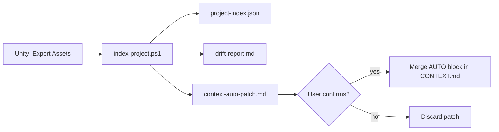

# V57 Context Index — operational guide

> Automatic indexing for **V57 Context Intelligence** — pack operational guide (readiness, index, query, drift).

---

## Requirements

| Requirement | Version |
|-------------|---------|
| .NET SDK | 8.0+ |
| Unity (consumer) | 2022.3 LTS+ |
| V57 pack | Phase 2+ (`V57/tools/`) |

---

## Install in consumer project

1. Copy/update **`V57/`** folder from `Base_Unity_V57`.
2. Copy Unity exporter:

```text
V57/tools/unity-export/Editor/V57IndexExporter.cs
  → Assets/Editor/V57/V57IndexExporter.cs
```

3. (Optional) Version `project-index.json` in git or add to `.gitignore`.

---

## When to enable Phase 2

Before `/context-index`, run the light audit (does not compile `v57-index`):

```powershell
./V57/tools/check-context-readiness.ps1 -WriteReport
```

Or in the agent: `/context-readiness`

| Status | Meaning |
|--------|---------|
| **Green** | Phase 1 enough (`CONTEXT.md` + specs + `touches`) |
| **Yellow** | Consider Phase 2 — complete `touches`, optional `/context-drift` |
| **Red** | Recommended `/context-index` + Unity export |

Reference thresholds: ≥150 scripts, ≥15 specs (OR), or evident drift between spec `touches` and disk.

---

## Commands

### PowerShell (recommended)

From the **Unity project root**:

```powershell
# Basic index
./V57/tools/index-project.ps1

# Index + CONTEXT proposal + drift
./V57/tools/index-project.ps1 -ProposeContext -Drift

# Index + interactive HTML graph (+ open browser)
./V57/tools/export-context-graph.ps1
```

### LLM agent

| Command | Action |
|---------|--------|
| `/context-readiness` | Green/Yellow/Red audit (no compile) |
| `/context-postmortem` | **Post-build:** readiness → optional Phase 2 work → **always** HTML graph (Forge CONTEXT panel) |
| `/context-index` | Regenerate index (+ CONTEXT proposal if requested) |
| `/context-graph` | Index (default) + interactive HTML viewer + open browser |
| `/context-query <specId>` | Subgraph for active task |
| `/context-path <A> <B>` | Dependency path |
| `/context-drift` | Spec ↔ disk report |

Skills: `V57/agents/skills/commands/context/`.

---

## Recommended flow



1. **Unity:** menu `V57 → Export Unity Assets Index` → `v57-unity-assets.json`
2. **Terminal:** `./V57/tools/index-project.ps1 -ProposeContext -Drift`
3. **Review:** `drift-report.md` — fix specs (`specId`, `touches`)
4. **Confirm-gated:** apply `context-auto-patch.md` to `CONTEXT.md`
5. **Agent:** `/context-query <spec>` before implementing

---

## Artifacts

| File | Description |
|------|-------------|
| `project-index.json` | Graph modules/interfaces/events/assets |
| `Docs/V57/reports/context-graph-viewer/index.html` | Interactive graph (via `/context-graph` or `export-context-graph.ps1`) |
| `v57-unity-assets.json` | Unity export (prefabs, SO, scenes) |
| `Docs/V57/reports/context-auto-patch.md` | AUTO block proposal |
| `Docs/V57/reports/drift-report.md` | Spec ↔ file misalignment |
| `V57/tools/schema/project-index.schema.json` | JSON Schema |
| `V57/tools/viewer/context-graph-template.html` | HTML template for the viewer |
| `V57/tools/export-context-graph.ps1` | Export script (index + HTML + open browser) |

---

## Spec YAML v1.1

Add to each spec (see template):

```yaml
specVersion: "1.1"
specId: my_feature
touches:
  scripts: [Assets/_Game/Scripts/...]
  prefabs: []
  scriptable_objects: []
  scenes: []
  tests: []
eventChannels: []
```

v1.0 specs remain valid; drift report will list legacy entries.

---

## Troubleshooting

| Problem | Solution |
|---------|----------|
| Large `_Unassigned` module | Add `touches` or align spec `name:` with classes |
| Empty assets | Run Unity export |
| Wrong deps | Roslyn heuristic; validate with `/context-path` |
| dotnet fails | `dotnet --list-sdks` — install SDK 8 |

---

*V57 Context Intelligence — distributed from `Base_Unity_V57`.*
