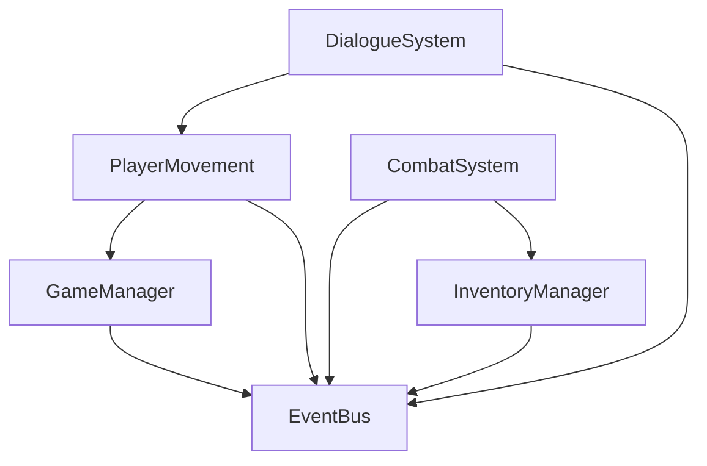

> **Purpose:** Starter architecture document for a **Unity game** at project root. Save this content as **`CONTEXT.md`** next to `Assets/`, then customize or run `/tdd-to-context <path-to-TDD> --bootstrap`. In **Base_Unity_V57**, the root `CONTEXT.md` describes the template pack, not your shipped game.

# CONTEXT.md

Living document that serves as the "technical elevator pitch" for the project.
Any LLM should be able to understand the project architecture by reading this file alone.

**Update frequency:** Whenever a new module is created or architecture changes.
**Location:** Root folder, always at `CONTEXT.md`

---

## Project Identity

```yaml
project_name: MyProject
engine: Unity 2022.3 LTS
# language: omit — derived from engine (STANDARDS_CANONICAL.md §3)
pattern: Component-based architecture
target_platform: PC (Windows/Mac)
test_assembly_prefix: MyProject
```

### Target platforms (optional — set via `/perf-budget`)

```yaml
targetPlatforms:
  - id: desktop_windows
    input: [keyboard_mouse, gamepad]
    resolution: 1920x1080
```

### Performance budgets (optional — set via `/perf-budget`)

```yaml
performanceBudgets:
  primaryPlatform: desktop_windows
  targetFrameTimeMs: 16.67
  maxDrawCalls: 300
  maxSetPassCalls: 150
  maxTrianglesVisible: 500000
  maxGcAllocPerFrameBytes: 0
  maxTotalMemoryMb: 512
```

See `V57/docs/performance/PERFORMANCE_BUDGETS.md` for reference values per platform.

### Networking (optional — set via `/network-setup` or `/tdd-to-context` when TDD §A multiplayer_model != N/A)

```yaml
networking:
  enabled: true
  framework: netcode_for_gameobjects
  tier: lan                    # lan | relay | dedicated
  topology: listen_host        # listen_host | dedicated_server
  maxPlayers: 4
  sessionVisibility: private   # lan_only | private | public
  packages:
    - com.unity.netcode.gameobjects
    - com.unity.transport
  mcpContextPath: Assets/MCP/Context/NetworkingGuidelines.md
```

See `V57/docs/networking/NETWORKING_NGO.md` and `V57/docs/networking/NETWORKING_VOCABULARY.md`. Run `/network-setup` before implementing `NetworkSession` spec.

---

## Modules Overview

| Module | Type | Description | Status |
|--------|------|-------------|--------|
| GameManager | Singleton | Central registry, game state, initialization | active |
| PlayerMovement | Feature | WASD movement, CharacterController, dash, jump | active |
| CombatSystem | System | Turn-based, action queue by speed stat | planned |
| InventoryManager | System | Items, equipment slots, consumables | planned |
| DialogueSystem | Feature | NPC conversations, decision tree | planned |
| EventBus | Core | Central event dispatcher for decoupled communication | active |

---

## Architecture Conventions

### Naming
- Classes/Methods/Properties: `PascalCase`
- Private fields: `_camelCase`
- Interfaces: `IPascalCase`
- Events: `OnPascalCase`

### Patterns
- Singletons for managers (via `Instance` property)
- ScriptableObjects for configuration and event channels
- Component-based: behaviors attached to GameObjects
- Event-driven communication via EventBus

### Folder Structure
```
Assets/
├── Art/2D/, Art/3D/
├── Audio/SFX/, Audio/Music/
├── ScriptableObjects/Data/, Events/, Configs/
├── Scenes/
├── Scripts/Core/, Systems/, Features/
└── Prefabs/Characters/, Environment/, UI/
```

---

## Module Dependencies



### Dependency Rules
- Systems can read other systems via interfaces
- Features always depend on GameManager and EventBus
- No direct references between UI and gameplay systems (use events)

---

## Interfaces (Public API Between Modules)

```csharp
// IInventoryReader - CombatSystem reads InventoryManager
public interface IInventoryReader
{
    ItemBase GetItem(int slotIndex);
    int GetItemCount(int slotIndex);
    bool HasItem(string itemId);
}

// IPlayerState - DialogueSystem reads PlayerMovement
public interface IPlayerState
{
    bool IsAlive { get; }
    Vector3 Position { get; }
    float HealthPercent { get; }
}

// IMovable - GameManager controls PlayerMovement
public interface IMovable
{
    void Move(Vector3 direction);
    void Jump();
    void Enable();
    void Disable();
}
```

---

## Known Systems (Do Not Duplicate)

These systems already exist - new specs must reference them, not recreate:

- `GameManager` - Singleton in `Scripts/Core/Managers/`
- `EventBus` - Central event channel in `ScriptableObjects/Events/`
- `AudioManager` - Handles SFX/Music in `Scripts/Systems/Audio/`

---

## Input Configuration

```yaml
input_system: old  # Input.GetAxis / Input.GetButton
# If using new input system, add: input_system: new
```

---

## Current Specs in Development

| Spec File | Generated | Implemented |
|-----------|-----------|-------------|
| `V57/specs/<slug>/features/player_movement.yaml` | Yes | No |
| `V57/specs/<slug>/features/combat_system.yaml` | No | No |

---

## Next Milestones

1. PlayerMovement complete → enables CombatSystem development
2. EventBus tested → all systems connect via events
3. InventoryManager v1 → enables CombatSystem

---

## Technical Notes

- Physics: CharacterController for player, colliders for environment
- No Addressables yet (add when asset count grows)
- Scene management: Single scene with load/unload for sections
- Save system: Not implemented yet, plan for v2

---

## Context reading policy (V57-CI)

Before repo-wide reads during implement/refactor, follow **`V57/agents/skills/shared/helpers/unity-context-reading-policy-skill.md`**:

1. `CONTEXT.md` (overview only)
2. Active spec YAML + `touches`
3. `/context-query` when `project-index.json` exists

Operations: [`V57/docs/context/CONTEXT_INDEX.md`](V57/docs/context/CONTEXT_INDEX.md) · Readiness: `/context-readiness`

### Auto-generated index (Phase 2+)

When using `/context-index`, merge the proposed block **only after user confirms**:

```markdown
<!-- v57:auto-index:start — DO NOT EDIT MANUALLY -->
## Auto-generated index
…
<!-- v57:auto-index:end -->
```

---

*Last updated: YYYY-MM-DD*
*Update trigger: New module created, architecture change, dependency added*
