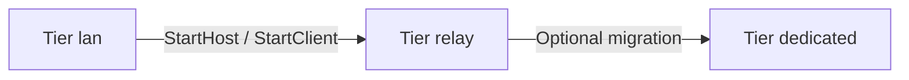

# Netcode for GameObjects — V57 guide

Master reference for **on-demand** multiplayer setup in V57 consumer projects. Not loaded during single-player `/game-setup` unless TDD requires networking.

| Item | Detail |
|------|--------|
| **Skill** | `/network-setup` — `V57/agents/skills/commands/network/unity-networking-skill.md` |
| **Patterns** | `V57/agents/skills/shared/references/unity-ngo-patterns-skill.md` |
| **Vocabulary** | `NETWORKING_VOCABULARY.md` |
| **Packages** | `NETWORKING_PACKAGES.md` |

---

## When to use

| Trigger | Action |
|---------|--------|
| TDD §A `multiplayer_model != N/A` | Suggest `/network-setup` after `/tdd-to-context` |
| `CONTEXT.md` `networking.enabled: true` | Run `/network-setup` before session spec implement |
| Spec has `networking:` block | Read patterns + run or verify setup |
| User invokes `/network-setup` | Full workflow |

**Not automatic in `/game-setup`** — opt-in only.

---

## Connectivity tiers



| Tier | Doc | Summary |
|------|-----|---------|
| **lan** | [NETWORKING_NGO_LAN.md](NETWORKING_NGO_LAN.md) | Listen host, direct IP, same network |
| **relay** | [NETWORKING_NGO_RELAY.md](NETWORKING_NGO_RELAY.md) | Private internet, Lobby + Relay + join code |
| **dedicated** | [NETWORKING_NGO_DEDICATED.md](NETWORKING_NGO_DEDICATED.md) | Server build extension |

Start with **lan** for vertical slice; promote to **relay** when internet private sessions are required.

---

## Architecture (consumer project)

```
Assets/
├── Scripts/Systems/Network/
│   ├── NetworkSessionManager.cs      # session FSM, start/stop
│   ├── NetworkRelayService.cs        # tier relay only
│   └── NetworkPlayerSpawner.cs       # optional
├── Prefabs/Network/
│   └── NetworkPlayer.prefab          # NetworkObject + behaviours
├── Scenes/
│   └── Bootstrap.unity               # optional: menu + network bootstrap
└── MCP/Context/
    ├── NetworkingGuidelines.md
    └── NetworkingCSP.md
```

Scene production: container `--- NETWORK ---` per `SCENE_PRODUCTION_STANDARDS.md`.

---

## Sync strategy (defaults)

| Data | Mechanism | Authority |
|------|-----------|-----------|
| Session state (connected, player count) | `NetworkVariable` or session events | Server |
| Player transform | `NetworkTransform` | Server |
| Player input | Owner reads input → `ServerRpc` | Validated on server |
| Score / health | `NetworkVariable` | Server |
| Local VFX | Client-only | Owner |

Override per mechanic in spec `networking.sync` and TDD §B.

---

## Session flow (high level)

### LAN

1. Host: create/join UI → `NetworkManager.StartHost()`
2. Clients: enter host IP:port → `StartClient()`
3. Server spawns player prefabs on connect

### Relay

1. Authenticate with UGS
2. Host: create private Lobby → allocate Relay → configure transport → `StartHost()`
3. Clients: join Lobby by code → Relay join → `StartClient()`

### Dedicated

1. Server process: `StartServer()` (headless build)
2. Clients: connect to server address → `StartClient()`

Details in tier docs.

---

## Testing

| Method | Tool |
|--------|------|
| MPPM virtual players | MPPM UI or `Unity.RunCommand` (legacy `unity_mppm_*` not in official MCP) |
| ParrelSync clones | Open clone projects manually; official MCP has no `unity_list_instances` |
| PlayMode tests | Session spec ACs; MPPM when runtime NGO required |

Minimum smoke: **2 clients spawn** in MPPM after `/network-setup`.

---

## Templates and specs

| Asset | Path |
|-------|------|
| MCP NetworkingGuidelines | `V57/docs/networking/NetworkingGuidelines.template.md` |
| MCP NetworkingCSP | `V57/docs/networking/NetworkingCSP.template.md` |
| Session system spec | `V57/specs/template/network_session_spec_template.yaml` |
| Feature spec `networking:` | `V57/specs/template/feature_spec_template.yaml` |

---

## Related pipeline skills

| Skill | Role |
|-------|------|
| `/tdd-to-context` | Maps `multiplayer_model` → CONTEXT `networking` |
| `/tdd-to-spec` | Emits `network_session.yaml` from TDD session mechanic |
| `/spec implement` | Implements session + networked features |
| `/scene-setup` | Validates network container when networking enabled |

---

*Last updated: 2026-07-02*
