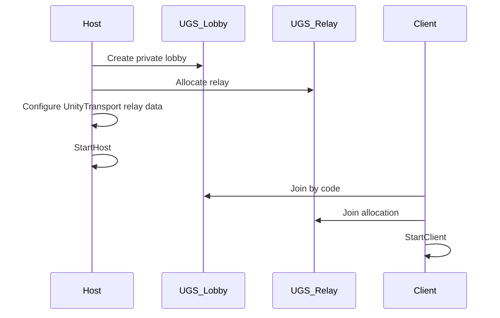

# NGO — Relay tier (private internet)

**Listen host** with **Unity Gaming Services (UGS) Lobby + Relay** for private sessions over the internet (join code / invite).

**Parent:** [NETWORKING_NGO.md](NETWORKING_NGO.md)  
**Vocabulary:** `multiplayer_model: ngo_listen_host_relay`, `networking.tier: relay`, `sessionVisibility: private`

---

## Topology

Same as LAN (listen host), but transport uses **Relay** allocation instead of direct IP.

---

## Packages

Base NGO packages plus:

- `com.unity.services.multiplayer`
- `com.unity.services.authentication`

See [NETWORKING_PACKAGES.md](NETWORKING_PACKAGES.md).

---

## Project configuration

1. Link Unity project to UGS in **Project Settings → Services**.
2. Enable **Lobby** and **Relay** in Unity Dashboard for the project.
3. Store **no secrets** in repo — use Unity project linking only.
4. Document allowed UGS endpoints in `NetworkingCSP.md`.

---

## Session flow

### Host

1. `AuthenticationService.Instance.SignInAnonymouslyAsync()` (or platform auth per TDD)
2. Create **private** Lobby (max players from TDD)
3. Create Relay allocation; get join code / lobby code for UI
4. Set relay server data on `UnityTransport` (NGO + UTP relay APIs per Unity version)
5. `NetworkManager.StartHost()`

### Client

1. Sign in (same auth path)
2. Join lobby by code
3. Join relay using lobby relay allocation data
4. Configure transport → `NetworkManager.StartClient()`

Implement in `NetworkRelayService` + `NetworkSessionManager` per `network_session_spec_template.yaml`.

---

## Join code UX

- Display **lobby code** (or short join code) to host after create.
- Client enters code in join UI.
- `session_visibility: private` — no public lobby listing in default template.

---

## Security (NetworkingCSP)

Document in `Assets/MCP/Context/NetworkingCSP.md`:

- UGS API endpoints used
- Auth method (anonymous vs platform)
- Server validation: connection approval callback rejects unknown clients if TDD requires
- Rate limits on join attempts (application-level)

---

## Disconnect / host leave

| Event | Default behavior |
|-------|------------------|
| Client disconnect | Despawn player; lobby member removed |
| Host disconnect | Session ends; clients return to menu |
| Reconnect | Optional — only if TDD ACs require |

---

## MCP verify checklist

- [ ] UGS packages installed; Services linked
- [ ] Relay path implemented in session manager (compile)
- [ ] LAN fallback not required for relay tier sign-off
- [ ] MPPM smoke with relay may be limited — document manual 2-machine test in report

---

## Testing notes

Full Relay flow often requires **two machines** or ParrelSync + separate UGS sessions. MPPM validates NGO spawn; Relay integration may need manual QA row in implement report.

---

*Last updated: 2026-07-02*
