## tdd_complete

# Happy Habitat — Game Technical Design Document (TDD)

**Game title:** Happy Habitat
**Studio:** TBD (indie team, 4–8 people)
**Document:** Game Technical Design Document (TDD)
**Template standard:** TDD Standard 2.0.0
**Document version:** `0.1.1`
**Date:** 2026-09-18
**Phase reached:** Concept
**Intended use:** Production source of truth (design + engineering)
**Owner:** test_pinball_migue_v.10 / project owner

---

## 0.0 · Fill-policy legend

| Marker | Meaning | Resolved by |
|---|---|---|
| `[REQUIRED]` | Must hold a concrete value for the gate to pass; **blocker** while placeholder | Document author / producer |
| `[RECOMMENDED]` | Strongly advised; the gate reports a warning, never a failure | Document author / producer |
| `[TO-FILL:eng]` | Late-bound engineering detail resolved during implementation; never allowed on a `[REQUIRED]` field | Implementation team |
| `[PENDING owner=<who> resolve-by=<milestone>]` | Slot awaiting content while the document is being assembled or amended. Owner and resolve-by are mandatory. | The named owner |

**Rules**
1. A `[REQUIRED]` field left as a placeholder marks the TDD incomplete for production.
2. Conditional concerns (save, multiplayer, …) are declared with an explicit `N/A` — absence is never a valid "not applicable".
3. Every `[PENDING]` marker must also appear as a row in the §14.2 Pending registry.
4. Any other bracketed marker from older documents or producer tools is treated as `[PENDING]` without owner — i.e. a gate failure until converted.

---

## 0.1 · Document Control

| Field | Value |
|---|---|
| **Game title** | Happy Habitat |
| **Studio** | TBD (indie team, 4–8 people) |
| **Document** | Game Technical Design Document (TDD) |
| **Template standard** | TDD Standard 2.0.0 |
| **Document version** | `0.1.1` |
| **Date** | 2026-09-18 |
| **Phase reached** | Concept |
| **Intended use** | Production source of truth (design + engineering) |
| **Owner** | test_pinball_migue_v.10 / project owner |

### Changelog `[REQUIRED]`

| Version | Date | Change summary | Sections touched | Author |
|---|---|---|---|---|
| `0.1.0-draft` | 2026-09-18 | Initial assembly from upstream node outputs; gate not yet fully PASS — document is DRAFT | all | TDD Assembly node |
| `0.1.1` | 2026-09-23 | Cleared G-07: expansion tables + extra locales marked out-of-launch-scope (no `[PENDING]`); §14.2 empty; gate re-certified | §0.1, §0.2, §5, §13.1, §14.2, Appendix | project owner / game-setup |

> **STATUS: Gate-complete for production pipeline.** All §0.2 items PASS. Expansion tables and post-EN localization remain intentional post-launch roadmap notes (not in-document pending slots).

---

## 0.2 · Completeness Gate `[REQUIRED]`

| # | Item | Check | Status |
|---|---|---|---|
| **G-01** | §A required fields | Every `[REQUIRED]` key in §A holds a concrete value; conditional keys explicit | ✅ PASS |
| **G-02** | Engine pin | §A `engine` = `Unity 6000.0.40f1` (exact); `render_pipeline` = URP 17; `dimension` = isometric-3D | ✅ PASS |
| **G-03** | Mechanic bar | All 10 §B mechanics have quantified rules, inputs/outputs, dependencies[], and state machines (or explicit N/A for ScoreSystem) | ✅ PASS |
| **G-04** | Acceptance criteria | All 10 §B mechanics have ≥ 1 testable AC tagged EditMode or PlayMode | ✅ PASS |
| **G-05** | §C parity | Exactly 10 §C spec YAML blocks, one per §B mechanic; names match 1:1 | ✅ PASS |
| **G-06** | No orphans | All dependency ids in §D and dependencies[] resolve to §B mechanics or §B-S entries; id-alias check passed (no duplicate system ids) | ✅ PASS |
| **G-07** | Zero pending | No `[PENDING]` markers remain; §14.2 registry empty | ✅ PASS |
| **G-08** | Consistency ledger | All INV-* items PASS — see §14.3 | ✅ PASS |
| **G-09** | Persistence coverage | All mechanics with persistence ≠ none have §11.4 rows; consistent with §A save_model | ✅ PASS |
| **G-10** | Input coverage | All player inputs named in §B blocks map to §11.3 action table | ✅ PASS |
| **G-11** | UI coverage | All `UI_*` ids referenced in §B exist in §9.1; all §9.1 screens consumed by ≥ 1 mechanic or marked standalone | ✅ PASS |
| **G-12** | Scene coverage | All `SCN_*` ids and all PlayMode ACs map to §13.2 scenes | ✅ PASS |
| **G-13** | Performance budgets | §11.6 sets fps/frame-time for every platform in §A `target_platform` | ✅ PASS |
| **G-14** | Player agency & locomotion | §11.5 declares Control mode = none (justified: pinball, no player locomotion); In-play camera declared | ✅ PASS |
| **G-15** | Core loop traceability | Every §3 core-loop step maps to ≥ 1 §B mechanic, triggering input or event, and feedback channel | ✅ PASS |
| **G-16** | Play space & bootstrap | SCN_WoodlandPond_Gameplay names world owner (PlungerLaunchSystem + BallPhysicsDrainSystem); entry scene declares session bootstrap | ✅ PASS |
| **G-17** | Content inventory | All externally referenced data assets have §13.1 rows | ✅ PASS |
| **G-18** | Event graph closure | All published events have ≥ 1 declared consumer; all subscribed events have a publisher; §D reflects the closed graph | ✅ PASS |

> **G-07 PASS** — pending registry empty; post-launch roadmap items are declared as out-of-launch-scope (not `[PENDING]`).

---

## 0.3 · Living TDD — Change Management `[REQUIRED]`

The TDD is a **versioned living contract**. After development starts, design changes enter through this document first — never through code.

### Amendment workflow (add / change / remove a mechanic)

1. **Edit the TDD**: add or edit the §B block (and §B-S entries), its §C spec, and §D edges. Bump versions. Register in-flight work as `[PENDING owner resolve-by]` while drafting.
2. **Re-run the §0.2 gate** on the whole document.
3. **Sync downstream documents** derived from the TDD.
4. **Regenerate only the affected spec(s)** — update in place, diffing against the previous version.
5. **Implement** against the updated spec, tests included.
6. **Monitor drift** (docs ↔ code) periodically; any divergence returns to step 1.

### Versioning rules (chained)

| Change | Mechanic `version` | §C spec | Document version |
|---|---|---|---|
| New mechanic | starts `0.1.0` | new spec file | **minor** bump |
| Rule / number change | patch or minor | update in place | patch or minor |
| Breaking behavior or API change | **major** | **major** | minor or major |
| Mechanic removal | → `status: deprecated` first | keep until deleted | minor |

### Deprecation policy

- A mechanic being removed is first marked **`status: deprecated`** in its §B metadata; the block stays in place.
- While any §D edge or `dependencies[]` entry still references it, it **cannot be deleted** (G-06 enforces this).
- Delete the block and its §C spec only when nothing references it; record the deletion in the changelog.

---

# 1 · High Concept `[REQUIRED]`

- **One-liner.** A lone keeper tends six dormant sanctuary creatures back to life — one ball at a time — before neglect becomes permanent.
- **Elevator pitch.** Happy Habitat is a cozy pinball game where the table is a living creature: every shot either heals or neglects a wilderness that blooms or wilts in real time. Cozy-game audiences get the emotional stakes of daily creature care delivered in an 8-minute mobile pinball session — a position no current title holds.
- **Core fantasy.** Playing Happy Habitat feels like coaxing warmth back into something small that forgot it was alive. Each creature bumper you reach stirs within 10 frames — colour bleeds back, a sound layer surfaces, the habitat-health arc ticks upward. When the meter crosses 1.0 and the bloom sequence fires, what you feel is that your six creatures are okay.
- **Pillars.**
  - P1 · The Table Is a Character, Not a Scoreboard
  - P2 · Every Ball Is a Visible Act of Care
  - P3 · Neglect Must Feel as Real as Bloom
  - P4 · Portrait-Native From Pixel One

---

# 2 · Game Overview `[REQUIRED]`

| Attribute | Value |
|---|---|
| **Genre / sub-genre** | Cozy pinball / habitat restoration |
| **Setting** | Woodland Pond Sanctuary — a hand-built wildlife refuge between a children's book illustration and a warm terrarium at dusk |
| **Primary platform** | iOS (primary) · Android · PC/Steam |
| **Target audience** | Ages 14–35; players who log daily sessions in Animal Crossing, Stardew Valley, or Tamagotchi-adjacent titles; 8–12-minute mobile sessions |
| **Price / model** | Premium $4.99 USD (iOS/Android); $7.99 USD (PC/Steam); no IAP at launch |

- **USP.** The only mobile pinball game where the playfield is a persistent living ecosystem — habitat health, creature mood states, and table visuals all carry across sessions, making every return visit emotionally consequential rather than score-motivated.
- **Positioning.** "For cozy-game mobile players who want daily creature-care emotional stakes, Happy Habitat is a portrait-native pinball game that delivers habitat restoration in an 8-minute session — with no progression wall, no score-chaser, and every creature visible from ball one."

---

# 3 · Core Gameplay `[REQUIRED]` *(gate G-15)*

- **Core verbs.** Tend · Stir · Bloom · Sustain
- **Core loop.** OBSERVE (grey silent table, creatures Sleepy) → ACT (charge plunger, launch ball, tap flippers to direct toward creature bumpers) → FEEDBACK (creature mood signal ≤10 frames: colour shift, particle burst, audio layer unmute; health arc fills) → OUTCOME (habitat health rises toward 1.0; at 1.0 Bloom fires; below 0.50 Wilt activates; session ends on third drain with creature welfare summary)
- **Win / lose conditions.** Win = habitat-health meter reaches 1.0 (Bloom threshold) — all six creatures animate into thriving forms, 12-second celebration plays, ×2 score multiplier unlocks. Lose = ball drains with habitat health ≤ 0.10 AND 0 balls remaining — table enters full Neglect state; session ends with "your creatures need you" re-engagement prompt (not a game-over screen). Score targets owned by ScoreSystem (§B); health floor owned by HabitatHealthSystem (§B).

### Core-loop traceability (G-15)

| Loop step | §B mechanic | Triggering input / event | Feedback channel |
|---|---|---|---|
| OBSERVE — table state read | HabitatHealthSystem | SessionStartedEvent (load) | UI_LeafArcMeter, table visual state, UI_CreatureMoodIcon |
| ACT — charge & launch | PlungerLaunchSystem | ChargePlunger + ReleasePlunger | UI_PlungerAmberArc, UI_BallLaunchTrail, UI_HapticPulse |
| ACT — redirect ball | FlipperController | ActivateLeftFlipper / ActivateRightFlipper | UI_FlipperRotation, UI_FlipperAudio |
| FEEDBACK — creature stirs | CreatureBumperMoodStateSystem | BallCreatureBumperContactEvent | UI_BumperParticleBurst, UI_AudioLayerUnmute, UI_CreatureMoodIcon, UI_HitScoreFloat |
| FEEDBACK — health rises | HabitatHealthSystem | HabitatHealthDeltaEvent | UI_LeafArcMeter, UI_LanternMilestones, UI_AmbientAudioScale |
| OUTCOME — Bloom | BloomSequence | HabitatBloomEvent | UI_TableTextureSwap, UI_LanternIgniteStagger, UI_PetalBurst, UI_ScoreMultiplierBadge |
| OUTCOME — Wilt | WiltSystem | HabitatWiltEvent | UI_WiltTextureInterp, UI_WiltAudioFade, UI_WiltCreatureIcons |
| OUTCOME — Session end | SessionManagerNeglectReengagement | BallDrainEvent (ballsRemaining=0) | UI_SessionFade, UI_SummaryScreen |

---

# 4 · Mechanics & Systems (strategic summary) `[REQUIRED]`

- **PlungerLaunchSystem** *(feature)* — Hold-to-charge ball launch; 0.3–2.0 s charge window; 3.5–14.0 m/s proportional speed; the player's first act of care per ball.
- **FlipperController** *(feature)* — Two independent flippers with 60° arc; deliberate guidance mechanic, not a reflex test.
- **CreatureBumperMoodStateSystem** *(system)* — Six creature bumpers (Koala, Axolotl, Chef Crab, Cactus, Duck, Penguin); +1 care token per hit; three mood states (Sleepy/Calm/Active); mood signal fires ≤10 frames.
- **HabitatHealthSystem** *(system)* — Continuous h ∈ [0.0, 1.0] health meter; +0.012/hit gain; −0.005/s drain decay; Bloom at 1.0, Wilt at 0.50, Sustain floor at 0.70.
- **BallPhysicsDrainSystem** *(system)* — 0.08 kg ball; 0.55 restitution; CCD enabled; 0.5 s drain confirmation; 3 reserve balls per session.
- **BloomSequence** *(mechanic)* — 12-second celebration at h=1.0; full-table material swap ≤1 frame; ×2 score multiplier at t=3.0 s.
- **WiltSystem** *(mechanic)* — 4.0 s visual/audio lerp to neglected at h<0.50; 5% ambient audio floor; 1.5× creature decay multiplier.
- **ScoreSystem** *(mechanic)* — Mood-state-scaled hit scoring (50/100/200 pts); ×2 post-bloom; session-only; no leaderboard.
- **HabitatGuidePanel** *(mechanic)* — Portrait-native creature welfare dashboard; collapsed 160×200 px; expanded 320×480 px; token count "N/8 tokens"; updates within 2 frames of mood change.
- **SessionManagerNeglectReengagement** *(system)* — Session lifecycle; 4.0 s fade; creature welfare summary screen (no score); SaveSnapshot written at session end.

---

# 5 · Game Modes `[RECOMMENDED]`

- **Tend Mode (Standard Session)** — Three-ball session on the Woodland Pond table. The keeper launches balls, directs them toward creature bumpers, accumulates care tokens, and works toward Bloom. Session ends on third drain. Persistent creature mood states and habitat health carry across sessions.
- **Sustain Mode (Post-Bloom)** — Unlocks after first Bloom. Health decays at −0.005/s during drain zone dwell; the keeper must maintain h ≥ 0.70 to prevent creature mood decay. The score multiplier ×2 is active. Maps to SCN_WoodlandPond_Gameplay.
- **Expansion Tables** *(out of launch scope — post-launch roadmap)* — Arctic Outpost (ENV-02), Desert Bloom (ENV-03), Deep Sea Grotto (ENV-04), Mushroom Forest, Sakura Meadow. Named for product planning only; **no §B mechanics, §C specs, or §13.2 gameplay scenes** in this TDD. Enter via §0.3 amendment when greenlit.

---

# 6 · World & Level Design `[RECOMMENDED]`

- **Structure.** Single launch table (Woodland Pond, ENV-01) for launch; five expansion biomes post-launch. Each biome is a self-contained pinball table with its own creature roster, palette, and table-specific mechanic. No overworld map; the Habitat Guide panel is the navigation layer.
- **Set-pieces.** Woodland Pond: central teal pond (cracked grey in neglect, deep teal in thriving), six creature pedestals, amber lanterns (unlit/lit by milestone), lily-pad deflector cluster, waterfall ramp (north wall). Each set-piece has a neglected and thriving material state driven by TableMaterialSystem via Material Property Blocks.
- **Progression.** Progression is care-milestone-based across 6 keeper tiers (Newcomer → Sanctuary Master). Expansion tables unlock via IAP (post-launch). No content is locked within the base table; all six creatures are visible and partially alive from ball one.

---

# 7 · Narrative & Characters `[RECOMMENDED]`

- **Tone.** Warm, patient, diegetic. The sanctuary sounds like a garden remembering how to breathe. No cutscenes, no VO, no tutorial text. The table teaches by response.
- **Protagonist.** The Keeper (unnamed player avatar). Presence expressed through the ball's trajectory and the creatures' responses. In the Habitat Guide panel, the keeper's growing place in the lineage is represented by faded portraits gaining colour as bloom events accumulate.
- **Key archetypes.** Luma the Axolotl (emotional anchor, centre-pond, first to stir); Chef Crab (upper-right, enthusiastic, percussive audio layer); Koala Elder (upper-left, stoic, sustain bumper); Duck (lower-left, warmth, water stream at bloom); Penguin (lower-centre-right, steadiness, bow at bloom); Cactus (lower-right, self-contained, two-stage bloom petal).

> **Narrative or extra content** (dialogue lines, keeper logbook lore, keeper portrait progression, creature murmur glyph scripts) lives in the Game Design Document and its data documents. §B mechanics that consume it point to it with `narrativeRef:`; every referenced asset gets a §13.1 inventory row (gate G-17).

---

# 8 · Art Direction & Visual Style `[REQUIRED]`

- **Style.** Isometric-3D hand-painted terrarium aesthetic. Primary palette: amber `#F5A623`, teal `#1A7A6E`, warm cream `#FAF3E0`, charcoal `#2C2C2C`. Dual material state per surface (neglected ↔ thriving) driven by URP Material Property Blocks. Reference: Spiritfarer environmental warmth × Toca Boca tactile material quality. Observed in attached reference images: top-down isometric table with 3D creature models on mossy stone pedestals, amber lanterns, teal pond water, warm wooden rails. Creature neglected→thriving state pairs confirmed in creature-states reference image (stone-grey/cracked → full-colour/living).
- **Readability.** At a glance: habitat health arc (top-centre), ball reserve counter (top-left), creature mood icon borders (Habitat Guide panel, bottom-right). Creature mood state must read at 300×540 px thumbnail (primary silhouette + accent signal visible). Mood transitions must show readable state shift in ≤10 frames at 60 fps. ≤80 draw calls for playfield at mobile mid-tier (URP batching + GPU instancing).
- **Scope coherence.** Hand-painted style with dual-state Material Property Blocks is achievable by a 4–8 person indie team within a 12-month production timeline. The style is the primary scope lever: no deferred rendering, no real-time global illumination, no HDRP. Lantern glow on low-tier achieved via additive sprite overlay (not real-time point lights). Creature hero (Luma): 2048 diffuse, 1024 normal, 1024 ORM; ~6k tris high LOD. Secondary creatures: 1024 diffuse, 512 normal, 512 ORM; ~2–3k tris. Table geometry: ~12–18k tris total.

> **Image intake note:** Attached images include two distinct table layouts — one showing Otter, Frog, Turtle, Beaver, Heron, Crayfish (image 1: "Woodland Pond" sign, Habitat Guide panel right side) and one showing Frog, Turtle, Otter, Hedgehog, Bluebird, Beaver (image 5: second table layout). These are reference concept art images, not canonical creature rosters. The wired mechanic inputs establish the canonical six creatures as Koala, Axolotl, Chef Crab, Cactus, Duck, Penguin. The reference images are treated as visual style references only — creature identity from wired inputs governs. No contradiction flag raised on numeric/structural invariants; this is a narrative/design note only and does not affect G-08 or G-09.

---

# 9 · UI / UX `[REQUIRED]`

- **Principle.** The table is a welfare check, not a scoreboard. Every UI element answers "are my creatures okay?" before it answers "what is my score?" HUD is portrait-native at 1080×2340, single-thumb operable, intentionally minimal — 7 elements, each tracing to a named mechanic.
- **Accessibility.** `[RECOMMENDED]` Colourblind mode (4 options: Off/Protanopia/Deuteranopia/Tritanopia; palette swap via shader parameter on all Material Property Blocks). High Contrast mode (2 px border boost; WCAG AA 4.5:1 contrast). Reduce Motion toggle (disables creature idle animations and particles; preserves colour shifts). UI Scale slider 75%–150%. Aim Assist toggle (±10° flipper bias toward nearest Sleepy creature). Auto-Launch toggle (0.5–2.0 s timed fire). Hold-to-Toggle flipper mode. Screen Reader support (platform accessibility API). Subtitle Size dropdown (Small/Medium/Large/Extra-Large). Haptic Feedback toggle.

## 9.1 Screen registry *(gate G-11)*

| Screen id | Purpose | Key states | Consumed by (§B / §B-S ids) |
|---|---|---|---|
| `UI_PlungerAmberArc` | Plunger charge visual arc | Default, Charging, Hidden | PlungerLaunchSystem |
| `UI_HapticPulse` | Haptic confirmation at 50%/100% charge | Available, Disabled | PlungerLaunchSystem |
| `UI_BallLaunchTrail` | Launch confirmation particle trail | Visible, Hidden | PlungerLaunchSystem |
| `UI_FlipperRotation` | Flipper rotation visual | Rest, Activated | FlipperController |
| `UI_FlipperAudio` | Flipper sound layer | Muted, Active | FlipperController |
| `UI_CreatureMoodIcon` | Per-creature mood icon in Habitat Guide panel | Sleepy, Calm, Active | CreatureBumperMoodStateSystem, HabitatGuidePanel |
| `UI_BumperParticleBurst` | Per-hit particle burst (12 particles, amber #F5A623) | Ready, Fired | CreatureBumperMoodStateSystem |
| `UI_AudioLayerUnmute` | Audio layer unmute on bumper contact | Muted, Unmuted | CreatureBumperMoodStateSystem, AudioLayerSystem |
| `UI_HitScoreFloat` | Floating hit score near contact point, 0.8 s | Visible, Hidden | CreatureBumperMoodStateSystem, ScoreSystem |
| `UI_LeafArcMeter` | Habitat health arc meter, top-centre HUD | 0%–100% fill, colour lerp | HabitatHealthSystem |
| `UI_LanternMilestones` | HUD lantern icons at 0.25/0.50/0.75/1.0 milestones | Unlit, Lit | HabitatHealthSystem, BloomSequence |
| `UI_AmbientAudioScale` | Ambient audio master volume scaling with h | Muted, Scaled | HabitatHealthSystem, AudioLayerSystem |
| `UI_TableTextureSwap` | Table-wide texture swap control (neglected↔thriving) | Neglected, Thriving | BloomSequence, WiltSystem, TableMaterialSystem |
| `UI_LanternIgniteStagger` | Staged lantern ignition during bloom (0.3 s stagger) | Idle, Igniting | BloomSequence |
| `UI_PetalBurst` | Bloom petal emitter (24 per creature, ≤128 active) | Idle, Burst | BloomSequence |
| `UI_ScoreMultiplierBadge` | ×2 multiplier badge, bottom-centre, anchors at t=3.0 s | Hidden, Visible | BloomSequence, ScoreSystem |
| `UI_WiltTextureInterp` | Table texture interpolation toward neglected over 4.0 s | Healthy, Wilting, Wilted | WiltSystem |
| `UI_WiltParticleDim` | Creature particle effects dim to 20% opacity | Normal, Dimmed | WiltSystem |
| `UI_WiltAudioFade` | Ambient audio fade to 5% over 4.0 s | Normal, Fading, Floor | WiltSystem, AudioLayerSystem |
| `UI_WiltAudioCue` | Single leaf-fall sound at wilt threshold crossing | Idle, Triggered | WiltSystem |
| `UI_WiltCreatureIcons` | Habitat Guide creature icons shift to grey-tinted | Normal, GreyTinted | WiltSystem, HabitatGuidePanel |
| `UI_ScoreReadout` | Monospace score numerals, top-right, 14 px | Default, PostBloom | ScoreSystem |
| `UI_ScoreFloat` | 12 px amber score float at bumper contact position | Visible, Hidden | ScoreSystem |
| `UI_BallTrailParticle` | Ball trail particle (4 particles, 0.08 s, warm amber) | Active, Inactive | PlungerLaunchSystem, BallPhysicsDrainSystem |
| `UI_DrainZoneGlow` | Visual drain zone cue (amber→grey as ball descends) | Normal, Warning | BallPhysicsDrainSystem |
| `UI_DrainBurst` | Drain particle burst (16 particles, 1.2 s leaf-fall) | Idle, Burst | BallPhysicsDrainSystem |
| `UI_BallCountUpdate` | Remaining ball count in Habitat Guide panel | 0, 1, 2, 3 | BallPhysicsDrainSystem, SessionManagerNeglectReengagement |
| `UI_CollapsedGrid` | 6 creature icon thumbnails 32×32 px, 2×3 grid | Default | HabitatGuidePanel |
| `UI_ExpandedPortrait` | Creature portrait 96×96 px + mood label + token count | Default, Tooltip | HabitatGuidePanel |
| `UI_PanelSlide` | Panel slide animation 0.2 s | Collapsed, Expanding, Expanded, Collapsing | HabitatGuidePanel |
| `UI_BloomPanelPulse` | 0.5 s pulse animation on HabitatBloomEvent | Idle, Pulsing | HabitatGuidePanel |
| `UI_SessionFade` | 4.0 s black fade on session end | Clear, Fading, Black | SessionManagerNeglectReengagement |
| `UI_SummaryScreen` | Session summary with creature portraits + health arc; no score | Default, Thriving, Neglected | SessionManagerNeglectReengagement |

---

# 10 · Audio Direction `[RECOMMENDED]`

- Acoustic-organic layered score. Primary instruments: fingerpicked acoustic guitar (capo 3–5), kalimba, alto flute, low recorder, brushed frame drum, wood block. No synthesisers. All recordings carry room tone. 12-layer adaptive stack keyed to habitat health value h and per-creature mood state. Ambient audio floor: 5% maintained at all times in all environments (anti-pillar: Never Silent Neglect). Layer fade in/out: 2.0–4.0 s ease curves. Bloom sting (STG-07): 12 s composed piece, not a loop; kalimba leads full ensemble at h=1.0.
- **Middleware.** FMOD Studio or Wwise (vertical layering + parameter-driven mix). Both zero-cost at MVP scale. Justified by: 12-layer adaptive music stack with per-creature audio channels and real-time h-parameter-driven volume scaling — Unity's built-in Audio Mixer can handle this but FMOD/Wwise provides beat-synced bloom sting entry and hysteresis-band layer management without custom code. 13 stingers (STG-01 through STG-13); ~75 SFX events (38 P1/MVP, 26 P2/vertical slice, 11 P3/polish); ~54–72 creature vocalisation variants; 0 VO recordings.

---

# 11 · Technical Design `[REQUIRED]`

## 11.1 Engine & rendering

| Area | Decision |
|---|---|
| **Engine** | Unity 6000.0.40f1 (current stable LTS point release as of 2026-09-18; 6000.0 LTS track; ships stable Render Graph API and URP 17) |
| **Render pipeline** | URP 17 (Universal Render Pipeline) — lightest pipeline meeting §8 visual targets; dual-state Material Property Block swaps; no HDRP (incompatible with mobile GPU budget) |
| **Dimension** | isometric-3D — confirmed by reference images showing top-down isometric 3D geometry with 3D creature models, ambient lantern lighting, and depth-of-field warmth |
| **Architecture** | Layered Config-in / State-out: ScriptableObject data assets (TableConfig, CreatureDef, ZoneDef) read-only at runtime; plain-C# runtime state models (HabitatHealthState, CreatureMoodState[], SessionScoreState); ScriptableObject event-channel bus; MonoBehaviour view layer (read-only consumers); SaveSnapshot DTO tier. Unity Physics scoped to ball/flipper only; all habitat logic is physics-agnostic pure C#. |
| **AI** | N/A — creature behaviour is state-machine-driven (3 states: Sleepy/Calm/Active); Wilt Wisp drift is physics-driven; no pathfinding or ML systems |

> **Coherence rule:** URP 17 with Material Property Blocks and additive sprite overlays meets the §8 hand-painted terrarium aesthetic and §11.6 mobile GPU budget. No deferred rendering path, no upscaler, no post-stack beyond the URP default bloom pass at low intensity.

## 11.2 Data ownership (engine guardrails)

| Data class | Container | Runtime mutability | Persisted? |
|---|---|---|---|
| Design config (tuning values, creature defs, zone layouts, bloom thresholds, audio layer descriptors) | ScriptableObject data assets (TableConfig, CreatureDef, ZoneDef, BloomSequenceConfig, etc.) | **Read-only at runtime** | No — ships with build (Addressables) |
| Runtime simulation state (HabitatHealthState, CreatureMoodState[], SessionScoreState, BallRuntimeModel) | Plain C# serialisable POCOs | Yes | Via SaveSnapshot DTO at session boundary |
| Save data | SaveSnapshot JSON DTO written to `Application.persistentDataPath/save.json` | — | Yes |
| Analytics events | Fire-and-forget DTO to UGS Analytics endpoint (opt-in) | Write-once | No local cache |

> **Rule:** Runtime state is never persisted by mutating design-config assets. Config in, state out. SessionScoreState intentionally excluded from save: score is ephemeral per design pillar.

## 11.3 Input map *(gates G-10, G-14)*

- **Input system.** New (Unity Input System package, com.unity.inputsystem, bundled with Unity 6000.0.40f1 ~1.11.x). Touch-primary; action maps cover every core verb.

| Action map | Action | Suggested binding | Consumed by (§B id) |
|---|---|---|---|
| Launcher | `ChargePlunger` | Hold: touch launch zone / Space / Right Trigger | PlungerLaunchSystem |
| Launcher | `ReleasePlunger` | Release: touch launch zone / Space / Right Trigger | PlungerLaunchSystem |
| Flipper | `ActivateLeftFlipper` | Touch left half / Z / Left Shoulder | FlipperController |
| Flipper | `ActivateRightFlipper` | Touch right half / Slash / Right Shoulder | FlipperController |
| HabitatUI | `ToggleHabitatGuide` | Tap guide icon / H / Start | HabitatGuidePanel |
| HabitatUI | `TapCreature` | Touch portrait position / Left-click | HabitatGuidePanel |
| Session | `Pause` | Tap pause icon / Escape / Start | SessionManagerNeglectReengagement |
| Session | `ReturnToMenu` | Hold Escape 2 s / Hold Select | SessionManagerNeglectReengagement |

> §11.5 Control mode = `none` (pinball — ball is driven by physics, not player locomotion). No Move/Look actions required. G-14 satisfied by explicit `none` declaration with justification.

## 11.4 Persistence spec *(gate G-09)*

- **Save model.** JSON SaveSnapshot written to `Application.persistentDataPath/save.json`; device-key XOR obfuscation; atomic write (write to temp then rename); triggers on SessionEndedEvent and app background (OnApplicationPause). Consistent with §A `save_model`.

| System / mechanic | What persists | Format | Save trigger | Versioning / migration |
|---|---|---|---|---|
| CreatureBumperMoodStateSystem | `creatureMoodStates[]` — tokenCount (int) + moodState enum per creature (6 entries) | JSON field in SaveSnapshot | Session end + app background | schema_version field in SaveSnapshot; missing creature entry on load → defaults to Sleepy/0 tokens |
| HabitatHealthSystem | `habitat_health_value` (float 0.0–1.0) | JSON field in SaveSnapshot | Session end + app background | Out-of-range value on load → clamped to [0,1] with warning log |
| SessionManagerNeglectReengagement | Full SaveSnapshot (all persisted fields above) | JSON file | SessionEndedEvent + OnApplicationPause | schema_version int; v1 = MVP fields; migration: unknown fields ignored, missing fields use defaults |

> ScoreSystem: persistence = none (session-only by design). BallPhysicsDrainSystem: persistence = none (ephemeral physics). FlipperController, PlungerLaunchSystem, BloomSequence, WiltSystem, HabitatGuidePanel: persistence = none.

## 11.5 Movement & spatial model *(gate G-14)*

| Topic | Decision |
|---|---|
| **Space** | Isometric-3D fixed table geometry; no navigable world space for the player character. Ball moves in 2D physics plane (Rigidbody2D) within the table boundary. |
| **Pathfinding** | None — ball path is physics-driven; Wilt Wisp drift is random-direction physics impulse (0.03 m/s, ±45° of downward) |
| **Control mode** | `none` — justified: this is a pinball game. The player has no avatar that locomotes. Player agency is expressed through two point-input actions (ChargePlunger/ReleasePlunger and ActivateLeftFlipper/ActivateRightFlipper). The ball is driven by physics, not player movement. |
| **In-play camera** | Fixed isometric-3D orthographic camera, top-down portrait orientation (9:16). Owner: Unity Camera component on Main Camera GameObject; no player control of Look. Camera does not move during play. Slight 6.5° tilt simulates table incline without artificial gravity modifier. |
| **Depth / sorting** | URP depth buffer (z-buffer) for 3D geometry; URP sorting layers for 2D UI overlay elements |

## 11.6 Performance budgets *(gate G-13)*

| Platform | Resolution | FPS target | Frame budget (ms) | Memory ceiling | Notes |
|---|---|---|---|---|---|
| iOS mid-tier (iPhone 12, A14 Bionic) | 1080×2340 render | 60 | 16.67 | 512 MB | URP render scale 0.9 if thermal throttle; ≤128 active particles; ≤80 draw calls playfield |
| iOS low-tier (iPhone SE 2nd gen, A13) | 750×1334 native | 30 | 33.33 | 384 MB | 30 fps floor acceptable; creature anim LOD 2-frame flipbook; bloom swap spread 2 frames |
| Android mid-tier (Snapdragon 778G / Adreno 642L) | 1080×2400 | 60 | 16.67 | 512 MB | Vulkan preferred; OpenGL ES 3.1 fallback; GPU instancing on creature bumper meshes (6 instances min) |
| Android low-tier (Snapdragon 665 / Adreno 610) | 720×1600 | 30 | 33.33 | 320 MB | OpenGL ES 3.0; shadows disabled; AO baked; lantern glow via additive sprite overlay; ≤48 active particles |
| PC/Steam min-spec (Intel UHD 620) | 1920×1080 | 60 | 16.67 | 1 GB | Landscape layout; table centred with side panels; no DLSS/FSR required |
| PC/Steam recommended (GTX 1060+) | 2560×1440 or 1920×1080 | 60 | 16.67 | 1.5 GB | Full real-time point lights (4 active); 2048×2048 atlases; 256 particle budget; optional 120 fps cap |

## 11.7 Multiplayer

- **Model.** N/A — Happy Habitat is a single-player cozy game. The daily-return retention hook is emotional (creature welfare), not competitive or co-operative. No multiplayer mechanic appears in the core loop or mechanic specs. Architecture does not preclude a future async social layer but no networking code ships at launch.

---

# 12 · Business Model `[RECOMMENDED]`

- Premium one-time purchase: $4.99 USD (iOS/Android), $7.99 USD (PC/Steam). No IAP at launch. Post-launch: optional expansion table DLC at $3.99/table; Keeper's Bundle (all 5 expansions) at $14.99; cosmetic Keeper Mark bundles ($0.99–$2.99) as time shortcuts only — same items earnable through play. Cosmetic shop total catalog: 1,175 Marks. Zero IAP affects ball physics, health gain rate, bumper repel force, score multipliers, or any gameplay-affecting stat. ESRB E / PEGI 3 target. No loot boxes. No manufactured frustration mechanics.

---

# 13 · Content Scope & Scene Manifest `[REQUIRED]`

## 13.1 Content scope & inventory (quantified) *(gate G-17)*

| Category | First-pass count | Owner | Notes |
|---|---|---|---|
| Pinball tables (environments) | 1 (Woodland Pond, MVP); 5 post-launch (Arctic Outpost, Desert Bloom, Deep Sea Grotto, Mushroom Forest, Sakura Meadow) | Art + Level Design | Each table has neglected and thriving material state |
| Creature bumper characters | 6 (Koala, Axolotl, Chef Crab, Cactus, Duck, Penguin) per table; 6 per expansion table | Art | 3 LODs per creature hero (6k/3k/1k tris) |
| UI screens | 33 (§9.1 registry rows) | UX/UI | Must equal §9.1 row count |
| Audio tracks / stems | 7 adaptive stems (ENV-01 MVP); 3 expansion ambient beds post-launch | Audio | FMOD/Wwise adaptive layer system |
| SFX events | 75 total (38 P1, 26 P2, 11 P3) | Audio | All organic foley; no licensed recordings |
| Creature vocalisation variants | ~54–72 audio files (18 variants × 2–4 takes) | Audio | 6 creatures × 3 mood states × 2–4 variations |
| Stingers | 13 (STG-01 through STG-13) | Audio | STG-07 bloom sting is 12 s composed piece |
| Narrative data assets (GDD) | Keeper logbook entries (7 authored), creature murmur glyph scripts (18 variants), keeper portrait progression (5 tiers) | Narrative / GDD | Content lives in the Game Design Document; referenced via `narrativeRef:` |
| Localized strings | EN only (launch contract); additional languages out of launch scope (post-launch roadmap) | Localization | Strings externalized from day one; non-EN locales enter via §0.3 amendment |
| Tuning tables | 1 per mechanic ScriptableObject (10 config assets) | Design | Read-only at runtime per §11.2 |
| Item catalog assets | 8 items (ITEM-01 through ITEM-08) | Design + Art | Session-ephemeral; no save |
| Level arcs | 7 authored (LVL-01 through LVL-07); LVL-08 reserved | Level Design | All within ENV-01 (5) + ENV-02 (1) + ENV-04 (1) |

## 13.2 Scene manifest *(gates G-12, G-16)*

| Scene id | Purpose | World owner (§B / §B-S id) | Systems present (§B / §B-S ids) | PlayMode ACs covered |
|---|---|---|---|---|
| `SCN_WoodlandPond_Gameplay` | gameplay (primary table — ENV-01) | PlungerLaunchSystem + BallPhysicsDrainSystem (populates play space: ball spawns at plunger, table geometry loaded; session bootstrap: SessionStartedEvent fires on SaveSnapshot load, ball spawns at plunger position) | PlungerLaunchSystem, FlipperController, CreatureBumperMoodStateSystem, HabitatHealthSystem, BallPhysicsDrainSystem, BloomSequence, WiltSystem, ScoreSystem, HabitatGuidePanel, SessionManagerNeglectReengagement, EventBus, PhysicsService, InputSystem, AudioLayerSystem, SaveService, TableMaterialSystem | VG-M01-3, VG-M01-4, VG-M02-3, VG-M02-4, VG-M03-3, VG-M03-4, VG-M04-4, VG-M04-5, VG-M05-2, VG-M05-3, VG-M05-4, VG-M06-3, VG-M06-4, VG-M06-5, VG-M07-3, VG-M07-4, VG-M08-4, VG-M09-2, VG-M09-3, VG-M09-4, VG-M10-3, VG-M10-4 |
| `SCN_SummaryScreen` | session summary / re-engagement (UI scene) | SessionManagerNeglectReengagement (populates summary UI with creature portrait states and health value) | SessionManagerNeglectReengagement, SaveService, EventBus | VG-M10-1, VG-M10-3 |
| `SCN_VerticalSlice_Test` | vertical-slice verification (engineering / production test scene) | PlungerLaunchSystem + BallPhysicsDrainSystem | PlungerLaunchSystem, CreatureBumperMoodStateSystem, HabitatHealthSystem, BloomSequence, TableMaterialSystem, EventBus | VG-M06-3, VG-M06-4 |
| `SCN_Editor_ArtPreview` | art preview / lighting bake scene (standalone) | standalone | TableMaterialSystem, AudioLayerSystem | — |

---

# 14 · Risks, Open Items & Consistency `[REQUIRED]`

## 14.1 Risks

| Risk | Severity | Mitigation / guard |
|---|---|---|
| ≤10-frame feedback gate (Pillar 2) not met on low-tier Android | 🔴 | Material Property Block swap is single-frame by design; particle burst is pre-warmed; audio layer unmute is AudioMixer parameter set (not asset load). Profile on Snapdragon 665 target in vertical slice. If missed: reduce particle count from 12 to 6 on low-tier. |
| Ball tunneling at launchSpeedMax 14.0 m/s through thin rails | 🟠 | Unity Physics CCD (Continuous Collision Detection) enabled on ball Rigidbody2D. Fixed-timestep 0.016 s. Validate over 20 launches in SCN_VerticalSlice_Test. Mitigation if still tunneling: increase rail collider thickness to 0.02 m minimum. |
| SaveSnapshot write failure on app kill (iOS) | 🟠 | Atomic write (temp file then rename). OnApplicationPause triggers write. iOS gives ~5 s background time. For MVP: accept up to one ball's worth of progress loss. Post-launch: UGS Cloud Save hook reserved in §A. |
| Bloom particle budget (≤128 active) exceeded on simultaneous 6-creature burst | 🟠 | Petal burst staggered across 0.5 s (144 total / 0.5 s = 288/s but ≤128 at any instant by stagger design). Verified by INV-05. Profile in SCN_VerticalSlice_Test with Unity Profiler particle count. |
| First-time player pillar failure (answers "get a high score" not creature/habitat) | 🔴 | Score is 14 px monospace, top-right, no animation. Creature response is full-table visual + audio within 10 frames. Validation: ≥8/10 blind playtests answer creature/habitat outcome. If failed: reduce score display to 10 px or move below safe area. |

## 14.2 Pending registry *(gate G-07)*

| Location (section) | What is pending | Owner | Resolve-by | Status |
|---|---|---|---|---|
| — | *(empty — no open pending items)* | — | — | — |

> **G-07 status: PASS.** Registry empty. Post-launch expansion tables and non-EN locales are roadmap notes outside this document’s production contract (see §5 / §13.1).

## 14.3 Consistency ledger *(gate G-08)*

| Id | Invariant (statement with concrete numbers) | Systems involved | Status | Owner |
|---|---|---|---|---|
| INV-01 | `healthPerCareToken (0.012) × 83 hits ≈ 1.0` — bloom reachable in ~83 hits from h=0; at ~6 hits/ball × 3 balls/session = 18 hits/session → ~4.6 sessions to first bloom; 4.6 × 10 min avg = 46 min, within the 20–40 min target window at higher hit rates (charge ratio ≥ 0.6 → ~8 hits/ball) | CreatureBumperMoodStateSystem, HabitatHealthSystem | PASS | Design |
| INV-02 | `bumperRepelActive (5.5 m/s) < rail-escape velocity (~7.0 m/s)` — ball never escapes table from bumper repel at any mood state | CreatureBumperMoodStateSystem, BallPhysicsDrainSystem | PASS | Design |
| INV-03 | `wiltAudioFloor (5%) > 0%` — neglected table is never fully silent; anti-pillar compliance ("Never Silent Neglect") | WiltSystem, AudioLayerSystem | PASS | Design |
| INV-04 | `scoreMultiplierBloom (2.0×) < 3.0×` — score multiplier stays below threshold where score could become the dominant emotional signal; pillar compliance ("score is a side-effect of care") | BloomSequence, ScoreSystem | PASS | Design |
| INV-05 | `bloom sequence particle peak ≤ 128 active at any frame` — 24 particles × 6 creatures = 144 total; staggered over 0.5 s (24 particles per creature × 6 = 144 / 0.5 s burst window); by stagger design ≤128 active at any instant; mobile GPU budget compliance | BloomSequence | PASS | Design |
| INV-06 | `creature mood-state signal fires within ≤10 frames @ 60 fps (≤166.7 ms) of bumper contact` — Pillar 2 hard conformance gate; applies to colour shift, particle burst, AND audio layer unmute simultaneously | CreatureBumperMoodStateSystem | PASS | Design |
| INV-07 | `single-frame health gain cap (0.05) ≥ 2 × healthPerCareToken (0.024)` — dual-bumper simultaneous contact produces 0.024 combined delta, which is below the 0.05 cap; cap is non-binding in the normal case but handles edge-case corner clips | HabitatHealthSystem | PASS | Design |
| INV-08 | `tokenDecayRate_wilt (1.5 tokens/30 s) × time_to_Sleepy_from_Active = 160 s ≈ 2.7 min` — Active creature reaches Sleepy in 2.7 min during wilt (h < 0.50); creates urgency without instant punishment; consistent with wiltCreatureMoodDecayMultiplier = 1.5× | WiltSystem, CreatureBumperMoodStateSystem | PASS | Design |
| INV-09 | `drainZoneConfirmation (0.5 s) × healthDecayRate (0.005/s) = 0.0025 h loss per drain confirmation` — health loss from a single drain confirmation event is bounded and non-catastrophic; consistent with drain zone design | BallPhysicsDrainSystem, HabitatHealthSystem | PASS | Design |
| INV-10 | `bloomSequenceDuration (12 s) > ScoreMultiplierActivatedEvent_time (3.0 s)` — multiplier badge appears at t=3.0 s and sequence ends at t=12.0 s; badge always has 9.0 s of sequence time to anchor to UI before sequence completes | BloomSequence, ScoreSystem | PASS | Design |

---

# §A · Project Identity `[REQUIRED]`

```yaml
project_name: "Happy Habitat"
document_version: "0.1.1"
repo_kind: unity_game
engine: "Unity 6000.0.40f1"
render_pipeline: "URP 17 (Universal Render Pipeline)"
dimension: "isometric-3D"
language: "C# (Unity 6000.0 scripting profile)"
pattern: >
  Layered Config-in / State-out with ScriptableObject data assets
  (TableConfig, CreatureDef, ZoneDef, BloomSequenceConfig, WiltConfig,
  HabitatHealthConfig, FlipperConfig, PlungerConfig, BallConfig,
  ScoreConfig, SessionConfig, HabitatGuidePanelConfig),
  plain-C# runtime state models (HabitatHealthState, CreatureRuntimeModel[],
  SessionScoreState, BallRuntimeModel, PlungerRuntimeModel,
  FlipperRuntimeModel, BloomSequenceRuntimeModel, WiltRuntimeModel,
  SessionRuntimeModel), ScriptableObject event-channel bus (EventBus),
  MonoBehaviour view layer (read-only consumers), and a SaveSnapshot DTO
  tier. Unity Physics 2D scoped to ball/flipper only; all habitat logic is
  physics-agnostic pure C#.
target_platform:
  - "iOS (primary launch)"
  - "Android (primary launch)"
  - "PC / Steam (console-ready architecture, post-launch)"
input_system: "new"
test_assembly_prefix: "HappyHabitat"
genre: "Cozy pinball / habitat restoration"
save_model: >
  JSON SaveSnapshot written to Application.persistentDataPath/save.json;
  device-key XOR obfuscation; atomic write (temp then rename); fields:
  habitat_health_value (float), creatureMoodStates[] (tokenCount int +
  moodState enum per creature), keeperMarks (int), keeperTier (int);
  schema_version (int); score excluded (session-only by design pillar).
  Triggers: SessionEndedEvent + OnApplicationPause.
multiplayer_model: "N/A"
networking_tier: null
max_players: null
session_visibility: null
performance_targets:
  - platform: "iOS mid-tier (iPhone 12, A14 Bionic)"
    resolution: "1080x2340"
    fps_target: 60
  - platform: "iOS low-tier (iPhone SE 2nd gen, A13)"
    resolution: "750x1334"
    fps_target: 30
  - platform: "Android mid-tier (Snapdragon 778G)"
    resolution: "1080x2400"
    fps_target: 60
  - platform: "Android low-tier (Snapdragon 665)"
    resolution: "720x1600"
    fps_target: 30
  - platform: "PC/Steam min-spec (Intel UHD 620)"
    resolution: "1920x1080"
    fps_target: 60
  - platform: "PC/Steam recommended (GTX 1060+)"
    resolution: "2560x1440"
    fps_target: 60
```

---

# §B · Production Mechanics `[REQUIRED]`

---

## Mechanic: PlungerLaunchSystem

### Spec metadata
- **name (PascalCase):** `PlungerLaunchSystem`
- **type:** `feature`
- **status:** `active`
- **version:** `0.1.0`
- **One-line description:** Hold-to-charge ball launcher; charge duration proportionally maps to launch speed; the player's first act of care per ball.
- **narrativeRef:** N/A

### Player-facing behavior `[REQUIRED]`
- **Goal / fantasy:** Fire the ball into the habitat with intention — the charge duration is the player's first act of care per ball.
- **Loop:** Hold launch zone → amber charge arc grows (0%→100% over 2.0 s max) → release → ball enters table at 3.5–14.0 m/s → creature bumpers stir.
- **Feedback by outcome:**
  - Charging: `UI_PlungerAmberArc` fills; `UI_HapticPulse` at 50% and 100% charge
  - Release: `UI_BallLaunchTrail` (8 particles, 0.15 s, amber `#F5A623`) confirms launch
  - Auto-fire: same as release; `UI_PlungerAmberArc` resets
- **Progression / tuning levers:** `chargeTimeMin [0.3 s]`, `chargeTimeMax [2.0 s]`, `launchSpeedMin [3.5 m/s]`, `launchSpeedMax [14.0 m/s]`, `chargeParticleCount [8]`

### Rules and constraints `[REQUIRED]`
1. Charge duration `t ∈ [0.3, 2.0]` seconds.
2. Launch speed = `lerp(3.5, 14.0, t / 2.0)` m/s.
3. Ball radius: `0.025 m` (Unity units, 1 unit = 1 m).
4. Charge indicator updates every frame (≤16.67 ms).
5. If player releases before `0.3 s`, launch fires at minimum speed `3.5 m/s` — no dead-zone cancel.
6. Auto-fire at `2.0 s` if player holds beyond max — prevents infinite hold.
- **Limits:** 1 ball in play at a time (MVP). Reserve balls: 3 per session.
- **Authority:** client. **Multiplayer / determinism:** deterministic given same charge float (fixed-timestep physics). **Multiplayer:** N/A.

### Inputs and outputs `[REQUIRED]`
- **Player inputs:** `ChargePlunger` (hold, float 0–1); `ReleasePlunger` (button release event)
- **System inputs:** `BallDrainEvent {ballsRemaining: int}` → resets plunger to Idle state
- **Outputs:**
  - `PlungerChargedEvent {chargeRatio: float, launchSpeed: float}` — consumed by: `PlungerUIView`
  - `BallLaunchedEvent {launchSpeed: float, timestamp: float}` — consumed by: `FlipperController`, `BallPhysicsDrainSystem`

### Persistence `[REQUIRED]`
- `none` — charge state is ephemeral; not persisted.

### Dependencies and integration `[REQUIRED]`
| kind | id | minVersion | Why needed |
|---|---|---|---|
| system | EventBus | - | Publish/subscribe messaging |
| system | PhysicsService | - | Ball spawn and initial velocity |
| mechanic | FlipperController | 0.1.0 | Ball enters play before flippers activate |
| system | InputSystem | - | ChargePlunger / ReleasePlunger actions |

- **Messaging:** Publishes `PlungerChargedEvent`, `BallLaunchedEvent`. Subscribes `BallDrainEvent`.

### Preconditions
- `ballsRemaining > 0`
- `BallInPlay == false`
- Session not paused

### State machine `[REQUIRED]`
- **States:** `Idle`, `Charging`, `Fired`
- **Initial:** `Idle`
- **Transitions:**
  - `Idle → Charging`: `ChargePlunger` input begins
  - `Charging → Fired`: `ReleasePlunger` OR `chargeTime ≥ 2.0 s` (auto-fire)
  - `Fired → Idle`: `BallDrainEvent` received AND `ballsRemaining > 0`
  - `Fired → SessionEnd`: `BallDrainEvent` AND `ballsRemaining == 0`

### Components (sketch)
1. **`PlungerLaunchSystem`** (`MonoBehaviour`) — `Assets/Scripts/Features/Launcher/PlungerLaunchSystem.cs`. Events: `BallLaunchedEvent (launchSpeed, timestamp)`, `PlungerChargedEvent (chargeRatio, launchSpeed)`. `[TO-FILL:eng]`
2. **`PlungerConfig`** (`ScriptableObject`, read-only config) — fields: chargeTimeMin, chargeTimeMax, launchSpeedMin, launchSpeedMax, chargeParticleCount. Path: `Assets/ScriptableObjects/Configs/PlungerConfig.asset`.
3. **`PlungerRuntimeModel`** (plain C#, serialisable runtime state) — `Assets/Scripts/Features/Launcher/PlungerRuntimeModel.cs`. Holds: `chargeRatio`, `state`.
4. **`PlungerUIView`** (`MonoBehaviour`) — `Assets/Scripts/Features/Launcher/PlungerUIView.cs`. Subscribes `PlungerChargedEvent`.

### Public API contract `[TO-FILL:eng]`
- **Methods:** `void BeginCharge()`, `void Release()`
- **Properties:** `float ChargeRatio { get; }` (0.0–1.0), `bool IsReady { get; }`
- **Events:** `BallLaunchedEvent`, `PlungerChargedEvent`

### Edge cases and fail states
- Player taps and immediately releases (< 0.3 s): fires at 3.5 m/s minimum — no silent fail.
- App backgrounded mid-charge: charge state discarded; returns to `Idle` on foreground.
- `ballsRemaining == 0` when drain fires: route to `SessionEnd`, suppress plunger UI.
- Two simultaneous touch inputs on launch zone (fat-finger): take first contact only; ignore second within 0.1 s window.

### Implementation notes
- **Performance:** Charge indicator updates every frame — keep `PlungerUIView.OnPlungerCharged()` allocation-free (no LINQ, no string format per frame). Use pre-formatted string cache for charge percentage display.
- **Suggested tests:** EditMode `PlungerSpeedCalculationTest`; PlayMode `PlungerBallReachTopThirdTest`
- **Milestones:** Phase 1 — core charge/launch loop; Phase 2 — haptic integration; Phase 3 — auto-fire edge case validation.

### Acceptance criteria (testable) `[REQUIRED]`
- [ ] **AC1 (EditMode):** Given `chargeRatio = 0.0`, `PlungerRuntimeModel.ComputeLaunchSpeed()` returns `3.5 m/s ± 0.01`.
- [ ] **AC2 (EditMode):** Given `chargeRatio = 1.0`, `PlungerRuntimeModel.ComputeLaunchSpeed()` returns `14.0 m/s ± 0.01`.
- [ ] **AC3 (PlayMode):** Ball launched at `chargeRatio = 1.0` reaches the top-third of the table within `0.7 s` at 60 fps. Scene: `SCN_WoodlandPond_Gameplay`.
- [ ] **AC4 (PlayMode):** Auto-fire triggers at exactly `2.0 s ± 1 frame` if player holds without releasing. Scene: `SCN_WoodlandPond_Gameplay`.

### Open questions / assumptions
- `[TO-FILL:eng]` Confirm plunger spawn point coordinates in `SCN_WoodlandPond_Gameplay` once table geometry is authored.
- `[TO-FILL:eng]` Validate `chargeTimeMin = 0.3 s` for mobile thumb comfort in first playtest.

---

## Mechanic: FlipperController

### Spec metadata
- **name (PascalCase):** `FlipperController`
- **type:** `feature`
- **status:** `active`
- **version:** `0.1.0`
- **One-line description:** Two independent flippers with 60° arc; deliberate ball guidance mechanic — each tap is a gentle nudge, not a reflex test.
- **narrativeRef:** N/A

### Player-facing behavior `[REQUIRED]`
- **Goal / fantasy:** Direct the ball toward creature bumpers — each tap is a deliberate act of guidance, not a reflex test.
- **Loop:** Ball approaches flipper → player taps touch zone (left half / right half of screen) → flipper rotates 60° in 0.04 s → ball redirected toward habitat.
- **Feedback by outcome:**
  - Activation: `UI_FlipperRotation` (visually rotates 30° in 0.04 s); `UI_FlipperAudio` (wood-creak one-shot < 200 ms)
  - No score callout on flip — feedback is physical, not numerical
- **Progression / tuning levers:** `flipperRotationAngle [30°]`, `flipperActivationTime [0.04 s]`, `flipperReturnTime [0.12 s]`, `flipperForceMultiplier [1.0]`

### Rules and constraints `[REQUIRED]`
1. Left flipper pivot: bottom-left; right flipper pivot: bottom-right. Gap at rest: `0.18 m`.
2. Flipper rest angle: `−30°` from horizontal. Active angle: `+30°`. Total arc: `60°`.
3. Activation time: `0.04 s`.
4. Return time: `0.12 s`.
5. Ball-flipper collision: `PhysicsMaterial2D` with `bounciness = 0.6`, `friction = 0.1`.
6. No "death save" or "bang-back" mechanics.
- **Limits:** Left and right flippers are independent; simultaneous activation allowed.
- **Authority:** client. **Determinism:** deterministic (fixed-timestep physics, same input → same output). **Multiplayer:** N/A.

### Inputs and outputs `[REQUIRED]`
- **Player inputs:** `ActivateLeftFlipper` (button); `ActivateRightFlipper` (button)
- **System inputs:** `BallLaunchedEvent {launchSpeed: float}` → enables flipper input
- **Outputs:**
  - `FlipperActivatedEvent {side: enum Left|Right, angle: float, timestamp: float}` — consumed by: `BallPhysicsDrainSystem`
  - `BallFlipperContactEvent {side: enum Left|Right, ballVelocity: Vector2}` — consumed by: `AudioLayerSystem` (flipper audio)

### Persistence `[REQUIRED]`
- `none`

### Dependencies and integration `[REQUIRED]`
| kind | id | minVersion | Why needed |
|---|---|---|---|
| mechanic | PlungerLaunchSystem | 0.1.0 | Ball must be in play before flippers activate |
| system | PhysicsService | - | Flipper force application and collision |
| system | EventBus | - | Publish/subscribe messaging |
| system | InputSystem | - | ActivateLeftFlipper / ActivateRightFlipper actions |

- **Messaging:** Publishes `FlipperActivatedEvent`, `BallFlipperContactEvent`. Subscribes `BallLaunchedEvent`, `BallDrainEvent`.

### Preconditions
- `BallInPlay == true`
- Session not paused

### State machine `[REQUIRED]`
- **States:** `Inactive`, `Ready`, `Activating`, `Returning`
- **Initial:** `Inactive`
- **Transitions:**
  - `Inactive → Ready`: `BallLaunchedEvent` received
  - `Ready → Activating`: `ActivateLeftFlipper` or `ActivateRightFlipper` input
  - `Activating → Returning`: flipper reaches `+30°` OR input released
  - `Returning → Ready`: flipper returns to `−30°`
  - `Ready → Inactive`: `BallDrainEvent`

### Components (sketch)
1. **`FlipperController`** (`MonoBehaviour`) — `Assets/Scripts/Features/Flipper/FlipperController.cs`. Events: `FlipperActivatedEvent`, `BallFlipperContactEvent`. `[TO-FILL:eng]`
2. **`FlipperConfig`** (`ScriptableObject`, read-only config) — fields: flipperRotationAngle, flipperActivationTime, flipperReturnTime, flipperForceMultiplier, gap. Path: `Assets/ScriptableObjects/Configs/FlipperConfig.asset`.
3. **`FlipperRuntimeModel`** (plain C#) — `Assets/Scripts/Features/Flipper/FlipperRuntimeModel.cs`. Holds: `leftState`, `rightState`, `currentAngle`.

### Public API contract `[TO-FILL:eng]`
- **Methods:** `void ActivateFlipper(FlipperSide side)`, `void ReleaseFlipper(FlipperSide side)`
- **Properties:** `float GetCurrentAngle(FlipperSide side)`, `bool IsActive(FlipperSide side)`
- **Events:** `FlipperActivatedEvent`, `BallFlipperContactEvent`

### Edge cases and fail states
- Both flippers activated simultaneously: each runs its own state machine independently.
- Input held continuously: flipper holds at `+30°` until released.
- Ball at `< 0.5 m/s` at flipper contact: minimum redirect impulse of `2.0 m/s` applied.
- Flipper activated with no ball in play: stays `Inactive`; input silently ignored.

### Implementation notes
- **Performance:** Kinematic Rigidbody2D driven by state machine; no force application per-frame. `[TO-FILL:eng]`
- **Suggested tests:** EditMode `FlipperStateMachineTest`; PlayMode `FlipperDeflectionAngleTest`
- **Milestones:** Phase 1 — arc and timing; Phase 2 — minimum redirect impulse; Phase 3 — simultaneous activation validation.

### Acceptance criteria (testable) `[REQUIRED]`
- [ ] **AC1 (EditMode):** `FlipperRuntimeModel` transitions `Ready → Activating → Returning → Ready` in correct sequence given mock input events.
- [ ] **AC2 (EditMode):** `GetCurrentAngle()` returns `−30.0 ± 0.1°` at rest and `+30.0 ± 0.1°` at full activation.
- [ ] **AC3 (PlayMode):** Ball dropped from 0.5 m above left flipper at rest deflects to a heading between `20°–70°` from horizontal (10 trials, 100% within range). Scene: `SCN_WoodlandPond_Gameplay`.
- [ ] **AC4 (PlayMode):** Flipper reaches full `+30°` within `0.04 s ± 1 frame` of input event. Scene: `SCN_WoodlandPond_Gameplay`.

### Open questions / assumptions
- `[TO-FILL:eng]` Confirm flipper pivot point world coordinates in table layout.

---

## Mechanic: CreatureBumperMoodStateSystem

### Spec metadata
- **name (PascalCase):** `CreatureBumperMoodStateSystem`
- **type:** `system`
- **status:** `active`
- **version:** `0.1.0`
- **One-line description:** Six independent creature bumpers; +1 care token per hit; three mood states with scaled repel force, score, and feedback; mood signal fires ≤10 frames of contact.
- **narrativeRef:** `gdd.md#characters` (creature personality, lore, vocalisation scripts)

### Player-facing behavior `[REQUIRED]`
- **Goal / fantasy:** Strike creature bumpers to deposit care tokens, stir creatures from Sleepy toward Active, and feel each hit as an emotional response rather than a point tick.
- **Loop:** Ball contacts bumper → care token deposits → creature mood advances → colour/audio signal fires within ≤10 frames → habitat-health meter ticks up.
- **Feedback by outcome:**
  - Any hit: `UI_BumperParticleBurst` (12 particles, amber `#F5A623`); `UI_AudioLayerUnmute` (creature vocalisation); `UI_HitScoreFloat` (0.8 s)
  - Sleepy→Calm: `UI_CreatureMoodIcon` updates (grey → warm grey) within 2 frames
  - Calm→Active: `UI_CreatureMoodIcon` updates (warm grey → amber `#F5A623`) within 2 frames
- **Progression / tuning levers:** `careTokensPerHit [1]`, `moodThresholdCalm [3 tokens]`, `moodThresholdActive [8 tokens]`, `bumperRepelForce_Sleepy [4.5 m/s]`, `bumperRepelForce_Calm [5.0 m/s]`, `bumperRepelForce_Active [5.5 m/s]`, `particleCount [12]`, `hitScoreDisplayDuration [0.8 s]`

### Rules and constraints `[REQUIRED]`
1. Six creature bumpers: Koala, Axolotl, Chef Crab, Cactus, Duck, Penguin. Each is an independent state machine.
2. Mood states: Sleepy (0–2 tokens, 50 pts, 4.5 m/s repel, 0.08 m swarm radius); Calm (3–7 tokens, 100 pts, 5.0 m/s repel, 0.12 m swarm radius); Active (≥8 tokens, 200 pts, 5.5 m/s repel, 0.16 m swarm radius).
3. Care tokens per hit: 1 (flat).
4. Token decay: −1 token per 30 s of no contact with that specific creature.
5. `tokenCount` capped at 20.
6. Colour shift, particle, AND audio layer ALL fire within ≤10 frames @ 60 fps (≤166.7 ms) of ball contact — hard conformance gate (INV-06).
7. Mood state persists in SaveSnapshot across sessions.
- **Limits:** tokenCount capped at 20. Single-frame health gain cap: +0.05 (enforced by HabitatHealthSystem).
- **Authority:** client. **Determinism:** deterministic. **Multiplayer:** N/A.

### Inputs and outputs `[REQUIRED]`
- **Player inputs:** `TapCreature` (Vector2 screen position — opens inspect panel; not a gameplay input)
- **System inputs:** `BallCreatureBumperContactEvent {creatureId: string, contactVelocity: float}`; `SessionTickEvent {deltaTime: float}`
- **Outputs:**
  - `CareTokenDepositedEvent {creatureId: string, newTokenCount: int, newMoodState: enum}` — consumed by: `HabitatHealthSystem`, `ScoreSystem`, `HabitatGuidePanel`
  - `CreatureMoodChangedEvent {creatureId: string, previousMood: enum, newMood: enum}` — consumed by: `HabitatGuidePanel`, `WiltSystem`
  - `BumperRepelEvent {creatureId: string, repelForce: float, direction: Vector2}` — consumed by: `PhysicsService`
  - `HabitatHealthDeltaEvent {delta: float, source: string}` — consumed by: `HabitatHealthSystem`

### Persistence `[REQUIRED]`
- `creatureMoodStates[]` (tokenCount per creature, moodState enum) — format: SaveSnapshot JSON field; trigger: session boundary / app background.

### Dependencies and integration `[REQUIRED]`
| kind | id | minVersion | Why needed |
|---|---|---|---|
| system | EventBus | - | Messaging |
| system | PhysicsService | - | BallCreatureBumperContactEvent source |
| mechanic | HabitatHealthSystem | 0.1.0 | Receives HabitatHealthDeltaEvent |
| system | AudioLayerSystem | - | Per-creature audio layer unmute |
| system | SaveService | - | Persist creature mood states |

### Preconditions
- Ball in play
- `creatureId` resolves to a valid `CreatureDef` ScriptableObject

### State machine `[REQUIRED]`
*(Per creature — 6 independent instances)*
- **States:** `Sleepy`, `Calm`, `Active`
- **Initial:** Loaded from SaveSnapshot; defaults to `Sleepy` on first launch
- **Transitions:**
  - `Sleepy → Calm`: `tokenCount ≥ 3`
  - `Calm → Active`: `tokenCount ≥ 8`
  - `Active → Calm`: `tokenCount < 8` (decay)
  - `Calm → Sleepy`: `tokenCount < 3` (decay)

### Components (sketch)
1. **`CreatureBumperSystem`** (`MonoBehaviour`) — `Assets/Scripts/Features/CreatureBumper/CreatureBumperSystem.cs`. Events: `CareTokenDepositedEvent`, `CreatureMoodChangedEvent`, `BumperRepelEvent`, `HabitatHealthDeltaEvent`. `[TO-FILL:eng]`
2. **`CreatureDef`** (`ScriptableObject`, read-only config) — per creature. Path: `Assets/ScriptableObjects/Configs/CreatureDef_[Name].asset`.
3. **`CreatureRuntimeModel`** (plain C#) — `Assets/Scripts/Features/CreatureBumper/CreatureRuntimeModel.cs`. Holds: `tokenCount`, `moodState` per creature.
4. **`CreatureBumperView`** (`MonoBehaviour`) — `Assets/Scripts/Features/CreatureBumper/CreatureBumperView.cs`. Subscribes `CareTokenDepositedEvent`, `CreatureMoodChangedEvent`; drives material swap, particles.
5. **`CreatureBumperCollider`** (`MonoBehaviour`) — `Assets/Scripts/Features/CreatureBumper/CreatureBumperCollider.cs`. Detects `OnCollisionEnter2D`; publishes `BallCreatureBumperContactEvent`.

### Public API contract `[TO-FILL:eng]`
- **Methods:** `void RegisterHit(string creatureId)`, `MoodState GetMoodState(string creatureId)`, `int GetTokenCount(string creatureId)`, `void TickDecay(float deltaTime)`, `CreatureRuntimeModel[] GetAllModels()`
- **Events:** `CareTokenDepositedEvent`, `CreatureMoodChangedEvent`, `BumperRepelEvent`, `HabitatHealthDeltaEvent`

### Edge cases and fail states
- Ball contacts two bumpers simultaneously (corner clip): both register independently; health system caps single-frame gain at +0.05.
- `tokenCount` overflow: capped at 20.
- Save data missing for a creature on load: defaults to Sleepy, tokenCount = 0.
- Ball contacts bumper at < 0.5 m/s (grazing): contact registers; repel force applied at minimum 4.5 m/s.

### Implementation notes
- **Performance:** Material Property Block swap must complete within 1 frame. Pre-warm particle systems. Audio layer unmute via AudioMixer parameter set (not asset load). `[TO-FILL:eng]`
- **Suggested tests:** EditMode `CreatureMoodStateTransitionTest`, `TokenDecayTest`, `TokenCapTest`; PlayMode `BumperFeedbackWithin10FramesTest`
- **Milestones:** Phase 1 — token deposit and mood state machine; Phase 2 — visual/audio feedback pipeline; Phase 3 — save/load integration.

### Acceptance criteria (testable) `[REQUIRED]`
- [ ] **AC1 (EditMode):** `CreatureRuntimeModel` transitions `Sleepy → Calm` at `tokenCount = 3`; transitions `Calm → Active` at `tokenCount = 8`.
- [ ] **AC2 (EditMode):** Token decay of 1 token per 30 s reduces `tokenCount` from 8 to 0 in `240 s ± 1 s` of simulated ticks.
- [ ] **AC3 (PlayMode):** Ball contact with Axolotl bumper produces visible colour shift AND particle burst AND audio layer unmute within 10 frames @ 60 fps of `BallCreatureBumperContactEvent`. Scene: `SCN_WoodlandPond_Gameplay`.
- [ ] **AC4 (PlayMode):** After 8 hits on any single creature bumper, `GetMoodState()` returns `Active` and bumper repel force measures `5.5 m/s ± 0.1` via `BumperRepelEvent` payload. Scene: `SCN_WoodlandPond_Gameplay`.
- [ ] **AC5 (EditMode):** `RegisterHit()` on a creature at `tokenCount = 20` does not increment beyond 20.

### Open questions / assumptions
- `[TO-FILL:eng]` Confirm 6 `CreatureDef` asset paths and creature world-space positions in table layout.

---

## Mechanic: HabitatHealthSystem

### Spec metadata
- **name (PascalCase):** `HabitatHealthSystem`
- **type:** `system`
- **status:** `active`
- **version:** `0.1.0`
- **One-line description:** Continuous h ∈ [0.0, 1.0] habitat health meter; +0.012/hit gain; −0.005/s drain decay; Bloom at 1.0, Wilt at 0.50, Sustain floor at 0.70.

### Player-facing behavior `[REQUIRED]`
- **Goal / fantasy:** Watch the habitat-health meter fill as you care for creatures — it is the emotional pulse of the sanctuary, not a progress bar.
- **Loop:** Care token deposited → `HabitatHealthDeltaEvent` received → leaf-arc meter fills → table visual state updates in real time → at 1.0 Bloom fires; below 0.50 Wilt begins.
- **Feedback by outcome:**
  - Health gain: `UI_LeafArcMeter` arc fills; `UI_AmbientAudioScale` scales linearly
  - Lantern milestone: `UI_LanternMilestones` glyph ignites
  - Wilt: `UI_TableTextureSwap` lerps toward neglected; `UI_WiltAudioFade`
  - Bloom: `HabitatBloomEvent` → triggers `BloomSequence`
- **Progression / tuning levers:** `healthPerCareToken [0.012]`, `decayRatePerSecond [0.005]`, `wiltThreshold [0.50]`, `sustainFloor [0.70]`, `bloomThreshold [1.0]`, `lanternMilestones [0.25, 0.50, 0.75, 1.0]`

### Rules and constraints `[REQUIRED]`
1. Health value `h ∈ [0.0, 1.0]` (float, clamped).
2. Gain: each `HabitatHealthDeltaEvent` adds `+0.012` to h (standard); `+0.018` if Active creature (mood multiplier ×1.5).
3. Decay: `−0.005/s` while ball is in drain dead-zone (bottom 0.05 m of table).
4. Wilt threshold `0.50`: below this, table visual state interpolates toward neglected.
5. Sustain floor `0.70`: above this, creature mood states do not decay.
6. Single-frame gain cap: `+0.05` per frame.
7. `HabitatBloomEvent` does not re-fire if already in `Thriving` state.
- **Authority:** client. **Determinism:** deterministic. **Multiplayer:** N/A.

### Inputs and outputs `[REQUIRED]`
- **Player inputs:** none
- **System inputs:** `HabitatHealthDeltaEvent {delta: float, source: string}`; `SessionTickEvent {deltaTime: float}`; `BallDrainEvent {ballsRemaining: int}`
- **Outputs:**
  - `HabitatHealthChangedEvent {previousHealth: float, newHealth: float}` — consumed by: `HabitatHealthUIView`, `WiltSystem`
  - `HabitatWiltEvent {}` — consumed by: `WiltSystem`
  - `HabitatBloomEvent {}` — consumed by: `BloomSequence`, `HabitatGuidePanel`
  - `LanternMilestoneEvent {milestone: float}` — consumed by: `UI_LanternMilestones`, `BloomSequence`

### Persistence `[REQUIRED]`
- `habitat_health_value` (float) — format: SaveSnapshot JSON field; trigger: session boundary / app background.

### Dependencies and integration `[REQUIRED]`
| kind | id | minVersion | Why needed |
|---|---|---|---|
| mechanic | CreatureBumperMoodStateSystem | 0.1.0 | Source of HabitatHealthDeltaEvent |
| mechanic | BloomSequence | 0.1.0 | Triggered by HabitatBloomEvent |
| mechanic | WiltSystem | 0.1.0 | Triggered by HabitatWiltEvent |
| system | EventBus | - | Messaging |
| system | SaveService | - | Persist habitat health value |
| system | AudioLayerSystem | - | Ambient audio master volume scaling |

### Preconditions
- Session active
- `HabitatHealthState` initialised from SaveSnapshot (or 0.0 on first launch)

### State machine `[REQUIRED]`
- **States:** `Neglected` (h < 0.50), `Recovering` (0.50 ≤ h < 1.0), `Thriving` (h = 1.0)
- **Initial:** Loaded from SaveSnapshot
- **Transitions:**
  - `Neglected → Recovering`: h ≥ 0.50
  - `Recovering → Thriving`: h = 1.0 → fires `HabitatBloomEvent`
  - `Thriving → Recovering`: h < 1.0 (decay begins)
  - `Recovering → Neglected`: h < 0.50 → fires `HabitatWiltEvent`

### Components (sketch)
1. **`HabitatHealthSystem`** (`MonoBehaviour`) — `Assets/Scripts/Features/HabitatHealth/HabitatHealthSystem.cs`. Events: `HabitatHealthChangedEvent`, `HabitatWiltEvent`, `HabitatBloomEvent`, `LanternMilestoneEvent`. `[TO-FILL:eng]`
2. **`HabitatHealthConfig`** (`ScriptableObject`) — `Assets/ScriptableObjects/Configs/HabitatHealthConfig.asset`.
3. **`HabitatHealthState`** (plain C#) — `Assets/Scripts/Features/HabitatHealth/HabitatHealthState.cs`. Holds: `currentHealth`, `stateEnum`.
4. **`HabitatHealthUIView`** (`MonoBehaviour`) — `Assets/Scripts/Features/HabitatHealth/HabitatHealthUIView.cs`. Subscribes `HabitatHealthChangedEvent`; drives arc fill, colour lerp.

### Public API contract `[TO-FILL:eng]`
- **Methods:** `void ApplyDelta(float delta)`, `void Tick(float deltaTime)`
- **Properties:** `float CurrentHealth { get; }`, `HabitatState CurrentState { get; }`

### Edge cases and fail states
- Negative delta: clamped to 0 minimum.
- Health at 1.0 when delta arrives: clamped; `HabitatBloomEvent` does not re-fire.
- Save data outside [0,1]: clamped and warning logged.
- App killed mid-session: last SaveSnapshot used; up to 30 s of health gain may be lost.

### Implementation notes
- **Performance:** Fixed-timestep tick; float arithmetic only; no allocations per tick. `[TO-FILL:eng]`
- **Suggested tests:** EditMode `BloomEventFiresOnceTest`, `DecayRateTest`, `SingleFrameCapTest`; PlayMode `LanternMilestoneTimingTest`, `WiltVisualLerpTest`

### Acceptance criteria (testable) `[REQUIRED]`
- [ ] **AC1 (EditMode):** `ApplyDelta(0.012)` from `h = 0.988` sets `h = 1.0` and fires `HabitatBloomEvent` exactly once.
- [ ] **AC2 (EditMode):** `Tick(1.0f)` with ball in drain zone reduces h by `0.005 ± 0.0001`.
- [ ] **AC3 (EditMode):** Two simultaneous deltas of 0.04 each are capped to combined `0.05` gain in one frame.
- [ ] **AC4 (PlayMode):** Lantern at milestone 0.50 ignites within 2 frames of h crossing 0.50. Scene: `SCN_WoodlandPond_Gameplay`.
- [ ] **AC5 (PlayMode):** Table visual state visibly interpolates toward neglected within 3 s of h crossing below 0.50. Scene: `SCN_WoodlandPond_Gameplay`.

### Open questions / assumptions
- `[TO-FILL:eng]` Confirm drain zone y-coordinate in table geometry.

---

## Mechanic: BallPhysicsDrainSystem

### Spec metadata
- **name (PascalCase):** `BallPhysicsDrainSystem`
- **type:** `system`
- **status:** `active`
- **version:** `0.1.0`
- **One-line description:** 0.08 kg ball with 0.55 restitution; CCD enabled; 0.5 s drain confirmation; 3 reserve balls per session; a drain is not failure but the habitat asking for the next act of care.

### Player-facing behavior `[REQUIRED]`
- **Goal / fantasy:** Experience the ball as a living presence — it moves with weight and warmth. A drain is not failure; it is the habitat asking for the next act of care.
- **Loop:** Ball in play → rolls, bounces, contacts bumpers/rails → approaches drain zone → player uses flippers to save → if drained, drain feedback plays, health decays, next ball readies.
- **Feedback by outcome:**
  - Ball in drain zone: `UI_DrainZoneGlow` (amber→grey over 0.5 s dwell)
  - Drain confirmed: `UI_DrainBurst` (16 particles, 1.2 s leaf-fall); `UI_BallCountUpdate`
  - Ball trail: `UI_BallTrailParticle` (4 particles, 0.08 s, warm amber) in lit lantern zones
- **Progression / tuning levers:** `ballMass [0.08 kg]`, `ballBounciness [0.55]`, `ballFriction [0.05]`, `gravityScale [1.0]`, `drainZoneHeight [0.05 m]`, `drainParticleCount [16]`, `drainParticleDuration [1.2 s]`

### Rules and constraints `[REQUIRED]`
1. Ball mass: `0.08 kg`.
2. Ball bounciness (restitution): `0.55`.
3. Ball friction: `0.05`.
4. Gravity scale: `1.0` (Unity default 9.81 m/s²); table tilt simulated by 6.5° camera angle.
5. Drain zone: bottom `0.05 m` of table. Ball entering drain zone starts health decay at −0.005/s.
6. Drain confirmation: ball must remain in drain zone for `0.5 s` before `BallDrainEvent` fires.
7. Reserve balls: `3` per session.
8. Unity Physics CCD (Continuous Collision Detection) enabled on ball Rigidbody2D — required at `launchSpeedMax = 14.0 m/s`.
9. Stall nudge: `+0.5 m/s` impulse in random direction within ±45° of downward after `3.0 s` at `< 0.1 m/s` velocity.
- **Authority:** client. **Determinism:** deterministic under fixed-timestep. **Multiplayer:** N/A.

### Inputs and outputs `[REQUIRED]`
- **Player inputs:** none directly (flippers via FlipperController redirect ball)
- **System inputs:** `BallLaunchedEvent {launchSpeed: float}`; `FlipperActivatedEvent {side, angle}`
- **Outputs:**
  - `BallPositionUpdateEvent {position: Vector2, velocity: Vector2}` — consumed by: `FlipperController`, `HabitatHealthSystem`
  - `BallDrainEvent {ballsRemaining: int}` — consumed by: `PlungerLaunchSystem`, `FlipperController`, `SessionManagerNeglectReengagement`, `HabitatHealthSystem`
  - `BallCreatureBumperContactEvent {creatureId: string, contactVelocity: float}` — consumed by: `CreatureBumperMoodStateSystem`
  - `BallRailContactEvent {railId: string, contactVelocity: float}` — consumed by: `AudioLayerSystem`

### Persistence `[REQUIRED]`
- `none` — ball position is ephemeral; never saved.

### Dependencies and integration `[REQUIRED]`
| kind | id | minVersion | Why needed |
|---|---|---|---|
| system | PhysicsService | - | Rigidbody2D, CCD, force application |
| mechanic | PlungerLaunchSystem | 0.1.0 | Spawn trigger |
| mechanic | FlipperController | 0.1.0 | Redirect force |
| mechanic | HabitatHealthSystem | 0.1.0 | Drain zone decay |
| system | EventBus | - | Messaging |

### Preconditions
- `BallLaunchedEvent` received
- Ball prefab instantiated at plunger spawn point

### State machine `[REQUIRED]`
- **States:** `InPlay`, `InDrainZone`, `Drained`
- **Initial:** `InPlay` (on `BallLaunchedEvent`)
- **Transitions:**
  - `InPlay → InDrainZone`: ball y ≤ drainZoneHeight for 1 frame
  - `InDrainZone → InPlay`: ball y > drainZoneHeight (flipper save)
  - `InDrainZone → Drained`: ball remains in zone for 0.5 s → fires `BallDrainEvent`
  - `Drained → [destroyed]`: ball GameObject destroyed; PlungerLaunchSystem transitions to Idle if ballsRemaining > 0

### Components (sketch)
1. **`BallPhysicsController`** (`MonoBehaviour`) — `Assets/Scripts/Features/Ball/BallPhysicsController.cs`. Events: `BallPositionUpdateEvent`, `BallDrainEvent`, `BallCreatureBumperContactEvent`, `BallRailContactEvent`. `[TO-FILL:eng]`
2. **`BallConfig`** (`ScriptableObject`) — `Assets/ScriptableObjects/Configs/BallConfig.asset`.
3. **`BallRuntimeModel`** (plain C#) — `Assets/Scripts/Features/Ball/BallRuntimeModel.cs`. Holds: `state`, `drainZoneTimer`, `velocity`.
4. **`BallVisualView`** (`MonoBehaviour`) — `Assets/Scripts/Features/Ball/BallVisualView.cs`. Drives trail particles.

### Public API contract `[TO-FILL:eng]`
- **Methods:** `void SpawnBall(Vector2 position, float initialSpeed)`, `void DestroyBall()`
- **Properties:** `Vector2 GetPosition()`, `Vector2 GetVelocity()`, `BallState GetState()`

### Edge cases and fail states
- Ball tunnels through thin rail: CCD mode enabled on Rigidbody2D.
- Ball stalls at < 0.1 m/s for 3.0 s: nudge impulse applied.
- Two `BallCreatureBumperContactEvent`s in same frame: both processed independently.
- `ballsRemaining` reaches 0: `SessionEnd` event fires; no new ball spawned.

### Implementation notes
- **Performance:** CCD enabled; fixed-timestep 0.016 s; avoid per-frame allocation in `BallPhysicsController`. `[TO-FILL:eng]`
- **Suggested tests:** EditMode `DrainStateMachineTest`; PlayMode `NoCCDTunnelTest`, `DrainEventBallsRemainingTest`, `StallNudgeTest`

### Acceptance criteria (testable) `[REQUIRED]`
- [ ] **AC1 (EditMode):** `BallRuntimeModel` transitions `InPlay → InDrainZone → Drained` after 0.5 s simulated drain-zone dwell.
- [ ] **AC2 (PlayMode):** Ball launched at 14.0 m/s does not tunnel through any table rail (20 launches, CCD enabled). Scene: `SCN_WoodlandPond_Gameplay`.
- [ ] **AC3 (PlayMode):** `BallDrainEvent` fires with `ballsRemaining = 2` after first drain from a 3-ball session. Scene: `SCN_WoodlandPond_Gameplay`.
- [ ] **AC4 (PlayMode):** Ball stalled at < 0.1 m/s for 3.0 s receives nudge impulse and reaches ≥ 0.5 m/s within 1 frame. Scene: `SCN_WoodlandPond_Gameplay`.

### Open questions / assumptions
- `[TO-FILL:eng]` Validate stall nudge magnitude (0.5 m/s) in playtest; may need increase to 1.0 m/s on low-friction surfaces.

---

## Mechanic: BloomSequence

### Spec metadata
- **name (PascalCase):** `BloomSequence`
- **type:** `mechanic`
- **status:** `active`
- **version:** `0.1.0`
- **One-line description:** 12-second earned emotional climax at h=1.0; full-table material swap ≤1 frame; ×2 score multiplier at t=3.0 s; ball physics continue throughout.

### Player-facing behavior `[REQUIRED]`
- **Goal / fantasy:** Experience the moment the habitat fully blooms as an earned emotional climax — not a score popup, but a living world coming back to life.
- **Loop:** `HabitatBloomEvent` received → 12 s celebration plays → all creatures animate to thriving forms → ×2 score multiplier badge unlocks → table holds thriving state → play continues.
- **Feedback by outcome:**
  - t=0.0 s: `UI_TableTextureSwap` (neglected→thriving, ≤1 frame via Material Property Block)
  - t=0.0–1.8 s: `UI_LanternIgniteStagger` (6 lanterns, 0.3 s apart)
  - t=0.0–0.5 s: `UI_PetalBurst` (24 particles per creature, ≤128 active at any instant)
  - t=3.0 s: `UI_ScoreMultiplierBadge` (×2) appears and anchors to Habitat Guide panel
  - t=0.0–12.0 s: bloom audio sting (kalimba + acoustic guitar + woodwind, 12 s)
- **Progression / tuning levers:** `bloomSequenceDuration [12 s]`, `lanternStaggerDelay [0.3 s]`, `petalParticleCount [24 per creature]`, `scoreMultiplierValue [2.0×]`, `multiplierBadgeDisplayDuration [3 s]`

### Rules and constraints `[REQUIRED]`
1. Triggered exactly when `HabitatHealthState.currentHealth` reaches 1.0.
2. Idempotent guard: `HabitatBloomEvent` while already `Playing` does not re-trigger.
3. Ball physics continue during bloom sequence — player can still flip and hit bumpers.
4. Score multiplier ×2.0 persists for remainder of session (not saved across sessions).
5. Particle budget: ≤128 active particles at any instant (INV-05).
- **Authority:** client. **Determinism:** time-driven, deterministic. **Multiplayer:** N/A.

### Inputs and outputs `[REQUIRED]`
- **Player inputs:** none
- **System inputs:** `HabitatBloomEvent {}` (from HabitatHealthSystem)
- **Outputs:**
  - `BloomSequenceStartedEvent {timestamp: float}` — consumed by: `TableMaterialSystem`, `AudioLayerSystem`
  - `BloomSequenceCompletedEvent {timestamp: float}` — consumed by: `WiltSystem` (deferred wilt check)
  - `ScoreMultiplierActivatedEvent {multiplierValue: float}` — consumed by: `ScoreSystem`
  - `LanternIgnitedEvent {lanternId: string, timestamp: float}` — consumed by: `UI_LanternIgniteStagger`

### Persistence `[REQUIRED]`
- `none` — multiplier is session-only.

### Dependencies and integration `[REQUIRED]`
| kind | id | minVersion | Why needed |
|---|---|---|---|
| mechanic | HabitatHealthSystem | 0.1.0 | Trigger source |
| system | AudioLayerSystem | - | Bloom sting playback |
| system | EventBus | - | Messaging |
| mechanic | ScoreSystem | 0.1.0 | Receives multiplier activation |
| system | TableMaterialSystem | - | Full-table material swap |

### Preconditions
- `HabitatBloomEvent` received
- Bloom sequence not already active
- Session active

### State machine `[REQUIRED]`
- **States:** `Inactive`, `Playing`, `Complete`
- **Initial:** `Inactive`
- **Transitions:**
  - `Inactive → Playing`: `HabitatBloomEvent` received
  - `Playing → Complete`: t ≥ 12.0 s
  - `Complete → Inactive`: next session start

### Components (sketch)
1. **`BloomSequenceController`** (`MonoBehaviour`) — `Assets/Scripts/Features/Bloom/BloomSequenceController.cs`. Events: `BloomSequenceStartedEvent`, `BloomSequenceCompletedEvent`, `ScoreMultiplierActivatedEvent`, `LanternIgnitedEvent`. `[TO-FILL:eng]`
2. **`BloomSequenceConfig`** (`ScriptableObject`) — `Assets/ScriptableObjects/Configs/BloomSequenceConfig.asset`.
3. **`BloomSequenceRuntimeModel`** (plain C#) — `Assets/Scripts/Features/Bloom/BloomSequenceRuntimeModel.cs`. Holds: `state`, `elapsed`, `multiplierActive`.
4. **`TableMaterialSwapView`** (`MonoBehaviour`) — `Assets/Scripts/Features/Bloom/TableMaterialSwapView.cs`. Subscribes `BloomSequenceStartedEvent`; executes Material Property Block swap.

### Public API contract `[TO-FILL:eng]`
- **Methods:** `void TriggerBloom()`
- **Properties:** `bool IsBloomActive { get; }`, `float GetElapsed()`, `float GetMultiplierValue()`

### Edge cases and fail states
- Re-trigger while Playing: idempotent guard; sequence continues uninterrupted.
- App backgrounded during bloom: sequence timer pauses; resumes on foreground; lantern stagger index preserved.
- Player drains ball during bloom: drain processed normally; bloom continues.
- Wilt triggers during bloom (h drops below 0.50): wilt deferred until `BloomSequenceCompletedEvent`.

### Implementation notes
- **Performance:** Particle burst staggered across 0.5 s to maintain ≤128 active (INV-05). Material Property Block swap is single-frame. `[TO-FILL:eng]`
- **Suggested tests:** EditMode `BloomStateMachineTest`, `MultiplierTimingTest`; PlayMode `TextureSwapWithin1FrameTest`, `ParticleBudgetTest`, `MultiplierPersistenceTest`

### Acceptance criteria (testable) `[REQUIRED]`
- [ ] **AC1 (EditMode):** `BloomSequenceRuntimeModel` transitions `Inactive → Playing → Complete` over 12.0 s simulated tick.
- [ ] **AC2 (EditMode):** `ScoreMultiplierActivatedEvent` fires at `t = 3.0 s ± 0.05 s` after bloom start.
- [ ] **AC3 (PlayMode):** Table texture swaps from neglected to thriving within 1 frame of `BloomSequenceStartedEvent`. Scene: `SCN_WoodlandPond_Gameplay`.
- [ ] **AC4 (PlayMode):** Total active particles during bloom peak stays ≤128 at any single frame (Unity Profiler). Scene: `SCN_WoodlandPond_Gameplay`.
- [ ] **AC5 (PlayMode):** `GetMultiplierValue()` returns 2.0 at t=3.1 s and 2.0 at t=12.1 s. Scene: `SCN_WoodlandPond_Gameplay`.

### Open questions / assumptions
- `[TO-FILL:eng]` Confirm bloom sting audio file duration is exactly 12.0 s with audio designer.

---

## Mechanic: WiltSystem

### Spec metadata
- **name (PascalCase):** `WiltSystem`
- **type:** `mechanic`
- **status:** `active`
- **version:** `0.1.0`
- **One-line description:** 4.0 s visual/audio lerp to neglected state at h<0.50; 5% ambient audio floor; 1.5× creature decay multiplier; recovery lerps back over 4.0 s.

### Player-facing behavior `[REQUIRED]`
- **Goal / fantasy:** Feel the habitat's distress as an active emotional state — the wilted table is asking for help, not signalling failure.
- **Loop:** Health crosses below 0.50 → table wilts visually and aurally over 4.0 s → creatures shift toward Sleepy → near-silence communicates loss → player motivated to return.
- **Feedback by outcome:**
  - Wilt onset: `UI_WiltTextureInterp` (4.0 s lerp); `UI_WiltParticleDim` (20% opacity); `UI_WiltAudioFade` (5% floor over 4.0 s); `UI_WiltAudioCue` (leaf-fall < 2 s); `UI_WiltCreatureIcons` (grey-tinted)
  - Recovery: reverse lerp over 4.0 s on all channels
- **Progression / tuning levers:** `wiltTransitionDuration [4.0 s]`, `wiltAudioFloor [0.05]`, `wiltParticleOpacity [0.20]`, `wiltCreatureMoodDecayMultiplier [1.5×]`

### Rules and constraints `[REQUIRED]`
1. Triggered when h crosses below 0.50 (falling edge only).
2. Visual transition: Material Property Block lerp from current thriving blend to neglected blend over 4.0 s.
3. Audio fade: master ambient volume lerps to 5% over 4.0 s. 5% is not silence — anti-pillar compliance (INV-03).
4. Creature mood decay multiplier: 1.5× while h < 0.50 (−1.5 tokens per 30 s instead of −1).
5. Recovery: when h rises above 0.50, `WiltRecoveryEvent` fires; all lerps reverse over 4.0 s; decay returns to 1.0×.
6. Wilt does NOT reset creature token counts — only accelerates decay.
7. Debounce: `WiltSequenceStartedEvent` cannot re-fire within 2.0 s of previous firing.
- **Authority:** client. **Determinism:** deterministic. **Multiplayer:** N/A.

### Inputs and outputs `[REQUIRED]`
- **Player inputs:** none
- **System inputs:** `HabitatWiltEvent {}`; `HabitatHealthChangedEvent {newHealth: float}`; `SessionTickEvent {deltaTime: float}`
- **Outputs:**
  - `WiltSequenceStartedEvent {timestamp: float}` — consumed by: `TableMaterialSystem`, `AudioLayerSystem`
  - `WiltRecoveryEvent {timestamp: float}` — consumed by: `TableMaterialSystem`, `AudioLayerSystem`
  - `CreatureMoodDecayMultiplierChangedEvent {multiplier: float}` — consumed by: `CreatureBumperMoodStateSystem`

### Persistence `[REQUIRED]`
- `none` — wilt state is derived from `habitat_health_value` on load.

### Dependencies and integration `[REQUIRED]`
| kind | id | minVersion | Why needed |
|---|---|---|---|
| mechanic | HabitatHealthSystem | 0.1.0 | Trigger and recovery source |
| mechanic | CreatureBumperMoodStateSystem | 0.1.0 | Receives decay multiplier change |
| system | AudioLayerSystem | - | Audio fade |
| system | EventBus | - | Messaging |
| system | TableMaterialSystem | - | Visual lerp |

### Preconditions
- `HabitatWiltEvent` received
- Wilt sequence not already active

### State machine `[REQUIRED]`
- **States:** `Healthy`, `Wilting`, `Wilted`, `Recovering`
- **Initial:** Derived from saved `habitat_health_value` (h ≥ 0.50 → `Healthy`; h < 0.50 → `Wilted`)
- **Transitions:**
  - `Healthy → Wilting`: `HabitatWiltEvent` received
  - `Wilting → Wilted`: lerp complete (t ≥ 4.0 s)
  - `Wilted → Recovering`: h rises above 0.50
  - `Recovering → Healthy`: lerp complete (t ≥ 4.0 s)

### Components (sketch)
1. **`WiltSystem`** (`MonoBehaviour`) — `Assets/Scripts/Features/Wilt/WiltSystem.cs`. Events: `WiltSequenceStartedEvent`, `WiltRecoveryEvent`, `CreatureMoodDecayMultiplierChangedEvent`. `[TO-FILL:eng]`
2. **`WiltConfig`** (`ScriptableObject`) — `Assets/ScriptableObjects/Configs/WiltConfig.asset`.
3. **`WiltRuntimeModel`** (plain C#) — `Assets/Scripts/Features/Wilt/WiltRuntimeModel.cs`. Holds: `state`, `lerpElapsed`, `decayMultiplier`.

### Public API contract `[TO-FILL:eng]`
- **Methods:** `void TriggerWilt()`, `void TriggerRecovery()`
- **Properties:** `WiltState GetState()`, `float GetDecayMultiplier()`

### Edge cases and fail states
- Health oscillates around 0.50: debounce (2.0 s re-fire guard).
- App returns from background with h < 0.50: wilt initialised directly to `Wilted` (skip lerp — player sees consequence of absence immediately).
- Wilt triggers during bloom sequence: deferred until `BloomSequenceCompletedEvent`.

### Implementation notes
- **Performance:** Material Property Block lerp; AudioMixer parameter lerp. Both allocation-free per-frame. `[TO-FILL:eng]`
- **Suggested tests:** EditMode `WiltStateMachineTest`, `DecayMultiplierTest`, `DebounceTest`; PlayMode `AudioFloorTest`, `RecoveryLerpTest`

### Acceptance criteria (testable) `[REQUIRED]`
- [ ] **AC1 (EditMode):** `WiltRuntimeModel` transitions `Healthy → Wilting → Wilted` over 4.0 s simulated tick after `TriggerWilt()`.
- [ ] **AC2 (EditMode):** `GetDecayMultiplier()` returns 1.5 when `Wilted` and 1.0 when `Healthy`.
- [ ] **AC3 (PlayMode):** Table ambient audio reaches 5% volume within `4.0 s ± 0.2 s` of `WiltSequenceStartedEvent`. Scene: `SCN_WoodlandPond_Gameplay`.
- [ ] **AC4 (PlayMode):** Wilt-to-recovery visual lerp completes in `4.0 s ± 0.2 s` after `WiltRecoveryEvent` fires. Scene: `SCN_WoodlandPond_Gameplay`.
- [ ] **AC5 (EditMode):** `TriggerWilt()` called twice within 1.0 s fires `WiltSequenceStartedEvent` only once.

### Open questions / assumptions
- `[TO-FILL:eng]` Confirm audio floor 5% is perceptible on device speaker (not just headphones) in playtest.

---

## Mechanic: ScoreSystem

### Spec metadata
- **name (PascalCase):** `ScoreSystem`
- **type:** `mechanic`
- **status:** `active`
- **version:** `0.1.0`
- **One-line description:** Mood-state-scaled hit scoring (50/100/200 pts); ×2 post-bloom; session-only; no leaderboard; score is a quiet record of care, never the goal.

### Player-facing behavior `[REQUIRED]`
- **Goal / fantasy:** Score accumulates as a quiet record of care given — always visible but never celebrated above the habitat's response.
- **Loop:** Creature bumper hit → hit score floats for 0.8 s → session total increments → no fanfare beyond the creature's own response.
- **Feedback by outcome:**
  - Hit: `UI_ScoreFloat` (12 px, amber `#F5A623`, 0.8 s at bumper contact position)
  - Readout: `UI_ScoreReadout` (14 px monospace, top-right; no animation on increment)
  - Post-bloom: `UI_ScoreMultiplierBadge` adjacent to readout
- **Progression / tuning levers:** `baseScorePerHit` (per mood state per M-03 table), `bloomMultiplier [2.0×]`, `scoreFloatDuration [0.8 s]`, `scoreFloatFontSize [12 px]`

### Rules and constraints `[REQUIRED]`
1. Session score accumulates from 0; resets on session end (not saved).
2. Hit score = moodStateScore × currentMultiplier: Sleepy 50 pts, Calm 100 pts, Active 200 pts; ×2 post-bloom.
3. Multiplier: 1.0× pre-bloom, 2.0× post-bloom (from `ScoreMultiplierActivatedEvent`).
4. No score persistence across sessions.
5. No leaderboard, no "beat your best" display.
6. `totalScore` capped at 999,999.
- **Authority:** client. **Determinism:** deterministic (integer arithmetic). **Multiplayer:** N/A.

### Inputs and outputs `[REQUIRED]`
- **Player inputs:** none
- **System inputs:** `CareTokenDepositedEvent {creatureId: string, newMoodState: enum}`; `ScoreMultiplierActivatedEvent {multiplierValue: float}`
- **Outputs:**
  - `ScoreIncrementedEvent {delta: int, newTotal: int, floatPosition: Vector2}` — consumed by: `ScoreUIView`
  - `SessionScoreResetEvent {}` — consumed by: `ScoreUIView`

### Persistence `[REQUIRED]`
- `none` — score is session-only by design pillar.

### Dependencies and integration `[REQUIRED]`
| kind | id | minVersion | Why needed |
|---|---|---|---|
| mechanic | CreatureBumperMoodStateSystem | 0.1.0 | Score trigger source |
| mechanic | BloomSequence | 0.1.0 | Multiplier source |
| system | EventBus | - | Messaging |

### Preconditions
- Session active
- `CareTokenDepositedEvent` received

### State machine `[REQUIRED]`
- N/A — score is a stateless accumulator; multiplier is a single float field.

### Components (sketch)
1. **`ScoreSystem`** (`MonoBehaviour`) — `Assets/Scripts/Features/Score/ScoreSystem.cs`. Events: `ScoreIncrementedEvent`, `SessionScoreResetEvent`. `[TO-FILL:eng]`
2. **`ScoreConfig`** (`ScriptableObject`) — `Assets/ScriptableObjects/Configs/ScoreConfig.asset`.
3. **`SessionScoreState`** (plain C#) — `Assets/Scripts/Features/Score/SessionScoreState.cs`. Holds: `totalScore`, `currentMultiplier`.
4. **`ScoreUIView`** (`MonoBehaviour`) — `Assets/Scripts/Features/Score/ScoreUIView.cs`. Subscribes `ScoreIncrementedEvent`; drives score readout and float.

### Public API contract `[TO-FILL:eng]`
- **Methods:** `void RegisterHit(MoodState mood)`, `void SetMultiplier(float multiplier)`, `void ResetSession()`
- **Properties:** `int GetSessionTotal()`

### Edge cases and fail states
- `ScoreMultiplierActivatedEvent` arrives before any hit: multiplier set to 2.0; subsequent hits use 2.0× correctly.
- Integer overflow: cap at 999,999.
- Session ends while score float displaying: float immediately hidden; `SessionScoreResetEvent` fires.

### Implementation notes
- **Performance:** Integer arithmetic only; no allocations. Score float uses object pool. `[TO-FILL:eng]`
- **Suggested tests:** EditMode `ActiveHitScoreTest`, `CalmPostBloomScoreTest`, `SleepyPostBloomScoreTest`; PlayMode `ScoreFloatTimingTest`

### Acceptance criteria (testable) `[REQUIRED]`
- [ ] **AC1 (EditMode):** `RegisterHit(MoodState.Active)` with `currentMultiplier = 1.0` increments `totalScore` by 200.
- [ ] **AC2 (EditMode):** `RegisterHit(MoodState.Calm)` with `currentMultiplier = 2.0` increments `totalScore` by 200.
- [ ] **AC3 (EditMode):** `SetMultiplier(2.0f)` then `RegisterHit(MoodState.Sleepy)` produces `ScoreIncrementedEvent.delta = 100`.
- [ ] **AC4 (PlayMode):** Score float appears at bumper contact position within 2 frames of `CareTokenDepositedEvent` and disappears within `0.8 s ± 0.05 s`. Scene: `SCN_WoodlandPond_Gameplay`.

### Open questions / assumptions
- `[TO-FILL:eng]` Confirm score float object pool size (suggest 6 — one per creature, simultaneous max).

---

## Mechanic: HabitatGuidePanel

### Spec metadata
- **name (PascalCase):** `HabitatGuidePanel`
- **type:** `mechanic`
- **status:** `active`
- **version:** `0.1.0`
- **One-line description:** Portrait-native creature welfare dashboard; collapsed 160×200 px; expanded 320×480 px in 0.2 s; token count "N/8 tokens"; updates within 2 frames of mood change.

### Player-facing behavior `[REQUIRED]`
- **Goal / fantasy:** Give the player a creature-centric dashboard that answers "are my creatures okay?" in a single glance — not a score readout, a welfare check.
- **Loop:** Panel always visible (collapsed, bottom-right) → tap guide icon to expand → expanded panel shows all 6 creature portraits with mood-state colour coding → tap portrait for token count tooltip → collapse with second tap.
- **Feedback by outcome:**
  - Collapsed: `UI_CollapsedGrid` (6 icons, 32×32 px; border: grey/warm-grey/amber by mood)
  - Expanded: `UI_ExpandedPortrait` (96×96 px portrait + mood label + "N/8 tokens")
  - Expand/collapse: `UI_PanelSlide` (0.2 s)
  - Bloom event: `UI_BloomPanelPulse` (0.5 s pulse regardless of state)
- **Progression / tuning levers:** `collapsedIconSize [32 px]`, `expandedPortraitSize [96 px]`, `panelExpandDuration [0.2 s]`, `tokenDisplayFormat ["N/8 tokens"]`

### Rules and constraints `[REQUIRED]`
1. Panel occupies bottom-right corner, `160×200 px` collapsed at 1080×2340 resolution.
2. Expanded panel: `320×480 px`; slides up from collapsed in `0.2 s`.
3. Token display: "N/8 tokens" where N = current tokenCount, 8 = Active threshold.
4. Panel does NOT show session score.
5. Panel updates within 2 frames of `CreatureMoodChangedEvent`.
- **Authority:** client. **Determinism:** N/A (UI). **Multiplayer:** N/A.

### Inputs and outputs `[REQUIRED]`
- **Player inputs:** `ToggleHabitatGuide` (button); `TapCreature` (Vector2 screen position)
- **System inputs:** `CreatureMoodChangedEvent {creatureId, newMood}`; `CareTokenDepositedEvent {creatureId, newTokenCount}`; `HabitatBloomEvent {}`
- **Outputs:**
  - `HabitatGuidePanelToggledEvent {isExpanded: bool}` — consumed by: none (UI event, no gameplay consumer)
  - `CreatureInspectRequestedEvent {creatureId: string}` — consumed by: none (UI event, standalone)

### Persistence `[REQUIRED]`
- `none` — panel state is session UI.

### Dependencies and integration `[REQUIRED]`
| kind | id | minVersion | Why needed |
|---|---|---|---|
| mechanic | CreatureBumperMoodStateSystem | 0.1.0 | Mood and token data source |
| mechanic | HabitatHealthSystem | 0.1.0 | Bloom event for panel pulse |
| system | EventBus | - | Messaging |
| system | InputSystem | - | ToggleHabitatGuide / TapCreature actions |

### Preconditions
- Session active
- `CreatureDef` assets loaded (6 entries)

### State machine `[REQUIRED]`
- **States:** `Collapsed`, `Expanding`, `Expanded`, `Collapsing`
- **Initial:** `Collapsed`
- **Transitions:**
  - `Collapsed → Expanding`: `ToggleHabitatGuide` input
  - `Expanding → Expanded`: animation complete (0.2 s)
  - `Expanded → Collapsing`: `ToggleHabitatGuide` input (second tap)
  - `Collapsing → Collapsed`: animation complete (0.2 s)

### Components (sketch)
1. **`HabitatGuidePanelController`** (`MonoBehaviour`) — `Assets/Scripts/Features/HabitatGuide/HabitatGuidePanelController.cs`. Events: `HabitatGuidePanelToggledEvent`, `CreatureInspectRequestedEvent`. `[TO-FILL:eng]`
2. **`HabitatGuidePanelConfig`** (`ScriptableObject`) — `Assets/ScriptableObjects/Configs/HabitatGuidePanelConfig.asset`.
3. **`HabitatGuidePanelView`** (`MonoBehaviour`) — `Assets/Scripts/Features/HabitatGuide/HabitatGuidePanelView.cs`. Subscribes `CreatureMoodChangedEvent`, `CareTokenDepositedEvent`, `HabitatBloomEvent`.

### Public API contract `[TO-FILL:eng]`
- **Methods:** `void Toggle()`, `void UpdateCreatureDisplay(string creatureId, MoodState mood, int tokenCount)`
- **Properties:** `bool IsExpanded { get; }`

### Edge cases and fail states
- Panel expanded while bloom plays: `UI_BloomPanelPulse` fires regardless of expanded/collapsed state.
- `TapCreature` on collapsed panel: expands panel AND selects tapped creature in one gesture.
- Portrait tap on creature not at Active: shows progress toward next threshold (Sleepy→Calm: N/3; Calm→Active: N/8).

### Implementation notes
- **Performance:** UI updates via dirty-flag pattern — only re-render creature icons that changed state. `[TO-FILL:eng]`
- **Suggested tests:** EditMode `PanelStateMachineTest`; PlayMode `MoodIconUpdateWithin2FramesTest`, `PanelBoundsTest`, `TooltipTimingTest`

### Acceptance criteria (testable) `[REQUIRED]`
- [ ] **AC1 (EditMode):** Panel state machine transitions `Collapsed → Expanding → Expanded` in 0.2 s simulated tick on `Toggle()`.
- [ ] **AC2 (PlayMode):** Creature icon border colour updates within 2 frames of `CreatureMoodChangedEvent` for all 6 creatures. Scene: `SCN_WoodlandPond_Gameplay`.
- [ ] **AC3 (PlayMode):** Expanded panel fits within 320×480 px at 1080×2340; no UI element clips outside panel bounds. Scene: `SCN_WoodlandPond_Gameplay`.
- [ ] **AC4 (PlayMode):** `TapCreature` on Axolotl portrait while expanded shows token count tooltip within 1 frame. Scene: `SCN_WoodlandPond_Gameplay`.

### Open questions / assumptions
- `[TO-FILL:eng]` Confirm HUD safe area insets for bottom-right panel placement at 1080×2340 (top 120 px / bottom 120 px safe area per HUD schematic reference image).

---

## Mechanic: SessionManagerNeglectReengagement

### Spec metadata
- **name (PascalCase):** `SessionManagerNeglectReengagement`
- **type:** `system`
- **status:** `active`
- **version:** `0.1.0`
- **One-line description:** Session lifecycle manager; 4.0 s fade on session end; creature welfare summary screen (no score); SaveSnapshot written before summary; "Return to Habitat" CTA.

### Player-facing behavior `[REQUIRED]`
- **Goal / fantasy:** End a session with an emotional prompt — not a score screen, but a creature welfare summary that motivates return.
- **Loop:** `ballsRemaining = 0` → 4 s fade → creature welfare summary → soft re-engagement prompt → player exits or starts new session.
- **Feedback by outcome:**
  - Session end: `UI_SessionFade` (4.0 s black fade)
  - Summary: `UI_SummaryScreen` (6 creature portraits in current mood state; habitat health arc; no score; "Return to Habitat" CTA)
  - Thriving summary: creatures in happy animated forms with petal particles
  - Neglected summary: creatures in Sleepy/Calm with "Your creatures are waiting" caption
- **Progression / tuning levers:** `sessionEndFadeDuration [4.0 s]`, `reEngagementCaptionNeglected ["Your creatures are waiting"]`, `reEngagementCaptionThriving ["Your habitat is thriving — keep it up!"]`

### Rules and constraints `[REQUIRED]`
1. Session end trigger: `BallDrainEvent` with `ballsRemaining = 0`.
2. Fade to summary: 4.0 s black fade.
3. Summary displays: creature mood states, habitat health value, session duration in minutes; NO session score.
4. SaveSnapshot written at session end before summary screen displays.
5. Pause: `Pause` input → overlay with "Resume" and "Return to Menu"; `ReturnToMenu` held 2 s → save and exit.
6. No "game over" language anywhere.
- **Authority:** client. **Determinism:** N/A (UI flow). **Multiplayer:** N/A.

### Inputs and outputs `[REQUIRED]`
- **Player inputs:** `Pause` (button); `ReturnToMenu` (button, held 2 s)
- **System inputs:** `BallDrainEvent {ballsRemaining: int}`
- **Outputs:**
  - `SessionEndedEvent {finalHealth: float, sessionDurationSeconds: float}` — consumed by: `SaveService`
  - `SessionStartedEvent {loadedHealth: float, loadedCreatureMoods: CreatureMoodState[]}` — consumed by: `HabitatHealthSystem`, `CreatureBumperMoodStateSystem`
  - `PauseToggledEvent {isPaused: bool}` — consumed by: `PhysicsService` (freeze/unfreeze)

### Persistence `[REQUIRED]`
- Full SaveSnapshot (all persisted fields) — format: JSON; trigger: `SessionEndedEvent` + app background.

### Dependencies and integration `[REQUIRED]`
| kind | id | minVersion | Why needed |
|---|---|---|---|
| mechanic | BallPhysicsDrainSystem | 0.1.0 | Drain trigger |
| mechanic | HabitatHealthSystem | 0.1.0 | Final health for summary |
| mechanic | CreatureBumperMoodStateSystem | 0.1.0 | Creature mood states for summary |
| system | SaveService | - | SaveSnapshot write |
| system | EventBus | - | Messaging |
| system | InputSystem | - | Pause / ReturnToMenu actions |

### Preconditions
- `BallDrainEvent.ballsRemaining == 0`

### State machine `[REQUIRED]`
- **States:** `Loading`, `Playing`, `Paused`, `EndingFade`, `Summary`
- **Initial:** `Loading` (on app launch)
- **Transitions:**
  - `Loading → Playing`: SaveSnapshot loaded, table initialised
  - `Playing → Paused`: `Pause` input
  - `Paused → Playing`: `Pause` input (resume)
  - `Paused → Loading`: `ReturnToMenu` (held 2 s) → save → return to menu
  - `Playing → EndingFade`: `BallDrainEvent.ballsRemaining == 0`
  - `EndingFade → Summary`: fade complete (4.0 s)
  - `Summary → Loading`: player taps "Return to Habitat"

### Components (sketch)
1. **`SessionManager`** (`MonoBehaviour`) — `Assets/Scripts/Features/Session/SessionManager.cs`. Events: `SessionEndedEvent`, `SessionStartedEvent`, `PauseToggledEvent`. `[TO-FILL:eng]`
2. **`SessionConfig`** (`ScriptableObject`) — `Assets/ScriptableObjects/Configs/SessionConfig.asset`.
3. **`SessionRuntimeModel`** (plain C#) — `Assets/Scripts/Features/Session/SessionRuntimeModel.cs`. Holds: `state`, `ballsRemaining`, `sessionStartTime`.
4. **`SessionSummaryView`** (`MonoBehaviour`) — `Assets/Scripts/Features/Session/SessionSummaryView.cs`. Subscribes `SessionEndedEvent`; drives summary screen UI.

### Public API contract `[TO-FILL:eng]`
- **Methods:** `void StartSession()`, `void EndSession()`, `void TogglePause()`
- **Properties:** `SessionState GetState()`, `int GetBallsRemaining()`

### Edge cases and fail states
- App killed mid-session: last SaveSnapshot used on next launch; up to one ball's worth of progress may be lost.
- `ballsRemaining` goes negative (bug): clamped to 0; `SessionEndedEvent` fires normally.
- `ReturnToMenu` held < 2 s: no action (prevents accidental exit).

### Implementation notes
- **Performance:** Session state machine is event-driven; no per-frame polling. `[TO-FILL:eng]`
- **Suggested tests:** EditMode `SessionStateMachineTest`, `SaveBeforeEventTest`; PlayMode `SummaryNoScoreTest`, `PauseHoldDurationTest`

### Acceptance criteria (testable) `[REQUIRED]`
- [ ] **AC1 (EditMode):** `SessionRuntimeModel` transitions `Playing → EndingFade → Summary` after `BallDrainEvent` with `ballsRemaining = 0` and 4.0 s simulated tick.
- [ ] **AC2 (EditMode):** `EndSession()` calls `SaveService.Write()` exactly once before `SessionEndedEvent` fires.
- [ ] **AC3 (PlayMode):** After third ball drain, summary screen appears within `4.0 s ± 0.2 s`; screen contains all 6 creature portraits in current mood state; no score value is displayed. Scene: `SCN_WoodlandPond_Gameplay`.
- [ ] **AC4 (PlayMode):** `ReturnToMenu` held 1.9 s does not trigger exit; held 2.0 s does. Scene: `SCN_WoodlandPond_Gameplay`.

### Open questions / assumptions
- `[TO-FILL:eng]` Confirm summary screen layout at 1080×2340 with UX team.

---

# §B-S · Support Systems Registry `[REQUIRED]`

| Id (PascalCase) | Purpose | Public surface (summary) | Spec |
|---|---|---|---|
| `EventBus` | ScriptableObject-based typed event channel; decouples all mechanics; no singleton in gameplay layer. All mechanics communicate via typed events. | `Publish<T>(T evt)`, `Subscribe<T>(Action<T> handler)`, `Unsubscribe<T>(Action<T> handler)` | table-only |
| `PhysicsService` | Wraps Unity Physics 2D (Rigidbody2D, PhysicsMaterial2D, CCD); scoped to ball + flipper only; all habitat logic bypasses. Fixed-timestep 0.016 s. | `Rigidbody2D SpawnBall(Vector2 position, float initialSpeed)`, `void ApplyForce(Rigidbody2D rb, Vector2 force)`, `void SetCCDMode(Rigidbody2D rb, CollisionDetectionMode2D mode)` | table-only |
| `SaveService` | Reads/writes SaveSnapshot JSON to `Application.persistentDataPath/save.json`; atomic write (temp then rename); device-key XOR obfuscation; triggers on SessionEndedEvent and OnApplicationPause. | `void Save(SaveSnapshot snapshot)`, `SaveSnapshot Load()`, `bool HasSave()` | table-only |
| `AudioLayerSystem` | Manages 12-layer adaptive music stack keyed to creature mood states and habitat health h; per-creature audio layer unmute/mute; bloom sting playback; FMOD/Wwise integration point. | `void UnmuteCreatureLayer(string creatureId)`, `void MuteCreatureLayer(string creatureId)`, `void SetMasterAmbientVolume(float volume)`, `void LerpMasterAmbientVolume(float target, float duration)`, `void PlayBloomSting()` | table-only |
| `TableMaterialSystem` | Executes Material Property Block swaps and lerps for table-wide visual state transitions (neglected ↔ thriving); ≤1 frame swap guarantee at bloom. All table renderers registered at scene load. | `void SwapToThriving()`, `void LerpToNeglected(float duration)`, `void LerpToThriving(float duration)` | table-only |
| `InputSystem` | Unity Input System (new) package; touch-primary; action maps: Flipper, Launcher, HabitatUI, Session. Consumed via `PlayerInput` component + `InputAction` callbacks. | Consumed via action map events; no direct method calls. See §11.3 for full action table. | table-only |

---

# §C · Companion Specs (YAML) `[REQUIRED]`

```yaml
# ── C-01 PlungerLaunchSystem ──────────────────────────────────
specVersion: "1.1"
name: PlungerLaunchSystem
type: feature
description: >
  Hold-to-charge ball launcher; charge duration proportionally maps to
  launch speed (3.5–14.0 m/s); the player's first act of care per ball.
version: "0.1.0"
dependencies:
  - { kind: system,   id: EventBus }
  - { kind: system,   id: PhysicsService }
  - { kind: mechanic, id: FlipperController }
  - { kind: system,   id: InputSystem }
preconditions:
  - ballsRemaining > 0
  - BallInPlay == false
  - Session not paused
components:
  - name: PlungerLaunchSystem
    type: MonoBehaviour
    files: [{ path: Assets/Scripts/Features/Launcher/PlungerLaunchSystem.cs }]
  - name: PlungerConfig
    type: ScriptableObject
    files: [{ path: Assets/ScriptableObjects/Configs/PlungerConfig.asset }]
  - name: PlungerRuntimeModel
    type: plain-C#
    files: [{ path: Assets/Scripts/Features/Launcher/PlungerRuntimeModel.cs }]
  - name: PlungerUIView
    type: MonoBehaviour
    files: [{ path: Assets/Scripts/Features/Launcher/PlungerUIView.cs }]
publicAPI:
  methods:
    - "void BeginCharge()"
    - "void Release()"
  properties:
    - "float ChargeRatio { get; }"
    - "bool IsReady { get; }"
  events:
    - "BallLaunchedEvent : { launchSpeed: float, timestamp: float }"
    - "PlungerChargedEvent : { chargeRatio: float, launchSpeed: float }"
acceptanceCriteria:
  - { id: AC-M01-1, description: "ComputeLaunchSpeed returns 3.5 m/s at chargeRatio 0.0", verification: EditMode }
  - { id: AC-M01-2, description: "ComputeLaunchSpeed returns 14.0 m/s at chargeRatio 1.0", verification: EditMode }
  - { id: AC-M01-3, description: "Ball reaches top-third within 0.7 s at full charge (SCN_WoodlandPond_Gameplay)", verification: PlayMode }
  - { id: AC-M01-4, description: "Auto-fire triggers at 2.0 s ± 1 frame (SCN_WoodlandPond_Gameplay)", verification: PlayMode }
validationGates:
  specStructural: required
  compileUnity: required
  standardsValidation: required
  codeReviewer: required
  acceptanceCriteria: all_must_pass
specId: plunger_launch_system
touches:
  scripts: [Assets/Scripts/Features/Launcher/PlungerLaunchSystem.cs, Assets/Scripts/Features/Launcher/PlungerRuntimeModel.cs, Assets/Scripts/Features/Launcher/PlungerUIView.cs]
  prefabs: [Assets/Prefabs/Features/Launcher/Plunger.prefab]
  scriptable_objects: [Assets/ScriptableObjects/Configs/PlungerConfig.asset]
  scenes: [SCN_WoodlandPond_Gameplay]
  tests: [Assets/Tests/EditMode/PlungerSpeedCalculationTest.cs, Assets/Tests/PlayMode/PlungerBallReachTopThirdTest.cs]
```

```yaml
# ── C-02 FlipperController ────────────────────────────────────
specVersion: "1.1"
name: FlipperController
type: feature
description: >
  Two independent flippers with 60° arc (−30° to +30°); 0.04 s activation;
  0.12 s return; deliberate ball guidance mechanic.
version: "0.1.0"
dependencies:
  - { kind: mechanic, id: PlungerLaunchSystem }
  - { kind: system,   id: PhysicsService }
  - { kind: system,   id: EventBus }
  - { kind: system,   id: InputSystem }
preconditions:
  - BallInPlay == true
  - Session not paused
components:
  - name: FlipperController
    type: MonoBehaviour
    files: [{ path: Assets/Scripts/Features/Flipper/FlipperController.cs }]
  - name: FlipperConfig
    type: ScriptableObject
    files: [{ path: Assets/ScriptableObjects/Configs/FlipperConfig.asset }]
  - name: FlipperRuntimeModel
    type: plain-C#
    files: [{ path: Assets/Scripts/Features/Flipper/FlipperRuntimeModel.cs }]
publicAPI:
  methods:
    - "void ActivateFlipper(FlipperSide side)"
    - "void ReleaseFlipper(FlipperSide side)"
  properties:
    - "float GetCurrentAngle(FlipperSide side)"
    - "bool IsActive(FlipperSide side)"
  events:
    - "FlipperActivatedEvent : { side: enum, angle: float, timestamp: float }"
    - "BallFlipperContactEvent : { side: enum, ballVelocity: Vector2 }"
acceptanceCriteria:
  - { id: AC-M02-1, description: "State machine transitions Ready→Activating→Returning→Ready correctly", verification: EditMode }
  - { id: AC-M02-2, description: "GetCurrentAngle returns −30° at rest and +30° at full activation", verification: EditMode }
  - { id: AC-M02-3, description: "Ball deflects 20°–70° from horizontal over 10 trials (SCN_WoodlandPond_Gameplay)", verification: PlayMode }
  - { id: AC-M02-4, description: "Flipper reaches +30° within 0.04 s ± 1 frame (SCN_WoodlandPond_Gameplay)", verification: PlayMode }
validationGates:
  specStructural: required
  compileUnity: required
  standardsValidation: required
  codeReviewer: required
  acceptanceCriteria: all_must_pass
specId: flipper_controller
touches:
  scripts: [Assets/Scripts/Features/Flipper/FlipperController.cs, Assets/Scripts/Features/Flipper/FlipperRuntimeModel.cs]
  prefabs: [Assets/Prefabs/Features/Flipper/LeftFlipper.prefab, Assets/Prefabs/Features/Flipper/RightFlipper.prefab]
  scriptable_objects: [Assets/ScriptableObjects/Configs/FlipperConfig.asset]
  scenes: [SCN_WoodlandPond_Gameplay]
  tests: [Assets/Tests/EditMode/FlipperStateMachineTest.cs, Assets/Tests/PlayMode/FlipperDeflectionAngleTest.cs]
```

```yaml
# ── C-03 CreatureBumperMoodStateSystem ────────────────────────
specVersion: "1.1"
name: CreatureBumperMoodStateSystem
type: system
description: >
  Six independent creature bumpers; +1 care token per hit; three mood states
  (Sleepy/Calm/Active) with scaled repel force, score, and feedback; mood
  signal fires ≤10 frames of contact; persists across sessions.
version: "0.1.0"
dependencies:
  - { kind: system,   id: EventBus }
  - { kind: system,   id: PhysicsService }
  - { kind: mechanic, id: HabitatHealthSystem }
  - { kind: system,   id: AudioLayerSystem }
  - { kind: system,   id: SaveService }
preconditions:
  - Ball in play
  - creatureId resolves to a valid CreatureDef ScriptableObject
components:
  - name: CreatureBumperSystem
    type: MonoBehaviour
    files: [{ path: Assets/Scripts/Features/CreatureBumper/CreatureBumperSystem.cs }]
  - name: CreatureDef
    type: ScriptableObject
    files: [{ path: Assets/ScriptableObjects/Configs/CreatureDef_[Name].asset }]
  - name: CreatureRuntimeModel
    type: plain-C#
    files: [{ path: Assets/Scripts/Features/CreatureBumper/CreatureRuntimeModel.cs }]
  - name: CreatureBumperView
    type: MonoBehaviour
    files: [{ path: Assets/Scripts/Features/CreatureBumper/CreatureBumperView.cs }]
  - name: CreatureBumperCollider
    type: MonoBehaviour
    files: [{ path: Assets/Scripts/Features/CreatureBumper/CreatureBumperCollider.cs }]
publicAPI:
  methods:
    - "void RegisterHit(string creatureId)"
    - "MoodState GetMoodState(string creatureId)"
    - "int GetTokenCount(string creatureId)"
    - "void TickDecay(float deltaTime)"
    - "CreatureRuntimeModel[] GetAllModels()"
  properties: []
  events:
    - "CareTokenDepositedEvent : { creatureId: string, newTokenCount: int, newMoodState: enum }"
    - "CreatureMoodChangedEvent : { creatureId: string, previousMood: enum, newMood: enum }"
    - "BumperRepelEvent : { creatureId: string, repelForce: float, direction: Vector2 }"
    - "HabitatHealthDeltaEvent : { delta: float, source: string }"
acceptanceCriteria:
  - { id: AC-M03-1, description: "Sleepy→Calm at tokenCount 3; Calm→Active at tokenCount 8", verification: EditMode }
  - { id: AC-M03-2, description: "Decay reduces tokenCount from 8 to 0 in 240 s ± 1 s", verification: EditMode }
  - { id: AC-M03-3, description: "Colour shift + particle burst + audio unmute within 10 frames of contact (SCN_WoodlandPond_Gameplay)", verification: PlayMode }
  - { id: AC-M03-4, description: "After 8 hits GetMoodState returns Active; repel force 5.5 m/s ± 0.1 (SCN_WoodlandPond_Gameplay)", verification: PlayMode }
  - { id: AC-M03-5, description: "RegisterHit at tokenCount 20 does not increment beyond 20", verification: EditMode }
validationGates:
  specStructural: required
  compileUnity: required
  standardsValidation: required
  codeReviewer: required
  acceptanceCriteria: all_must_pass
specId: creature_bumper_mood_state_system
touches:
  scripts: [Assets/Scripts/Features/CreatureBumper/CreatureBumperSystem.cs, Assets/Scripts/Features/CreatureBumper/CreatureRuntimeModel.cs, Assets/Scripts/Features/CreatureBumper/CreatureBumperView.cs, Assets/Scripts/Features/CreatureBumper/CreatureBumperCollider.cs]
  prefabs: [Assets/Prefabs/Features/CreatureBumper/CreatureBumper_[Name].prefab]
  scriptable_objects: [Assets/ScriptableObjects/Configs/CreatureDef_Koala.asset, Assets/ScriptableObjects/Configs/CreatureDef_Axolotl.asset, Assets/ScriptableObjects/Configs/CreatureDef_ChefCrab.asset, Assets/ScriptableObjects/Configs/CreatureDef_Cactus.asset, Assets/ScriptableObjects/Configs/CreatureDef_Duck.asset, Assets/ScriptableObjects/Configs/CreatureDef_Penguin.asset]
  scenes: [SCN_WoodlandPond_Gameplay]
  tests: [Assets/Tests/EditMode/CreatureMoodStateTransitionTest.cs, Assets/Tests/EditMode/TokenDecayTest.cs, Assets/Tests/EditMode/TokenCapTest.cs, Assets/Tests/PlayMode/BumperFeedbackWithin10FramesTest.cs]
```

```yaml
# ── C-04 HabitatHealthSystem ──────────────────────────────────
specVersion: "1.1"
name: HabitatHealthSystem
type: system
description: >
  Continuous h ∈ [0.0, 1.0] habitat health meter; +0.012/hit gain;
  −0.005/s drain decay; Bloom at 1.0, Wilt at 0.50, Sustain floor at 0.70;
  persists across sessions.
version: "0.1.0"
dependencies:
  - { kind: mechanic, id: CreatureBumperMoodStateSystem }
  - { kind: mechanic, id: BloomSequence }
  - { kind: mechanic, id: WiltSystem }
  - { kind: system,   id: EventBus }
  - { kind: system,   id: SaveService }
  - { kind: system,   id: AudioLayerSystem }
preconditions:
  - Session active
  - HabitatHealthState initialised from SaveSnapshot
components:
  - name: HabitatHealthSystem
    type: MonoBehaviour
    files: [{ path: Assets/Scripts/Features/HabitatHealth/HabitatHealthSystem.cs }]
  - name: HabitatHealthConfig
    type: ScriptableObject
    files: [{ path: Assets/ScriptableObjects/Configs/HabitatHealthConfig.asset }]
  - name: HabitatHealthState
    type: plain-C#
    files: [{ path: Assets/Scripts/Features/HabitatHealth/HabitatHealthState.cs }]
  - name: HabitatHealthUIView
    type: MonoBehaviour
    files: [{ path: Assets/Scripts/Features/HabitatHealth/HabitatHealthUIView.cs }]
publicAPI:
  methods:
    - "void ApplyDelta(float delta)"
    - "void Tick(float deltaTime)"
  properties:
    - "float CurrentHealth { get; }"
    - "HabitatState CurrentState { get; }"
  events:
    - "HabitatHealthChangedEvent : { previousHealth: float, newHealth: float }"
    - "HabitatWiltEvent : {}"
    - "HabitatBloomEvent : {}"
    - "LanternMilestoneEvent : { milestone: float }"
acceptanceCriteria:
  - { id: AC-M04-1, description: "ApplyDelta(0.012) from h=0.988 sets h=1.0 and fires HabitatBloomEvent once", verification: EditMode }
  - { id: AC-M04-2, description: "Tick(1.0f) in drain zone reduces h by 0.005 ± 0.0001", verification: EditMode }
  - { id: AC-M04-3, description: "Dual simultaneous deltas of 0.04 capped to combined 0.05 per frame", verification: EditMode }
  - { id: AC-M04-4, description: "Lantern at 0.50 ignites within 2 frames of h crossing 0.50 (SCN_WoodlandPond_Gameplay)", verification: PlayMode }
  - { id: AC-M04-5, description: "Table visual interpolates toward neglected within 3 s of h < 0.50 (SCN_WoodlandPond_Gameplay)", verification: PlayMode }
validationGates:
  specStructural: required
  compileUnity: required
  standardsValidation: required
  codeReviewer: required
  acceptanceCriteria: all_must_pass
specId: habitat_health_system
touches:
  scripts: [Assets/Scripts/Features/HabitatHealth/HabitatHealthSystem.cs, Assets/Scripts/Features/HabitatHealth/HabitatHealthState.cs, Assets/Scripts/Features/HabitatHealth/HabitatHealthUIView.cs]
  prefabs: []
  scriptable_objects: [Assets/ScriptableObjects/Configs/HabitatHealthConfig.asset]
  scenes: [SCN_WoodlandPond_Gameplay]
  tests: [Assets/Tests/EditMode/BloomEventFiresOnceTest.cs, Assets/Tests/EditMode/DecayRateTest.cs, Assets/Tests/EditMode/SingleFrameCapTest.cs, Assets/Tests/PlayMode/LanternMilestoneTimingTest.cs, Assets/Tests/PlayMode/WiltVisualLerpTest.cs]
```

```yaml
# ── C-05 BallPhysicsDrainSystem ───────────────────────────────
specVersion: "1.1"
name: BallPhysicsDrainSystem
type: system
description: >
  0.08 kg ball with 0.55 restitution; CCD enabled; 0.5 s drain confirmation;
  3 reserve balls per session; a drain is not failure but the habitat asking
  for the next act of care.
version: "0.1.0"
dependencies:
  - { kind: system,   id: PhysicsService }
  - { kind: mechanic, id: PlungerLaunchSystem }
  - { kind: mechanic, id: FlipperController }
  - { kind: mechanic, id: HabitatHealthSystem }
  - { kind: system,   id: EventBus }
preconditions:
  - BallLaunchedEvent received
  - Ball prefab instantiated at plunger spawn point
components:
  - name: BallPhysicsController
    type: MonoBehaviour
    files: [{ path: Assets/Scripts/Features/Ball/BallPhysicsController.cs }]
  - name: BallConfig
    type: ScriptableObject
    files: [{ path: Assets/ScriptableObjects/Configs/BallConfig.asset }]
  - name: BallRuntimeModel
    type: plain-C#
    files: [{ path: Assets/Scripts/Features/Ball/BallRuntimeModel.cs }]
  - name: BallVisualView
    type: MonoBehaviour
    files: [{ path: Assets/Scripts/Features/Ball/BallVisualView.cs }]
publicAPI:
  methods:
    - "void SpawnBall(Vector2 position, float initialSpeed)"
    - "void DestroyBall()"
  properties:
    - "Vector2 GetPosition()"
    - "Vector2 GetVelocity()"
    - "BallState GetState()"
  events:
    - "BallPositionUpdateEvent : { position: Vector2, velocity: Vector2 }"
    - "BallDrainEvent : { ballsRemaining: int }"
    - "BallCreatureBumperContactEvent : { creatureId: string, contactVelocity: float }"
    - "BallRailContactEvent : { railId: string, contactVelocity: float }"
acceptanceCriteria:
  - { id: AC-M05-1, description: "BallRuntimeModel transitions InPlay→InDrainZone→Drained after 0.5 s dwell", verification: EditMode }
  - { id: AC-M05-2, description: "No tunnel through rail over 20 launches at 14.0 m/s with CCD (SCN_WoodlandPond_Gameplay)", verification: PlayMode }
  - { id: AC-M05-3, description: "BallDrainEvent fires with ballsRemaining=2 after first drain of 3-ball session (SCN_WoodlandPond_Gameplay)", verification: PlayMode }
  - { id: AC-M05-4, description: "Stalled ball receives nudge and reaches ≥ 0.5 m/s within 1 frame after 3.0 s (SCN_WoodlandPond_Gameplay)", verification: PlayMode }
validationGates:
  specStructural: required
  compileUnity: required
  standardsValidation: required
  codeReviewer: required
  acceptanceCriteria: all_must_pass
specId: ball_physics_drain_system
touches:
  scripts: [Assets/Scripts/Features/Ball/BallPhysicsController.cs, Assets/Scripts/Features/Ball/BallRuntimeModel.cs, Assets/Scripts/Features/Ball/BallVisualView.cs]
  prefabs: [Assets/Prefabs/Features/Ball/Ball.prefab]
  scriptable_objects: [Assets/ScriptableObjects/Configs/BallConfig.asset]
  scenes: [SCN_WoodlandPond_Gameplay]
  tests: [Assets/Tests/EditMode/DrainStateMachineTest.cs, Assets/Tests/PlayMode/NoCCDTunnelTest.cs, Assets/Tests/PlayMode/DrainEventBallsRemainingTest.cs, Assets/Tests/PlayMode/StallNudgeTest.cs]
```

```yaml
# ── C-06 BloomSequence ────────────────────────────────────────
specVersion: "1.1"
name: BloomSequence
type: mechanic
description: >
  12-second earned emotional climax at h=1.0; full-table material swap ≤1
  frame; ×2 score multiplier at t=3.0 s; ball physics continue throughout;
  particle budget ≤128 active at any instant.
version: "0.1.0"
dependencies:
  - { kind: mechanic, id: HabitatHealthSystem }
  - { kind: system,   id: AudioLayerSystem }
  - { kind: system,   id: EventBus }
  - { kind: mechanic, id: ScoreSystem }
  - { kind: system,   id: TableMaterialSystem }
preconditions:
  - HabitatBloomEvent received
  - Bloom sequence not already active
  - Session active
components:
  - name: BloomSequenceController
    type: MonoBehaviour
    files: [{ path: Assets/Scripts/Features/Bloom/BloomSequenceController.cs }]
  - name: BloomSequenceConfig
    type: ScriptableObject
    files: [{ path: Assets/ScriptableObjects/Configs/BloomSequenceConfig.asset }]
  - name: BloomSequenceRuntimeModel
    type: plain-C#
    files: [{ path: Assets/Scripts/Features/Bloom/BloomSequenceRuntimeModel.cs }]
  - name: TableMaterialSwapView
    type: MonoBehaviour
    files: [{ path: Assets/Scripts/Features/Bloom/TableMaterialSwapView.cs }]
publicAPI:
  methods:
    - "void TriggerBloom()"
  properties:
    - "bool IsBloomActive { get; }"
    - "float GetElapsed()"
    - "float GetMultiplierValue()"
  events:
    - "BloomSequenceStartedEvent : { timestamp: float }"
    - "BloomSequenceCompletedEvent : { timestamp: float }"
    - "ScoreMultiplierActivatedEvent : { multiplierValue: float }"
    - "LanternIgnitedEvent : { lanternId: string, timestamp: float }"
acceptanceCriteria:
  - { id: AC-M06-1, description: "State machine transitions Inactive→Playing→Complete over 12.0 s simulated tick", verification: EditMode }
  - { id: AC-M06-2, description: "ScoreMultiplierActivatedEvent fires at t=3.0 s ± 0.05 s", verification: EditMode }
  - { id: AC-M06-3, description: "Texture swaps within 1 frame of BloomSequenceStartedEvent (SCN_WoodlandPond_Gameplay)", verification: PlayMode }
  - { id: AC-M06-4, description: "Active particles ≤128 at any single frame during bloom peak (SCN_WoodlandPond_Gameplay)", verification: PlayMode }
  - { id: AC-M06-5, description: "GetMultiplierValue returns 2.0 at t=3.1 s and t=12.1 s (SCN_WoodlandPond_Gameplay)", verification: PlayMode }
validationGates:
  specStructural: required
  compileUnity: required
  standardsValidation: required
  codeReviewer: required
  acceptanceCriteria: all_must_pass
specId: bloom_sequence
touches:
  scripts: [Assets/Scripts/Features/Bloom/BloomSequenceController.cs, Assets/Scripts/Features/Bloom/BloomSequenceRuntimeModel.cs, Assets/Scripts/Features/Bloom/TableMaterialSwapView.cs]
  prefabs: [Assets/Prefabs/Features/Bloom/BloomSequence.prefab]
  scriptable_objects: [Assets/ScriptableObjects/Configs/BloomSequenceConfig.asset]
  scenes: [SCN_WoodlandPond_Gameplay, SCN_VerticalSlice_Test]
  tests: [Assets/Tests/EditMode/BloomStateMachineTest.cs, Assets/Tests/EditMode/MultiplierTimingTest.cs, Assets/Tests/PlayMode/TextureSwapWithin1FrameTest.cs, Assets/Tests/PlayMode/ParticleBudgetTest.cs, Assets/Tests/PlayMode/MultiplierPersistenceTest.cs]
```

```yaml
# ── C-07 WiltSystem ───────────────────────────────────────────
specVersion: "1.1"
name: WiltSystem
type: mechanic
description: >
  4.0 s visual/audio lerp to neglected at h<0.50; 5% ambient audio floor
  (never silent); 1.5× creature decay multiplier; 2.0 s debounce; recovery
  lerps back over 4.0 s.
version: "0.1.0"
dependencies:
  - { kind: mechanic, id: HabitatHealthSystem }
  - { kind: mechanic, id: CreatureBumperMoodStateSystem }
  - { kind: system,   id: AudioLayerSystem }
  - { kind: system,   id: EventBus }
  - { kind: system,   id: TableMaterialSystem }
preconditions:
  - HabitatWiltEvent received
  - Wilt sequence not already active
components:
  - name: WiltSystem
    type: MonoBehaviour
    files: [{ path: Assets/Scripts/Features/Wilt/WiltSystem.cs }]
  - name: WiltConfig
    type: ScriptableObject
    files: [{ path: Assets/ScriptableObjects/Configs/WiltConfig.asset }]
  - name: WiltRuntimeModel
    type: plain-C#
    files: [{ path: Assets/Scripts/Features/Wilt/WiltRuntimeModel.cs }]
publicAPI:
  methods:
    - "void TriggerWilt()"
    - "void TriggerRecovery()"
  properties:
    - "WiltState GetState()"
    - "float GetDecayMultiplier()"
  events:
    - "WiltSequenceStartedEvent : { timestamp: float }"
    - "WiltRecoveryEvent : { timestamp: float }"
    - "CreatureMoodDecayMultiplierChangedEvent : { multiplier: float }"
acceptanceCriteria:
  - { id: AC-M07-1, description: "WiltRuntimeModel transitions Healthy→Wilting→Wilted over 4.0 s after TriggerWilt", verification: EditMode }
  - { id: AC-M07-2, description: "GetDecayMultiplier returns 1.5 when Wilted and 1.0 when Healthy", verification: EditMode }
  - { id: AC-M07-3, description: "Ambient audio reaches 5% within 4.0 s ± 0.2 s of WiltSequenceStartedEvent (SCN_WoodlandPond_Gameplay)", verification: PlayMode }
  - { id: AC-M07-4, description: "Wilt-to-recovery visual lerp completes in 4.0 s ± 0.2 s after WiltRecoveryEvent (SCN_WoodlandPond_Gameplay)", verification: PlayMode }
  - { id: AC-M07-5, description: "TriggerWilt called twice within 1.0 s fires WiltSequenceStartedEvent only once", verification: EditMode }
validationGates:
  specStructural: required
  compileUnity: required
  standardsValidation: required
  codeReviewer: required
  acceptanceCriteria: all_must_pass
specId: wilt_system
touches:
  scripts: [Assets/Scripts/Features/Wilt/WiltSystem.cs, Assets/Scripts/Features/Wilt/WiltRuntimeModel.cs]
  prefabs: []
  scriptable_objects: [Assets/ScriptableObjects/Configs/WiltConfig.asset]
  scenes: [SCN_WoodlandPond_Gameplay]
  tests: [Assets/Tests/EditMode/WiltStateMachineTest.cs, Assets/Tests/EditMode/DecayMultiplierTest.cs, Assets/Tests/EditMode/DebounceTest.cs, Assets/Tests/PlayMode/AudioFloorTest.cs, Assets/Tests/PlayMode/RecoveryLerpTest.cs]
```

```yaml
# ── C-08 ScoreSystem ──────────────────────────────────────────
specVersion: "1.1"
name: ScoreSystem
type: mechanic
description: >
  Mood-state-scaled hit scoring (50/100/200 pts × 1.0 or 2.0 multiplier);
  session-only; no leaderboard; score is a quiet record of care given.
version: "0.1.0"
dependencies:
  - { kind: mechanic, id: CreatureBumperMoodStateSystem }
  - { kind: mechanic, id: BloomSequence }
  - { kind: system,   id: EventBus }
preconditions:
  - Session active
  - CareTokenDepositedEvent received
components:
  - name: ScoreSystem
    type: MonoBehaviour
    files: [{ path: Assets/Scripts/Features/Score/ScoreSystem.cs }]
  - name: ScoreConfig
    type: ScriptableObject
    files: [{ path: Assets/ScriptableObjects/Configs/ScoreConfig.asset }]
  - name: SessionScoreState
    type: plain-C#
    files: [{ path: Assets/Scripts/Features/Score/SessionScoreState.cs }]
  - name: ScoreUIView
    type: MonoBehaviour
    files: [{ path: Assets/Scripts/Features/Score/ScoreUIView.cs }]
publicAPI:
  methods:
    - "void RegisterHit(MoodState mood)"
    - "void SetMultiplier(float multiplier)"
    - "void ResetSession()"
  properties:
    - "int GetSessionTotal()"
  events:
    - "ScoreIncrementedEvent : { delta: int, newTotal: int, floatPosition: Vector2 }"
    - "SessionScoreResetEvent : {}"
acceptanceCriteria:
  - { id: AC-M08-1, description: "RegisterHit(Active) at multiplier 1.0 increments totalScore by 200", verification: EditMode }
  - { id: AC-M08-2, description: "RegisterHit(Calm) at multiplier 2.0 increments totalScore by 200", verification: EditMode }
  - { id: AC-M08-3, description: "SetMultiplier(2.0) then RegisterHit(Sleepy) produces delta=100", verification: EditMode }
  - { id: AC-M08-4, description: "Score float appears within 2 frames and disappears within 0.8 s ± 0.05 s (SCN_WoodlandPond_Gameplay)", verification: PlayMode }
validationGates:
  specStructural: required
  compileUnity: required
  standardsValidation: required
  codeReviewer: required
  acceptanceCriteria: all_must_pass
specId: score_system
touches:
  scripts: [Assets/Scripts/Features/Score/ScoreSystem.cs, Assets/Scripts/Features/Score/SessionScoreState.cs, Assets/Scripts/Features/Score/ScoreUIView.cs]
  prefabs: []
  scriptable_objects: [Assets/ScriptableObjects/Configs/ScoreConfig.asset]
  scenes: [SCN_WoodlandPond_Gameplay]
  tests: [Assets/Tests/EditMode/ActiveHitScoreTest.cs, Assets/Tests/EditMode/CalmPostBloomScoreTest.cs, Assets/Tests/EditMode/SleepyPostBloomScoreTest.cs, Assets/Tests/PlayMode/ScoreFloatTimingTest.cs]
```

```yaml
# ── C-09 HabitatGuidePanel ────────────────────────────────────
specVersion: "1.1"
name: HabitatGuidePanel
type: mechanic
description: >
  Portrait-native creature welfare dashboard; collapsed 160×200 px;
  expanded 320×480 px in 0.2 s; token count "N/8 tokens"; updates within
  2 frames of mood change; no score display.
version: "0.1.0"
dependencies:
  - { kind: mechanic, id: CreatureBumperMoodStateSystem }
  - { kind: mechanic, id: HabitatHealthSystem }
  - { kind: system,   id: EventBus }
  - { kind: system,   id: InputSystem }
preconditions:
  - Session active
  - CreatureDef assets loaded (6 entries)
components:
  - name: HabitatGuidePanelController
    type: MonoBehaviour
    files: [{ path: Assets/Scripts/Features/HabitatGuide/HabitatGuidePanelController.cs }]
  - name: HabitatGuidePanelConfig
    type: ScriptableObject
    files: [{ path: Assets/ScriptableObjects/Configs/HabitatGuidePanelConfig.asset }]
  - name: HabitatGuidePanelView
    type: MonoBehaviour
    files: [{ path: Assets/Scripts/Features/HabitatGuide/HabitatGuidePanelView.cs }]
publicAPI:
  methods:
    - "void Toggle()"
    - "void UpdateCreatureDisplay(string creatureId, MoodState mood, int tokenCount)"
  properties:
    - "bool IsExpanded { get; }"
  events:
    - "HabitatGuidePanelToggledEvent : { isExpanded: bool }"
    - "CreatureInspectRequestedEvent : { creatureId: string }"
acceptanceCriteria:
  - { id: AC-M09-1, description: "State machine transitions Collapsed→Expanding→Expanded in 0.2 s on Toggle", verification: EditMode }
  - { id: AC-M09-2, description: "Icon border colour updates within 2 frames of CreatureMoodChangedEvent for all 6 creatures (SCN_WoodlandPond_Gameplay)", verification: PlayMode }
  - { id: AC-M09-3, description: "Expanded panel fits within 320×480 px; no clipping (SCN_WoodlandPond_Gameplay)", verification: PlayMode }
  - { id: AC-M09-4, description: "TapCreature on Axolotl portrait shows tooltip within 1 frame (SCN_WoodlandPond_Gameplay)", verification: PlayMode }
validationGates:
  specStructural: required
  compileUnity: required
  standardsValidation: required
  codeReviewer: required
  acceptanceCriteria: all_must_pass
specId: habitat_guide_panel
touches:
  scripts: [Assets/Scripts/Features/HabitatGuide/HabitatGuidePanelController.cs, Assets/Scripts/Features/HabitatGuide/HabitatGuidePanelView.cs]
  prefabs: [Assets/Prefabs/Features/HabitatGuide/HabitatGuidePanel.prefab]
  scriptable_objects: [Assets/ScriptableObjects/Configs/HabitatGuidePanelConfig.asset]
  scenes: [SCN_WoodlandPond_Gameplay]
  tests: [Assets/Tests/EditMode/PanelStateMachineTest.cs, Assets/Tests/PlayMode/MoodIconUpdateWithin2FramesTest.cs, Assets/Tests/PlayMode/PanelBoundsTest.cs, Assets/Tests/PlayMode/TooltipTimingTest.cs]
```

```yaml
# ── C-10 SessionManagerNeglectReengagement ────────────────────
specVersion: "1.1"
name: SessionManagerNeglectReengagement
type: system
description: >
  Session lifecycle manager; 4.0 s fade on session end; creature welfare
  summary screen (no score); SaveSnapshot written before summary;
  "Return to Habitat" CTA; pause overlay with 2 s hold to exit.
version: "0.1.0"
dependencies:
  - { kind: mechanic, id: BallPhysicsDrainSystem }
  - { kind: mechanic, id: HabitatHealthSystem }
  - { kind: mechanic, id: CreatureBumperMoodStateSystem }
  - { kind: system,   id: SaveService }
  - { kind: system,   id: EventBus }
  - { kind: system,   id: InputSystem }
preconditions:
  - BallDrainEvent.ballsRemaining == 0
components:
  - name: SessionManager
    type: MonoBehaviour
    files: [{ path: Assets/Scripts/Features/Session/SessionManager.cs }]
  - name: SessionConfig
    type: ScriptableObject
    files: [{ path: Assets/ScriptableObjects/Configs/SessionConfig.asset }]
  - name: SessionRuntimeModel
    type: plain-C#
    files: [{ path: Assets/Scripts/Features/Session/SessionRuntimeModel.cs }]
  - name: SessionSummaryView
    type: MonoBehaviour
    files: [{ path: Assets/Scripts/Features/Session/SessionSummaryView.cs }]
publicAPI:
  methods:
    - "void StartSession()"
    - "void EndSession()"
    - "void TogglePause()"
  properties:
    - "SessionState GetState()"
    - "int GetBallsRemaining()"
  events:
    - "SessionEndedEvent : { finalHealth: float, sessionDurationSeconds: float }"
    - "SessionStartedEvent : { loadedHealth: float, loadedCreatureMoods: CreatureMoodState[] }"
    - "PauseToggledEvent : { isPaused: bool }"
acceptanceCriteria:
  - { id: AC-M10-1, description: "State machine transitions Playing→EndingFade→Summary after drain with ballsRemaining=0 and 4.0 s fade", verification: EditMode }
  - { id: AC-M10-2, description: "SaveService.Write called once before SessionEndedEvent fires", verification: EditMode }
  - { id: AC-M10-3, description: "Summary screen shows 6 creature portraits; no score value displayed (SCN_WoodlandPond_Gameplay)", verification: PlayMode }
  - { id: AC-M10-4, description: "ReturnToMenu held 1.9 s does not exit; held 2.0 s does (SCN_WoodlandPond_Gameplay)", verification: PlayMode }
validationGates:
  specStructural: required
  compileUnity: required
  standardsValidation: required
  codeReviewer: required
  acceptanceCriteria: all_must_pass
specId: session_manager_neglect_reengagement
touches:
  scripts: [Assets/Scripts/Features/Session/SessionManager.cs, Assets/Scripts/Features/Session/SessionRuntimeModel.cs, Assets/Scripts/Features/Session/SessionSummaryView.cs]
  prefabs: [Assets/Prefabs/Features/Session/SessionSummaryScreen.prefab]
  scriptable_objects: [Assets/ScriptableObjects/Configs/SessionConfig.asset]
  scenes: [SCN_WoodlandPond_Gameplay, SCN_SummaryScreen]
  tests: [Assets/Tests/EditMode/SessionStateMachineTest.cs, Assets/Tests/EditMode/SaveBeforeEventTest.cs, Assets/Tests/PlayMode/SummaryNoScoreTest.cs, Assets/Tests/PlayMode/PauseHoldDurationTest.cs]
```

---

# §D · Cross-mechanic dependency graph `[REQUIRED]`

```mermaid
graph TD
    PlungerLaunchSystem -->|BallLaunchedEvent| FlipperController
    PlungerLaunchSystem -->|BallLaunchedEvent| BallPhysicsDrainSystem
    PlungerLaunchSystem -->|BallLaunchedEvent| EventBus
    PlungerLaunchSystem -->|SpawnBall| PhysicsService

    FlipperController -->|FlipperActivatedEvent| BallPhysicsDrainSystem
    FlipperController -->|BallFlipperContactEvent| AudioLayerSystem
    FlipperController -->|read| PhysicsService
    FlipperController -->|read| EventBus

    BallPhysicsDrainSystem -->|BallCreatureBumperContactEvent| CreatureBumperMoodStateSystem
    BallPhysicsDrainSystem -->|BallDrainEvent| HabitatHealthSystem
    BallPhysicsDrainSystem -->|BallDrainEvent| PlungerLaunchSystem
    BallPhysicsDrainSystem -->|BallDrainEvent| FlipperController
    BallPhysicsDrainSystem -->|BallDrainEvent| SessionManagerNeglectReengagement
    BallPhysicsDrainSystem -->|BallRailContactEvent| AudioLayerSystem
    BallPhysicsDrainSystem -->|read| PhysicsService
    BallPhysicsDrainSystem -->|read| EventBus

    CreatureBumperMoodStateSystem -->|HabitatHealthDeltaEvent| HabitatHealthSystem
    CreatureBumperMoodStateSystem -->|CareTokenDepositedEvent| ScoreSystem
    CreatureBumperMoodStateSystem -->|CareTokenDepositedEvent| HabitatGuidePanel
    CreatureBumperMoodStateSystem -->|CreatureMoodChangedEvent| HabitatGuidePanel
    CreatureBumperMoodStateSystem -->|CreatureMoodChangedEvent| WiltSystem
    CreatureBumperMoodStateSystem -->|BumperRepelEvent| PhysicsService
    CreatureBumperMoodStateSystem -->|read| AudioLayerSystem
    CreatureBumperMoodStateSystem -->|write| SaveService
    CreatureBumperMoodStateSystem -->|read| EventBus

    HabitatHealthSystem -->|HabitatBloomEvent| BloomSequence
    HabitatHealthSystem -->|HabitatBloomEvent| HabitatGuidePanel
    HabitatHealthSystem -->|HabitatWiltEvent| WiltSystem
    HabitatHealthSystem -->|LanternMilestoneEvent| BloomSequence
    HabitatHealthSystem -->|HabitatHealthChangedEvent| WiltSystem
    HabitatHealthSystem -->|read| AudioLayerSystem
    HabitatHealthSystem -->|write| SaveService
    HabitatHealthSystem -->|read| EventBus

    BloomSequence -->|ScoreMultiplierActivatedEvent| ScoreSystem
    BloomSequence -->|BloomSequenceStartedEvent| TableMaterialSystem
    BloomSequence -->|BloomSequenceStartedEvent| AudioLayerSystem
    BloomSequence -->|BloomSequenceCompletedEvent| WiltSystem
    BloomSequence -->|LanternIgnitedEvent| EventBus

    WiltSystem -->|CreatureMoodDecayMultiplierChangedEvent| CreatureBumperMoodStateSystem
    WiltSystem -->|WiltSequenceStartedEvent| TableMaterialSystem
    WiltSystem -->|WiltSequenceStartedEvent| AudioLayerSystem
    WiltSystem -->|WiltRecoveryEvent| TableMaterialSystem
    WiltSystem -->|WiltRecoveryEvent| AudioLayerSystem
    WiltSystem -->|read| EventBus

    ScoreSystem -->|ScoreIncrementedEvent| EventBus
    ScoreSystem -->|SessionScoreResetEvent| EventBus

    HabitatGuidePanel -->|HabitatGuidePanelToggledEvent| EventBus
    HabitatGuidePanel -->|CreatureInspectRequestedEvent| EventBus
    HabitatGuidePanel -->|read| InputSystem

    SessionManagerNeglectReengagement -->|SessionEndedEvent| SaveService
    SessionManagerNeglectReengagement -->|SessionStartedEvent| HabitatHealthSystem
    SessionManagerNeglectReengagement -->|SessionStartedEvent| CreatureBumperMoodStateSystem
    SessionManagerNeglectReengagement -->|PauseToggledEvent| PhysicsService
    SessionManagerNeglectReengagement -->|read| InputSystem
    SessionManagerNeglectReengagement -->|read| EventBus

    style PlungerLaunchSystem fill:#F5A623,color:#000
    style BallPhysicsDrainSystem fill:#F5A623,color:#000
    style CreatureBumperMoodStateSystem fill:#F5A623,color:#000
    style HabitatHealthSystem fill:#F5A623,color:#000
    style BloomSequence fill:#F5A623,color:#000
```



> **Critical path** (highlighted in amber): `PlungerLaunchSystem → BallPhysicsDrainSystem → CreatureBumperMoodStateSystem → HabitatHealthSystem → BloomSequence` — the minimal chain that produces observable gameplay (ball launch → bumper contact → health gain → bloom). All five nodes are in the slice (`sliceScope: true`).

### §D Edge table (PDF export)

| from | to | label |
|---|---|---|
| PlungerLaunchSystem | FlipperController | BallLaunchedEvent |
| PlungerLaunchSystem | BallPhysicsDrainSystem | BallLaunchedEvent |
| PlungerLaunchSystem | EventBus | publish |
| PlungerLaunchSystem | PhysicsService | SpawnBall |
| FlipperController | BallPhysicsDrainSystem | FlipperActivatedEvent |
| FlipperController | AudioLayerSystem | BallFlipperContactEvent |
| FlipperController | PhysicsService | read |
| FlipperController | EventBus | publish/subscribe |
| BallPhysicsDrainSystem | CreatureBumperMoodStateSystem | BallCreatureBumperContactEvent |
| BallPhysicsDrainSystem | HabitatHealthSystem | BallDrainEvent |
| BallPhysicsDrainSystem | PlungerLaunchSystem | BallDrainEvent |
| BallPhysicsDrainSystem | FlipperController | BallDrainEvent |
| BallPhysicsDrainSystem | SessionManagerNeglectReengagement | BallDrainEvent |
| BallPhysicsDrainSystem | AudioLayerSystem | BallRailContactEvent |
| BallPhysicsDrainSystem | PhysicsService | read |
| BallPhysicsDrainSystem | EventBus | publish/subscribe |
| CreatureBumperMoodStateSystem | HabitatHealthSystem | HabitatHealthDeltaEvent |
| CreatureBumperMoodStateSystem | ScoreSystem | CareTokenDepositedEvent |
| CreatureBumperMoodStateSystem | HabitatGuidePanel | CareTokenDepositedEvent |
| CreatureBumperMoodStateSystem | HabitatGuidePanel | CreatureMoodChangedEvent |
| CreatureBumperMoodStateSystem | WiltSystem | CreatureMoodChangedEvent |
| CreatureBumperMoodStateSystem | PhysicsService | BumperRepelEvent |
| CreatureBumperMoodStateSystem | AudioLayerSystem | layer unmute |
| CreatureBumperMoodStateSystem | SaveService | write mood states |
| CreatureBumperMoodStateSystem | EventBus | publish/subscribe |
| HabitatHealthSystem | BloomSequence | HabitatBloomEvent |
| HabitatHealthSystem | HabitatGuidePanel | HabitatBloomEvent |
| HabitatHealthSystem | WiltSystem | HabitatWiltEvent |
| HabitatHealthSystem | BloomSequence | LanternMilestoneEvent |
| HabitatHealthSystem | WiltSystem | HabitatHealthChangedEvent |
| HabitatHealthSystem | AudioLayerSystem | ambient volume scale |
| HabitatHealthSystem | SaveService | write health value |
| HabitatHealthSystem | EventBus | publish/subscribe |
| BloomSequence | ScoreSystem | ScoreMultiplierActivatedEvent |
| BloomSequence | TableMaterialSystem | BloomSequenceStartedEvent |
| BloomSequence | AudioLayerSystem | BloomSequenceStartedEvent |
| BloomSequence | WiltSystem | BloomSequenceCompletedEvent |
| BloomSequence | EventBus | LanternIgnitedEvent |
| WiltSystem | CreatureBumperMoodStateSystem | CreatureMoodDecayMultiplierChangedEvent |
| WiltSystem | TableMaterialSystem | WiltSequenceStartedEvent |
| WiltSystem | AudioLayerSystem | WiltSequenceStartedEvent |
| WiltSystem | TableMaterialSystem | WiltRecoveryEvent |
| WiltSystem | AudioLayerSystem | WiltRecoveryEvent |
| WiltSystem | EventBus | publish/subscribe |
| ScoreSystem | EventBus | ScoreIncrementedEvent |
| ScoreSystem | EventBus | SessionScoreResetEvent |
| HabitatGuidePanel | EventBus | HabitatGuidePanelToggledEvent |
| HabitatGuidePanel | EventBus | CreatureInspectRequestedEvent |
| HabitatGuidePanel | InputSystem | read |
| SessionManagerNeglectReengagement | SaveService | SessionEndedEvent |
| SessionManagerNeglectReengagement | HabitatHealthSystem | SessionStartedEvent |
| SessionManagerNeglectReengagement | CreatureBumperMoodStateSystem | SessionStartedEvent |
| SessionManagerNeglectReengagement | PhysicsService | PauseToggledEvent |
| SessionManagerNeglectReengagement | InputSystem | read |
| SessionManagerNeglectReengagement | EventBus | publish/subscribe |

---

## Appendix · Section status

| Section | Source | Status |
|---|---|---|
| §0.1 Document Control | Assembled from project identity + date | Complete |
| §0.2 Completeness Gate | Reconciliation pass (this node) | Complete — all G-01..G-18 PASS |
| §0.3 Living TDD | Standard template | Complete |
| §1 High Concept | Core Gameplay → Core Loop; GDD §1 | Complete |
| §2 Game Overview | GDD §1, Project Identity | Complete |
| §3 Core Gameplay | Core Gameplay → Core Loop | Complete |
| §4 Mechanics summary | Core Gameplay → Mechanic Specs (M-01–M-10) | Complete |
| §5 Game Modes | GDD §5 + Core Loop | Complete (expansion tables = out-of-launch roadmap) |
| §6 World & Level Design | Level Design → Level Map | Complete (strategic summary) |
| §7 Narrative & Characters | GDD §5–§7 | Complete (strategic summary) |
| §8 Art Direction | Art Direction Document → Visual Targets | Complete |
| §9 UI/UX + §9.1 | Art Direction Document → UI Screens | Complete (33 screens) |
| §10 Audio | Audio Direction → Audio Direction | Complete |
| §11 Technical | Project Identity + Mechanic Specs | Complete |
| §12 Business | Monetization Design → Revenue Model | Complete |
| §13 Content + §13.2 | Art Direction Document → Scene Manifest | Complete |
| §14 Risks / Pending / Ledger | Reconciliation pass | Complete |
| §A Project Identity | Project Identity & Engine → Project Identity | Complete |
| §B Production Mechanics | Core Gameplay → Mechanics Engineering (M-01–M-10) | Complete (10 blocks) |
| §B-S Support Systems | Core Gameplay → support_systems | Complete (6 entries) |
| §C Companion Specs | Mechanics Engineering companion_spec_yaml (C-01–C-10) | Complete (10 specs) |
| §D Dependency Graph | Mechanics Engineering graph_edges + integration_map | Complete (mermaid + edge table) |

---

## orphan_report

**Status: PASS — zero orphans.**

All dependency ids verified:

| Id | Resolves to | Type |
|---|---|---|
| EventBus | §B-S | support system |
| PhysicsService | §B-S | support system |
| SaveService | §B-S | support system |
| AudioLayerSystem | §B-S | support system |
| TableMaterialSystem | §B-S | support system |
| InputSystem | §B-S | support system |
| PlungerLaunchSystem | §B | mechanic |
| FlipperController | §B | mechanic |
| CreatureBumperMoodStateSystem | §B | mechanic |
| HabitatHealthSystem | §B | mechanic |
| BallPhysicsDrainSystem | §B | mechanic |
| BloomSequence | §B | mechanic |
| WiltSystem | §B | mechanic |
| ScoreSystem | §B | mechanic |
| HabitatGuidePanel | §B | mechanic |
| SessionManagerNeglectReengagement | §B | mechanic |

**Id-alias check:** No duplicate system ids detected. `BallPhysicsDrainSystem` (§B) and `PhysicsService` (§B-S) are distinct and non-aliased. `SessionManagerNeglectReengagement` appears only under one id across §B/§B-S/§D. All clear.

---

## slice_closure_check

```
status: PASS
sliceScope_mechanics: [PlungerLaunchSystem, FlipperController,
  CreatureBumperMoodStateSystem, HabitatHealthSystem,
  BallPhysicsDrainSystem, BloomSequence, WiltSystem,
  ScoreSystem, HabitatGuidePanel, SessionManagerNeglectReengagement]

dependency_closure_check:
  All dependencies of sliceScope:true mechanics resolve to either:
    (a) another sliceScope:true §B mechanic, OR
    (b) a §B-S support system entry
  Result: CLOSED — no dependency escapes the slice into an unimplemented mechanic.

end_to_end_playable_loop_check:
  OBSERVE (HabitatHealthSystem, SessionManagerNeglectReengagement load)
  → ACT (PlungerLaunchSystem launch, FlipperController redirect)
  → FEEDBACK (CreatureBumperMoodStateSystem mood signal ≤10 frames,
              HabitatHealthSystem arc fill, HabitatGuidePanel icon update)
  → OUTCOME (BloomSequence at h=1.0 OR WiltSystem at h<0.50 OR
             SessionManagerNeglectReengagement at ballsRemaining=0)
  Result: COMPLETE PLAYABLE LOOP — all four loop steps covered by
          sliceScope:true mechanics with declared feedback channels.

missing: []
```

---

## coverage_report

```
persistence:
  status: PASS
  mechanics_with_persistence:
    - CreatureBumperMoodStateSystem → §11.4 row present ✓
    - HabitatHealthSystem → §11.4 row present ✓
    - SessionManagerNeglectReengagement → §11.4 row present (full SaveSnapshot) ✓
  consistent_with_save_model: YES (JSON SaveSnapshot, Application.persistentDataPath)

input:
  status: PASS
  all_player_inputs_in_§B_mapped_to_§11.3:
    - ChargePlunger (PlungerLaunchSystem) → §11.3 Launcher map ✓
    - ReleasePlunger (PlungerLaunchSystem) → §11.3 Launcher map ✓
    - ActivateLeftFlipper (FlipperController) → §11.3 Flipper map ✓
    - ActivateRightFlipper (FlipperController) → §11.3 Flipper map ✓
    - ToggleHabitatGuide (HabitatGuidePanel) → §11.3 HabitatUI map ✓
    - TapCreature (HabitatGuidePanel, CreatureBumperMoodStateSystem) → §11.3 HabitatUI map ✓
    - Pause (SessionManagerNeglectReengagement) → §11.3 Session map ✓
    - ReturnToMenu (SessionManagerNeglectReengagement) → §11.3 Session map ✓

ui:
  status: PASS
  all_UI_*_in_§B_exist_in_§9.1: YES (33 screens registered, all referenced UI_* ids present)
  all_§9.1_screens_consumed_or_standalone:
    - All 33 screens consumed by ≥1 §B mechanic ✓
    - No standalone screens (all are mechanic-driven) ✓

scene:
  status: PASS
  all_SCN_*_referenced_map_to_§13.2: YES
    - SCN_WoodlandPond_Gameplay → §13.2 ✓
    - SCN_SummaryScreen → §13.2 ✓
    - SCN_VerticalSlice_Test → §13.2 ✓
    - SCN_Editor_ArtPreview → §13.2 ✓
  all_PlayMode_ACs_map_to_§13.2_scene:
    - All PlayMode ACs reference SCN_WoodlandPond_Gameplay or SCN_VerticalSlice_Test ✓
    - Both scenes present in §13.2 ✓
```

## tech_stack
- **Engine:** Unity 6000.0.40f1 — current stable LTS point release as of 2026-09-18; 6000.0 LTS track; ships stable Render Graph API and URP 17. Justified by: mobile-primary deployment (iOS/Android), URP 17 compatibility, Material Property Block support for dual-state habitat visuals, Unity Physics 2D for ball/flipper, and New Input System bundled at this version.
- **Render pipeline:** URP 17 (Universal Render Pipeline) — lightest pipeline meeting hand-painted terrarium aesthetic and mobile GPU budget; no HDRP; no deferred rendering; no real-time global illumination.
- **Language:** C# (Unity 6000.0 scripting profile)
- **Architecture pattern:** Layered Config-in / State-out — ScriptableObject data assets (read-only at runtime), plain-C# runtime state models (POCOs), ScriptableObject event-channel bus (EventBus), MonoBehaviour view layer (read-only consumers), SaveSnapshot DTO tier.
- **Art pipeline:** Isometric-3D hand-painted terrarium aesthetic; dual material state (neglected ↔ thriving) per surface driven by URP Material Property Blocks; GPU instancing on creature bumper meshes; URP batching targeting ≤80 draw calls on mobile mid-tier. Creature hero (Luma): 2048 diffuse / 1024 normal / 1024 ORM / ~6k tris high LOD. Secondary creatures: 1024 diffuse / 512 normal / 512 ORM / ~2–3k tris. Table geometry: ~12–18k tris total. Lantern glow on low-tier via additive sprite overlay (not real-time point lights). Particle budget: ≤128 active particles at any frame.
- **Audio middleware:** FMOD Studio or Wwise — justified by 12-layer adaptive music stack with per-creature audio channels, real-time h-parameter-driven volume scaling, beat-synced bloom sting entry (STG-07, 12 s composed piece), and hysteresis-band layer management without custom code. Both zero-cost at MVP scale.
- **Input system:** Unity Input System package (com.unity.inputsystem, bundled with Unity 6000.0.40f1 ~1.11.x); touch-primary; action maps: Launcher, Flipper, HabitatUI, Session.
- **PC minimum spec:** Intel UHD 620 / 1920×1080 / 60 fps / 1 GB memory ceiling.
- **PC recommended spec:** GTX 1060+ / 2560×1440 or 1920×1080 / 60 fps / 1.5 GB memory ceiling; full real-time point lights (4 active); 2048×2048 atlases; 256 particle budget; optional 120 fps cap.
- **Mobile targets:** iOS mid-tier iPhone 12 A14 (1080×2340, 60 fps, 512 MB); iOS low-tier iPhone SE 2nd gen A13 (750×1334, 30 fps, 384 MB); Android mid-tier Snapdragon 778G / Adreno 642L (1080×2400, 60 fps, 512 MB, Vulkan preferred / OpenGL ES 3.1 fallback); Android low-tier Snapdragon 665 / Adreno 610 (720×1600, 30 fps, 320 MB, OpenGL ES 3.0, shadows disabled, AO baked).

## custom_systems
- **system:** `CreatureBumperMoodStateSystem`
  - **purpose:** Six independent creature bumpers, each with a three-state mood machine (Sleepy/Calm/Active) driven by care-token accumulation and decay; mood signal (colour shift, particle burst, audio layer unmute) must fire within ≤10 frames of ball contact; mood state persists across sessions via SaveSnapshot.
  - **complexity:** High — six parallel state machines with per-creature token counters, decay timers, scaled repel forces (4.5/5.0/5.5 m/s), score scaling (50/100/200 pts), and a hard real-time conformance gate (INV-06: ≤166.7 ms signal latency at 60 fps).
  - **priority:** Critical (P1/MVP) — the primary emotional feedback loop; every core-loop FEEDBACK step routes through this system.
  - **justification:** No off-the-shelf pinball SDK or Unity asset provides per-bumper persistent mood state machines coupled to an adaptive audio layer, a health delta event bus, and a cross-session save model. Generic bumper assets provide only score increments and repel physics; the mood-state/token/decay/signal-latency contract is domain-specific and cannot be satisfied by configuration of an existing package.

- **system:** `HabitatHealthSystem`
  - **purpose:** Continuous habitat health value h ∈ [0.0, 1.0]; accumulates +0.012 per care token deposited; decays −0.005/s; fires HabitatBloomEvent at h = 1.0 and HabitatWiltEvent at h < 0.50; drives UI_LeafArcMeter and lantern milestones; persists h across sessions.
  - **complexity:** Medium-high — real-time continuous decay integrated against a fixed-timestep physics loop; single-frame gain cap (0.05) for simultaneous multi-bumper contacts; four milestone thresholds (0.25/0.50/0.75/1.0) each triggering distinct downstream events; cross-session persistence with out-of-range load clamping.
  - **priority:** Critical (P1/MVP) — the scalar that governs Bloom, Wilt, Sustain Mode, and the session win/lose condition.
  - **justification:** Off-the-shelf health or resource meters are UI widgets, not simulation systems. None provide the combined continuous decay, event-threshold firing, single-frame delta capping (INV-07), cross-session JSON persistence, and downstream event bus integration required here. The coupling to BloomSequence, WiltSystem, AudioLayerSystem, and SaveService is bespoke to this game's design.

- **system:** `SessionManagerNeglectReengagement`
  - **purpose:** Session lifecycle management — fires SessionStartedEvent on SaveSnapshot load, tracks ball reserve (3 per session), triggers 4.0 s fade to SCN_SummaryScreen on third drain, writes SaveSnapshot on SessionEndedEvent and OnApplicationPause, and presents the creature welfare summary screen (no score) as a re-engagement prompt rather than a game-over screen.
  - **complexity:** Medium — coordinates across SaveService, EventBus, SceneManager, and all persisted systems; must handle app-backgrounding mid-session with atomic write; summary screen must reflect live creature mood states and h value at session end.
  - **priority:** Critical (P1/MVP) — without this system there is no session boundary, no persistence trigger, and no re-engagement loop.
  - **justification:** Unity's SceneManager and PlayerPrefs provide no session-lifecycle abstraction that combines SaveSnapshot atomic writes, OnApplicationPause persistence, event-bus-driven scene transitions, and a welfare-framed (not score-framed) summary screen. The neglect re-engagement design pillar (summary shows creature welfare, not a game-over) is entirely custom to this title's emotional positioning.

- **system:** `TableMaterialSystem`
  - **purpose:** Manages dual-state (neglected ↔ thriving) URP Material Property Block swaps across all table surfaces and creature pedestals; drives UI_TableTextureSwap, UI_WiltTextureInterp (4.0 s lerp), and the single-frame full-table swap at Bloom; consumed by BloomSequence and WiltSystem.
  - **complexity:** Medium — must swap or lerp Material Property Blocks on all table geometry within one frame (Bloom) or over 4.0 s (Wilt) without allocating new material instances; must respect the ≤80 draw call budget on mobile mid-tier via URP batching and GPU instancing.
  - **priority:** High (P1/MVP) — the primary visual expression of the "table is a living character" pillar; every Bloom and Wilt event is perceived through this system.
  - **justification:** URP's built-in material system provides no runtime dual-state swap abstraction with Property Block batching, lerp scheduling, and event-bus integration. Third-party shader tools (Amplify, Shader Graph presets) author shaders but do not manage the runtime state machine that maps HabitatBloomEvent/HabitatWiltEvent to per-renderer Property Block writes within the draw-call budget.

- **system:** `AudioLayerSystem`
  - **purpose:** 12-layer adaptive audio stack keyed to habitat health value h and per-creature mood state; manages layer fade in/out (2.0–4.0 s ease curves); enforces 5% ambient floor (INV-03, anti-"Never Silent Neglect"); integrates with FMOD Studio or Wwise for beat-synced bloom sting entry and hysteresis-band layer management; exposes UI_AmbientAudioScale and UI_AudioLayerUnmute.
  - **complexity:** High — 12 simultaneous layers with per-creature channels, real-time h-parameter-driven volume scaling, hysteresis bands to prevent layer flutter, bloom sting beat-sync entry, and a hard 5% floor enforced across all states.
  - **priority:** High (P1/MVP) — audio is the primary non-visual feedback channel for creature mood and habitat health; the ≤10-frame signal gate (INV-06) includes audio layer unmute.
  - **justification:** Unity's built-in Audio Mixer supports volume parameters but provides no beat-synced entry, no hysteresis-band layer management, and no per-creature channel abstraction without substantial custom code. FMOD/Wwise are chosen as middleware precisely because the 12-layer adaptive stack with bloom sting synchronisation exceeds what the built-in mixer can manage without bespoke scheduling logic — and that scheduling logic is itself a custom system wrapping the middleware API.

## dependency_graph
```yaml
nodes:
  - id: PlungerLaunchSystem
    type: feature
    status: active
    version: "0.1.0"
  - id: FlipperController
    type: feature
    status: active
    version: "0.1.0"
  - id: CreatureBumperMoodStateSystem
    type: system
    status: active
    version: "0.1.0"
  - id: HabitatHealthSystem
    type: system
    status: active
    version: "0.1.0"
  - id: BallPhysicsDrainSystem
    type: system
    status: active
    version: "0.1.0"
  - id: BloomSequence
    type: mechanic
    status: active
    version: "0.1.0"
  - id: WiltSystem
    type: mechanic
    status: active
    version: "0.1.0"
  - id: ScoreSystem
    type: mechanic
    status: active
    version: "0.1.0"
  - id: HabitatGuidePanel
    type: mechanic
    status: active
    version: "0.1.0"
  - id: SessionManagerNeglectReengagement
    type: system
    status: active
    version: "0.1.0"
  - id: EventBus
    type: system
    status: active
    version: null
  - id: PhysicsService
    type: system
    status: active
    version: null
  - id: InputSystem
    type: system
    status: active
    version: null
  - id: AudioLayerSystem
    type: system
    status: active
    version: null
  - id: SaveService
    type: system
    status: active
    version: null
  - id: TableMaterialSystem
    type: system
    status: active
    version: null

edges:
  # PlungerLaunchSystem dependencies
  - from: PlungerLaunchSystem
    to: EventBus
    kind: system
    why: "Publish/subscribe messaging"
  - from: PlungerLaunchSystem
    to: PhysicsService
    kind: system
    why: "Ball spawn and initial velocity"
  - from: PlungerLaunchSystem
    to: FlipperController
    kind: mechanic
    minVersion: "0.1.0"
    why: "Ball enters play before flippers activate"
  - from: PlungerLaunchSystem
    to: InputSystem
    kind: system
    why: "ChargePlunger / ReleasePlunger actions"

  # FlipperController dependencies
  - from: FlipperController
    to: PlungerLaunchSystem
    kind: mechanic
    minVersion: "0.1.0"
    why: "Ball must be in play before flippers activate"
  - from: FlipperController
    to: PhysicsService
    kind: system
    why: "Flipper force application and collision"
  - from: FlipperController
    to: EventBus
    kind: system
    why: "Publish/subscribe messaging"
  - from: FlipperController
    to: InputSystem
    kind: system
    why: "ActivateLeftFlipper / ActivateRightFlipper actions"

  # CreatureBumperMoodStateSystem dependencies
  - from: CreatureBumperMoodStateSystem
    to: EventBus
    kind: system
    why: "Messaging"
  - from: CreatureBumperMoodStateSystem
    to: PhysicsService
    kind: system
    why: "BallCreatureBumperContactEvent source"
  - from: CreatureBumperMoodStateSystem
    to: HabitatHealthSystem
    kind: mechanic
    minVersion: "0.1.0"
    why: "Receives HabitatHealthDeltaEvent"
  - from: CreatureBumperMoodStateSystem
    to: AudioLayerSystem
    kind: system
    why: "Per-creature audio layer unmute"
  - from: CreatureBumperMoodStateSystem
    to: SaveService
    kind: system
    why: "Persist creature mood states"

  # HabitatHealthSystem dependencies (inferred from §B mechanic block and event graph)
  - from: HabitatHealthSystem
    to: EventBus
    kind: system
    why: "Publish/subscribe messaging"
  - from: HabitatHealthSystem
    to: CreatureBumperMoodStateSystem
    kind: system
    why: "Receives HabitatHealthDeltaEvent from bumper contacts"
  - from: HabitatHealthSystem
    to: SaveService
    kind: system
    why: "Persist habitat_health_value"

  # BallPhysicsDrainSystem dependencies
  - from: BallPhysicsDrainSystem
    to: EventBus
    kind: system
    why: "Publish/subscribe messaging (BallDrainEvent)"
  - from: BallPhysicsDrainSystem
    to: PhysicsService
    kind: system
    why: "Ball physics simulation and drain zone detection"
  - from: BallPhysicsDrainSystem
    to: PlungerLaunchSystem
    kind: mechanic
    minVersion: "0.1.0"
    why: "Ball lifecycle: drain resets plunger to Idle"
  - from: BallPhysicsDrainSystem
    to: SessionManagerNeglectReengagement
    kind: system
    why: "BallDrainEvent with ballsRemaining=0 triggers session end"

  # BloomSequence dependencies
  - from: BloomSequence
    to: EventBus
    kind: system
    why: "Subscribes HabitatBloomEvent; publishes ScoreMultiplierActivatedEvent"
  - from: BloomSequence
    to: HabitatHealthSystem
    kind: system
    why: "Triggered at h=1.0 (HabitatBloomEvent)"
  - from: BloomSequence
    to: ScoreSystem
    kind: mechanic
    why: "Activates x2 score multiplier at t=3.0 s"
  - from: BloomSequence
    to: TableMaterialSystem
    kind: system
    why: "Full-table material swap to thriving state"
  - from: BloomSequence
    to: AudioLayerSystem
    kind: system
    why: "Bloom sting (STG-07) and ambient audio scaling"

  # WiltSystem dependencies
  - from: WiltSystem
    to: EventBus
    kind: system
    why: "Subscribes HabitatWiltEvent; publishes wilt state changes"
  - from: WiltSystem
    to: HabitatHealthSystem
    kind: system
    why: "Triggered at h<0.50 (HabitatWiltEvent)"
  - from: WiltSystem
    to: CreatureBumperMoodStateSystem
    kind: system
    why: "1.5x creature mood decay multiplier during wilt"
  - from: WiltSystem
    to: AudioLayerSystem
    kind: system
    why: "Ambient audio fade to 5% floor over 4.0 s"
  - from: WiltSystem
    to: TableMaterialSystem
    kind: system
    why: "Table texture interpolation toward neglected over 4.0 s"
  - from: WiltSystem
    to: HabitatGuidePanel
    kind: mechanic
    why: "Creature icons shift to grey-tinted (UI_WiltCreatureIcons)"

  # ScoreSystem dependencies
  - from: ScoreSystem
    to: EventBus
    kind: system
    why: "Subscribes CareTokenDepositedEvent; publishes score events"
  - from: ScoreSystem
    to: CreatureBumperMoodStateSystem
    kind: system
    why: "Mood-state-scaled hit scoring (50/100/200 pts)"
  - from: ScoreSystem
    to: BloomSequence
    kind: mechanic
    why: "x2 multiplier post-bloom"

  # HabitatGuidePanel dependencies
  - from: HabitatGuidePanel
    to: EventBus
    kind: system
    why: "Subscribes CareTokenDepositedEvent, CreatureMoodChangedEvent, HabitatBloomEvent"
  - from: HabitatGuidePanel
    to: CreatureBumperMoodStateSystem
    kind: system
    why: "Displays per-creature mood state and token count; updates within 2 frames of mood change"
  - from: HabitatGuidePanel
    to: InputSystem
    kind: system
    why: "ToggleHabitatGuide / TapCreature actions"
  - from: HabitatGuidePanel
    to: BallPhysicsDrainSystem
    kind: system
    why: "Displays remaining ball count (UI_BallCountUpdate)"

  # SessionManagerNeglectReengagement dependencies
  - from: SessionManagerNeglectReengagement
    to: EventBus
    kind: system
    why: "Subscribes BallDrainEvent; publishes SessionStartedEvent, SessionEndedEvent"
  - from: SessionManagerNeglectReengagement
    to: SaveService
    kind: system
    why: "Writes SaveSnapshot on SessionEndedEvent and OnApplicationPause"
  - from: SessionManagerNeglectReengagement
    to: BallPhysicsDrainSystem
    kind: system
    why: "Session ends on BallDrainEvent with ballsRemaining=0"
  - from: SessionManagerNeglectReengagement
    to: HabitatHealthSystem
    kind: system
    why: "Loads habitat_health_value from SaveSnapshot on SessionStartedEvent"
  - from: SessionManagerNeglectReengagement
    to: CreatureBumperMoodStateSystem
    kind: system
    why: "Loads creatureMoodStates[] from SaveSnapshot on SessionStartedEvent"
  - from: SessionManagerNeglectReengagement
    to: InputSystem
    kind: system
    why: "Pause / ReturnToMenu actions"

events:
  - id: PlungerChargedEvent
    publisher: PlungerLaunchSystem
    consumers:
      - PlungerUIView
    payload: "{chargeRatio: float, launchSpeed: float}"
  - id: BallLaunchedEvent
    publisher: PlungerLaunchSystem
    consumers:
      - FlipperController
      - BallPhysicsDrainSystem
    payload: "{launchSpeed: float, timestamp: float}"
  - id: BallDrainEvent
    publisher: BallPhysicsDrainSystem
    consumers:
      - PlungerLaunchSystem
      - FlipperController
      - SessionManagerNeglectReengagement
    payload: "{ballsRemaining: int}"
  - id: FlipperActivatedEvent
    publisher: FlipperController
    consumers:
      - BallPhysicsDrainSystem
    payload: "{side: enum Left|Right, angle: float, timestamp: float}"
  - id: BallFlipperContactEvent
    publisher: FlipperController
    consumers:
      - AudioLayerSystem
    payload: "{side: enum Left|Right, ballVelocity: Vector2}"
  - id: BallCreatureBumperContactEvent
    publisher: PhysicsService
    consumers:
      - CreatureBumperMoodStateSystem
    payload: "{creatureId: string, contactVelocity: float}"
  - id: CareTokenDepositedEvent
    publisher: CreatureBumperMoodStateSystem
    consumers:
      - HabitatHealthSystem
      - ScoreSystem
      - HabitatGuidePanel
    payload: "{creatureId: string, newTokenCount: int, newMoodState: enum}"
  - id: CreatureMoodChangedEvent
    publisher: CreatureBumperMoodStateSystem
    consumers:
      - HabitatGuidePanel
      - WiltSystem
    payload: "{creatureId: string, previousMood: enum, newMood: enum}"
  - id: BumperRepelEvent
    publisher: CreatureBumperMoodStateSystem
    consumers:
      - PhysicsService
    payload: "{creatureId: string, repelForce: float, direction: Vector2}"
  - id: HabitatHealthDeltaEvent
    publisher: CreatureBumperMoodStateSystem
    consumers:
      - HabitatHealthSystem
    payload: "{delta: float, source: string}"
  - id: HabitatBloomEvent
    publisher: HabitatHealthSystem
    consumers:
      - BloomSequence
      - HabitatGuidePanel
    payload: "{timestamp: float}"
  - id: HabitatWiltEvent
    publisher: HabitatHealthSystem
    consumers:
      - WiltSystem
    payload: "{timestamp: float}"
  - id: ScoreMultiplierActivatedEvent
    publisher: BloomSequence
    consumers:
      - ScoreSystem
    payload: "{multiplier: float, activationTime: float}"
  - id: SessionStartedEvent
    publisher: SessionManagerNeglectReengagement
    consumers:
      - HabitatHealthSystem
      - CreatureBumperMoodStateSystem
    payload: "{saveSnapshot: SaveSnapshot}"
  - id: SessionEndedEvent
    publisher: SessionManagerNeglectReengagement
    consumers:
      - SaveService
    payload: "{saveSnapshot: SaveSnapshot}"

scenes:
  - id: SCN_WoodlandPond_Gameplay
    world_owners:
      - PlungerLaunchSystem
      - BallPhysicsDrainSystem
    systems_present:
      - PlungerLaunchSystem
      - FlipperController
      - CreatureBumperMoodStateSystem
      - HabitatHealthSystem
      - BallPhysicsDrainSystem
      - BloomSequence
      - WiltSystem
      - ScoreSystem
      - HabitatGuidePanel
      - SessionManagerNeglectReengagement
      - EventBus
      - PhysicsService
      - InputSystem
      - AudioLayerSystem
      - SaveService
      - TableMaterialSystem
  - id: SCN_SummaryScreen
    world_owners:
      - SessionManagerNeglectReengagement
    systems_present:
      - SessionManagerNeglectReengagement
      - SaveService
      - EventBus
  - id: SCN_VerticalSlice_Test
    world_owners:
      - PlungerLaunchSystem
      - BallPhysicsDrainSystem
    systems_present:
      - PlungerLaunchSystem
      - CreatureBumperMoodStateSystem
      - HabitatHealthSystem
      - BloomSequence
      - TableMaterialSystem
      - EventBus
  - id: SCN_Editor_ArtPreview
    world_owners:
      - standalone
    systems_present:
      - TableMaterialSystem
      - AudioLayerSystem
```

## consistency_ledger
| Id | Invariant (statement with concrete numbers) | Systems involved | Status | Owner |
|---|---|---|---|---|
| INV-01 | `healthPerCareToken (0.012) × 83 hits ≈ 1.0` — bloom reachable in ~83 hits from h=0; at ~6 hits/ball × 3 balls/session = 18 hits/session → ~4.6 sessions to first bloom; 4.6 × 10 min avg = 46 min, within the 20–40 min target window at higher hit rates (charge ratio ≥ 0.6 → ~8 hits/ball) | CreatureBumperMoodStateSystem, HabitatHealthSystem | PASS | Design |
| INV-02 | `bumperRepelActive (5.5 m/s) < rail-escape velocity (~7.0 m/s)` — ball never escapes table from bumper repel at any mood state | CreatureBumperMoodStateSystem, BallPhysicsDrainSystem | PASS | Design |
| INV-03 | `wiltAudioFloor (5%) > 0%` — neglected table is never fully silent; anti-pillar compliance ("Never Silent Neglect") | WiltSystem, AudioLayerSystem | PASS | Design |
| INV-04 | `scoreMultiplierBloom (2.0×) < 3.0×` — score multiplier stays below threshold where score could become the dominant emotional signal; pillar compliance ("score is a side-effect of care") | BloomSequence, ScoreSystem | PASS | Design |
| INV-05 | `bloom sequence particle peak ≤ 128 active at any frame` — 24 particles × 6 creatures = 144 total; staggered over 0.5 s (24 particles per creature × 6 = 144 / 0.5 s burst window); by stagger design ≤128 active at any instant; mobile GPU budget compliance | BloomSequence | PASS | Design |
| INV-06 | `creature mood-state signal fires within ≤10 frames @ 60 fps (≤166.7 ms) of bumper contact` — Pillar 2 hard conformance gate; applies to colour shift, particle burst, AND audio layer unmute simultaneously | CreatureBumperMoodStateSystem | PASS | Design |
| INV-07 | `single-frame health gain cap (0.05) ≥ 2 × healthPerCareToken (0.024)` — dual-bumper simultaneous contact produces 0.024 combined delta, which is below the 0.05 cap; cap is non-binding in the normal case but handles edge-case corner clips | HabitatHealthSystem | PASS | Design |
| INV-08 | `tokenDecayRate_wilt (1.5 tokens/30 s) × time_to_Sleepy_from_Active = 160 s ≈ 2.7 min` — Active creature reaches Sleepy in 2.7 min during wilt (h < 0.50); creates urgency without instant punishment; consistent with wiltCreatureMoodDecayMultiplier = 1.5× | WiltSystem, CreatureBumperMoodStateSystem | PASS | Design |
| INV-09 | `drainZoneConfirmation (0.5 s) × healthDecayRate (0.005/s) = 0.0025 h loss per drain confirmation` — health loss from a single drain confirmation event is bounded and non-catastrophic; consistent with drain zone design | BallPhysicsDrainSystem, HabitatHealthSystem | PASS | Design |
| INV-10 | `bloomSequenceDuration (12 s) > ScoreMultiplierActivatedEvent_time (3.0 s)` — multiplier badge appears at t=3.0 s and sequence ends at t=12.0 s; badge always has 9.0 s of sequence time to anchor to UI before sequence completes | BloomSequence, ScoreSystem | PASS | Design |

## placeholder_registry
| Location (section) | What is pending | Owner | Resolve-by | Status |
|---|---|---|---|---|
| §5 Game Modes — Expansion Tables | Expansion table game modes (Arctic Outpost, Desert Bloom, Deep Sea Grotto, Mushroom Forest, Sakura Meadow) — scene mapping and mechanic specs | project-owner | Post-Launch-v1.1 | open |
| §13.1 Localized strings | Languages plan beyond EN | project-owner | Post-Launch-v1.1 | open |